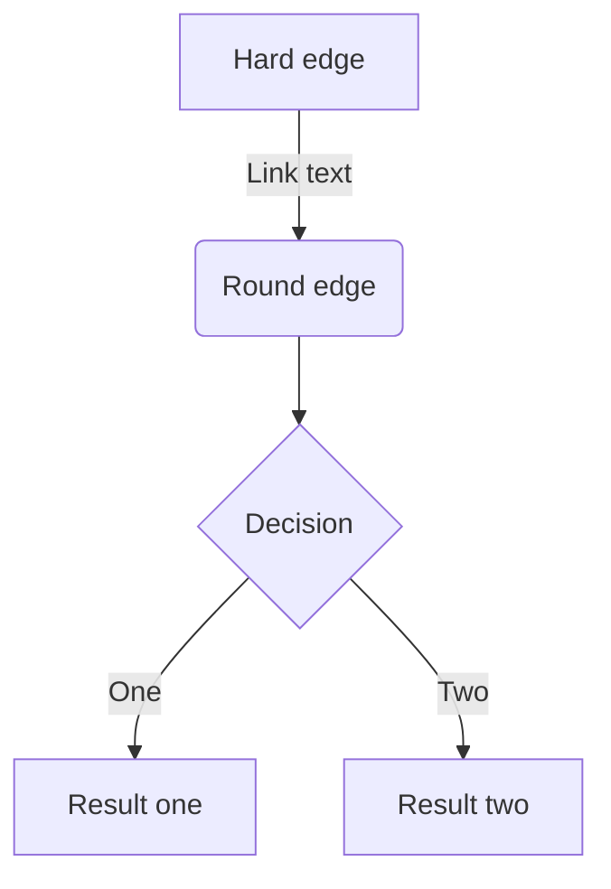

# Ansible 文档阅读
ansible 提供一个自动化平台健华系统和应用的部署。ansible通过SSH来管理系统。
ansible使用的是playbooks，用的是YAML语言。

hosts
- deployment hosts: 运行ansible playbooks
- target hosts：安装openstack服务以及设施等组件

安装的流程

准备deployment host

