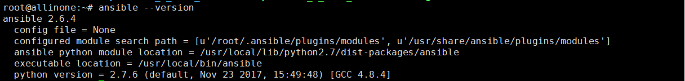
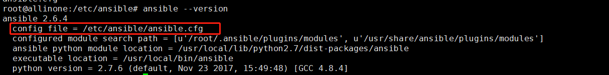
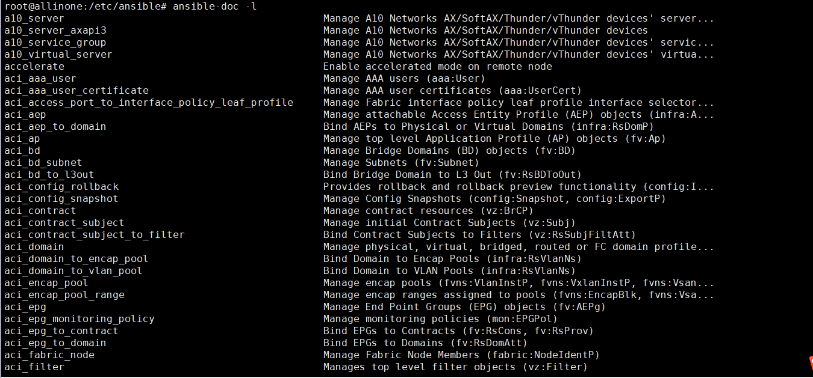
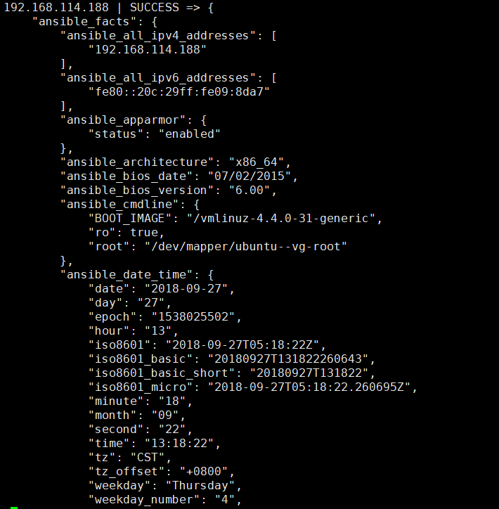
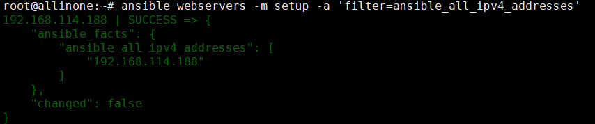
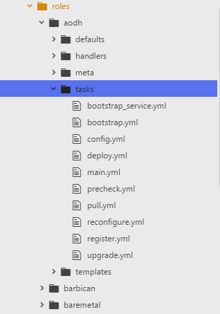

# ansible学习
最近在看《ansible 自动化运维技术与最佳实践》这本书，结合网上的一些博客来学习ansible。现整理相关的内容。
## 环境配置
安装ansible
在ubuntu上有两种方式自动安装，可以用apt-get安装，也可以用pip安装。pip安装的版本更高一些。当然啦，安装的方式还有很多，比如说源码安装、tar包安装、yum安装等等。
```shell
sudo apt-get install -y ansible
或者
sudo pip install ansible
```
查看ansible的安装版本以及一些常用的命令

这里看到如果我们用pip安装完ansible之后，config file是None的。也就是说不存在`/etc/ansible`这个配置文件夹，需要自己创建。


生成密钥，输入命令行，然后直接回车两次，会发现在`.ssh`目录下会生成相应的文件。公钥储存在`id_rsa.pub`,私钥储存在`id_rsa`中。
```
ssh-keygen
```

密钥分发。同步公钥到被管节点上。然后在控制节点上就可以免密码登录到被管节点上。可以看到控制节点上会多了一个`authorized_keys`。里面储存了被管节点的公钥信息。当再次SSH登录被管节点时，直接用这个文件的信息与被管节点进行身份验证，实现免密登录。
```
ssh-copy-id [user@]hostname
```

## 简单测试
编写`/etc/ansible/hosts`文件,其实也就是我们的主机列表，可以分组起别名的方式。
然后通过ansible的命令来执行一些操作，比如说ping啊，或者shell的commands。默认使用的是`/etc/ansible/hosts`文件，但是如果要指定其他文件，可通过`-i`来传入指定参数文件。
hosts文件
```
[webservers]
192.168.114.188
```
一些测试的命令，包括主机连通性测试，一些远程命令的测试。如果需要获取详细的输出结果，可以在命令后加上`-vvv`或者`-v`。
```
ansible 192.168.114.188 -m ping -vvv
ansible webservers -m ping -vvv
ansible -m command -a '/bin/echo hello ansible!'
```

## 各组件介绍
### inventory文件
**单个inventory文件**
例如`/etc/ansible/hosts`就是一个INI的静态文件
定义主机和主机组
```
172.18.231.1 ansible_ssh_pass='123456'
172.18.231.2 ansible_ssh_pass='123456'
[docker]
172.18.231.10[1:3]
[docker:var]
ansible_ssh_pass='123456'
[ansible:children]
docker
```
**多个inventory文件**
一个inventory目录下有不同的文件，不同文件存放不同的主机(层级式)。并且需要在配置文件ansible.cfg中设置inventory的值，不再指向一个文件，而是指向一个目录。
ps：其实一个文件跟多个文件没什么太大的区别。
- inventory
    - docker
    - hosts

**动态inventory文件**
支持主机列表和变量信息从外部拉取，然后用Ansible进行管理。
操作：把ansible.cfg文件中的inventory的定义值改成可执行脚本即可。

**inventory内置参数**
ansible_ssh_host
ansible_ssh_port
ansible_ssh_user
ansible_sudo_pass
...

### Ad-Hoc命令
通过命令行的形式使用ansible模块。ansible自带很多模块，可以直接使用。

-B SECONDS
-m MODULE_NAME
-P POLL_INTERVAL, --poll=POLL_INTERVAL  set the poll interval if using -B (default=15)
-a MODULE_ARGS
-f FORKS
-o 压缩输出

- 执行命令
ansible命令都是并发执行的，可以针对目标主机执行任何命令。默认通过配置文件ansible.cfg中的forks值来指定并发数。如果任务执行的时间比较长，可以用异步执行的功能。
- 复制文件
用copy模块来批量下发文件，文件的变化通过MD5值来判断。
```
ansible webservers -m copy -a 'src=/etc/ansible/hosts dest=/root/hosts owner=root group=root mode=644 backup=yes' -o
ansible webservers -m shell -a 'md5sum /root/hosts' -f 6 -o
```
这个说是文件分发，但是我貌似不能将这个文件放到被管主机那里。TODO:有待验证。
- 包和服务管理
```
ansible webservers -m yum -a 'name=httpd state=latest' -f 5 -o
ansible webservers -m shell -a 'netstat -tpln| grep httpd' -f 5
```
- 用户管理
首先通过openssl命令来生成一个密码，因为ansible user的password参数需要接受加密后的值。
然后用user模块来批量建立新用户
测试的时候可以用新用户名+密码来验证新用户是否建立成功。


### Ansible playbook
playbook是ansible进行配置管理的组件。
因为这个内容比较多，后面会单独写一篇文章来总结。

### Ansible facts信息
facts组件是ansible用于被管机器设备信息的一个功能。

可以使用filter来查看指定的信息。
facts信息放在一个json格式的数据结构中
```
ansible IP_ADDRESS -m setup
```

可以使用setup模块来查看机器的所有facts信息。

把facts信息作为playbook变量信息进行引用
- 用facter来扩展facts信息
- 用ohai拓展facts信息

### Ansible role
role只是对日常使用的playbook的目录结构进行一些规范。当我们定义一个role时，在写playbooks时静态文件跟jinja2模板文件直接使用相对路径即可，ansible会自动到对应的目录下寻找相应的文件。role的路径也可在配置文件ansible.cfg中进行指定。
比如说之前接触的kolla-ansible的项目，目录结构就按照ansible role的规范来执行。
- site.yaml 是role引用的入口文件
- handlers目录 存放一些task的handler
- files目录 存放静态文件
- tasks目录 存放playbook中的task
- templates目录 存放jinja2模板文件
- vars目录 存放变量文件

