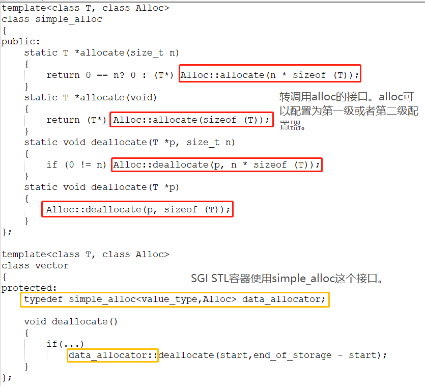

《STL源码剖析》读书笔记
- STL设计的目的
建立数据结构和算法的一套标准，并且降低期间的耦合关系以提升各自的独立性、弹性、交互操作性。
- STL六大组件
容器（containers），指各种数据结构：vector、list、deque、set、map。从实现的角度，STL容器是一种class template。
算法（algorithms），常用算法例如sort、search、copy、erase...
迭代器（iterators），容器与算法之间的胶合剂，是所谓的“泛型指针”
仿函数（functors），行为类似函数，可作为函数的某种策略
配接器（adapters），一种修饰容器或仿函数或迭代器接口的东西，例如queue和stack，底层借助于deque
配置器（allocators）:为容器配置存储的空间，SGI STL的配置器用的是alloc，不接受任何参数

- 环境组态
<stl_config.h>，定义许多常量，标识某些组态的成立与否。所有的STL头文件都会直接或者间接包含这个组态文件，并以条件式写法，让预处理器根据各个常量决定取舍哪一段程序代码

- 临时对象的产生和运用
临时变量，在型别名称之后加上一对小括号，可指定初值，其意义相当于调用相应的constructor并且不指定对象名称，例如vector<int>(n,1)用于初始化一个二维vector

- 前闭后开区间表示法
任何一个STL算法需要获得一对迭代器（泛型指针）所标示的区间，用于表示操作的范围。一般是前闭后开的区间，[begin, last),迭代器last指的是最后一个元素的下一个位置
```
for(;first!=last;first++){
    ...//do sth
}
```
- 函数指针
将一整组操作当做参数来传递，可通过函数指针来达成
缺点在于无法持有自己的状态（所谓的局部状态），也无法达到组件技术中的可适配性（无法再将某些修饰条件加在它上面从而改变它的状态）

- 仿函数
使用起来像函数一样的东西，例如针对某个class进行operator()重载
    ```
    template <class T>
    struct plus{
        T operator()(const T&x, const T&y) const{ return x+y;}
    }
    //产生放函数对象
    plus<int> plusobj;
    //使用仿函数
    cout<<plusobj(3,5)<<endl;
    ```
    plus<T>非常接近STL的实现，唯一差别在于它缺乏“可配接能力”

- SGI空间配置器
STL的操作对象（所有的数值）都存放在容器之内，而容器一定需要配置空间以置放资料。
    - 标准的空间配置器：std::allocator，因为效率低，一般不建议使用。只是对基层内存配置/释放行为::operator new和::operator delete做了薄薄的包装
    - 特殊的空间配置器：std:alloc

- c++内存配置操作和释放操作
new阶段：调用::operator new配置内存::construct()；调用构造函数构造对象内容alloc::allocate()
delete阶段：调用析构函数::destroy()；调用::operator delete释放内存alloc::deallocate()

- 空间的配置和释放
SGI以malloc()和free()完成内存的配置和释放。考虑到小型区块可能造成内存破碎问题，SGI设计了双层级配置器。第一层直接用malloc和free，第二级配置器视情况采用不同策略。如果配置区别大于128bytes，选用第一级配置器；当小于128bytes时，采用复杂的memory pool的整理方式。是否同时开放第二级配置器，取决于__USE_MALLOC是否被定义。

- 内存基本处理工具
    - construct()接受一个指针和一个初值value，用途是将初值设定到指针所指的空间上
    - destroy()有两个版本，一个版本是接受一个指针，准备将该指针所指之物析构掉；版本2是接受first和last两个迭代器，将[first, last)范围内所有对象析构掉(要考虑效率问题)
    - uninitialized_copy使我们能够将内存的配置与对象的构造函数分离开来。对于输入范围的每个对象产生一个复制品，放入输出范围中。
    - uninitialized_fill使我们能够将内存的配置与对象的构造函数分离开来。如果输入范围内的迭代器指向未初始化的内存，那么会在该范围内产生x的复制品。
    - unintialized_fill_n使我们能够将内存的配置与对象的构造函数分离开来。会为指定范围内的所有元素设定相同的初值

- POD(plain old data)
标量型别或传统的c struct型别，有trival/ctor/dtor/copy/assignment函数。
对于POD型别，一般是直接调用copy函数/最有效的初值填写手法fill()/
对于非POD型别，一般逐个使用构造函数/一个一个元素构造/

- 迭代器模式
提供一种方法，使之能够依序巡访某个聚合物（容器）所含的各个元素，而又无需暴露该聚合物的内部表达方式

- 迭代器
迭代器是一种类似指针的对象，最重要的工作就是内容提领（deference）和成员访问（member access），因此最重要的是对operator*和operator->进行重载工作。

- Traits编程技法
凡原生指针，都没有能力定义自己的相应型别
凡class-type iterators，都有能力定义自己的相应型别
通过class template partial specialization的作用，不论是原生指针还是class-type iterator，都可以让外界很方便地获取其相应型别。
traits就是一个特性萃取机，获取各个迭代器的特性（相应型别）
template <class I>
struct iterator_traits{
    typedef typename I::value_type value_type;
}
如果traits能够有效运作，每个迭代器必须遵循约定，自行以内嵌型别定义的方式定义出相应型别。
traits技法大量使用于STL实现品中，利用“内嵌型别”的编程技巧与编译器的template参数推导功能，增强c++未能提供的关于型别认证方面的能力，弥补c++不为强型别语言的遗憾。

- 迭代器的相应型别
    - value type：指迭代器所指对象的型别
    - difference type:表示两个迭代器之间的距离
    - pointer：传回一个左值，令它代表p所指之物的地址
    - reference：传回一个左值，令它代表p所指之物
    - iterator catagory：产生一个临时变量，其型别隶属于四个迭代器类型（I、F、B、R)之一，然后根据这个型别，编译器再决定用哪个重载函数

    template<class InputeIterator, class Distance>
    inline void advance(InputeIterator& i, Distance n);

- iterator_traits
萃取迭代器的特性

- __ type_traits
萃取型别（type）的特性，这个型别是否具备non-trivial defalt ctor/non-trival-copy ctor/non-trival assignment operator

- 序列式容器(
缩进表示基层与衍生层的关系，衍生是内含关系，例如priority_queue内含一个heap
其中的元素是可序(ordered)，但未必有序(sorted)
    - array(c++内建),
    - vector,
        - heap(以算法形式呈现),
            - priority_queue
    - list(非标准),
    - slist(非标准),
    - deque(非标准),
        - stack(配接器, adapter，修改某物接口，形成另一种风貌),
        - queue(配接器, adapter)


- vector
    - vector是动态空间，随着元素的增加，他的内部机制会自动扩充空间以容纳新元素，能够合理和灵活地运用内存。关键技术在于对其大小的控制以及重新配置时的数据移动效率。(array是静态空间，一旦配置了就不能改变，如果要换个大一点的空间，需要由用户客户端执行，首先需要配置一块新空间，再将元素从旧地址一一搬到新地址，最后将原来的空间还给系统)
    - vector维护的是一个连续线性空间，支持随机存取，普通指针有这样的能力，因此vector提供的是Random Access iterators
    - 数据结构：三个迭代器——start(表示目前使用空间的头)、finish(表示目前使用空间的尾)、end_of_storage(表示目前可用空间的尾)
    - 满载的时候，会扩充空间：重新配置、移动数据、释放原空间
    - 空间拓展的原则：如果原大小为0，则配置为1(个元素大小)，如果原大小不为0，则配置原大小的两倍，前半段用于放置原数据，后半段准备用来放置新数据。
    - 所谓的动态增加大小，不是在原空间之后接续新空间，而是以原大小的两倍另外配置一块较大的空间，然后将原内容拷贝过来，然后再在原内容之后构造新元素，释放原空间。**因此一旦引起空间重新配置，指向原vector的所有迭代器都会失效。**
    - 操作
        - push_back
        - pop_back
        - erase
        - clear
        - insert
        ```
        if(插入元素个数大于0){
            1. 备用空间足够，大于等于新增元素个数
                1.1 插入点之后的现有元素大于新增元素个数
                    uninitialized_copy()
                    移动finish
                    copy_backward()
                    fill()
                1.2 插入点只有的现有元素小于新增元素个数
                    uninitialized_fill_n()
                    移动finish
                    uninitialized_copy()
                    移动finish
                    fill()
            2. 备用空间不够，扩展空间
                2.1 首先决定新长度：旧长度的两倍，或者旧长度+新增元素个数
                2.2 再将旧vector的插入点之前的元素复制到新空间 uninitialized_copy()
                2.3 再将新增元素填入新空间 uninitialized_fill_n()
                2.4 再将旧vector的插入点之后复制到新空间 uninitialized_copy()
        }
        ```

- list
    - 每次插入或者删除一个元素，就配置或释放一个元素空间，对空间的使用绝对精准，对于任何位置的元素插入和删除都是常数时间
    - list是一个双向链表，而且是一个环状双向链表，迭代器必须具备前移后移的能力，所以list提供的是Bidirectional Iterators
    - 插入和删除操作不会造成原有的list迭代器失效
    - 相关操作：push_back, push_front，erase, pop_front,pop_back, clear, remove,unique
    - transfer迁移操作：将某连续范围的元素迁移到某个特定位置之前，技术上只是指针的移动而已。
    - list不能用STL算法的sort()，必须使用自己的sort() member function，因为STL的sort函数只接受RandomAccessIterator

- deque
    - 双向开口的连续线性空间，可在头尾两端分别做元素的插入和删除，效率为常数时间。没有容量的概念，它是以分段连续空间组合而成，随时可以增加一段新的空间并链接起来
    - deque是由一段一段的定量连续空间构成，一旦有必要在deque的前端或者尾部增加新空间，便配置一段定量持续空间，串接在整个deque的头端或尾端。
    - start(iterator)指向第一缓冲区的第一个元素：cur,first, last, node
      finish(iterator)指向最后缓冲区的最后一个元素的下一个位置:cur, first, last, node
      多个缓存区，每个缓存区储存多个元素
      维护一个指向map的指针map_pointer，也维护start、finish的迭代器
      
     - 在头部或者尾部插入元素的时候，会判断是否需要扩充map(备用空间是否足够)，如果需要就付诸行动，配置一块新的缓冲区，直接将节点安置在现有的map中，设定新元素，然后改变迭代器start或者finish的状态。
     - 相关操作：push_back(考虑扩充缓冲区)、push_front(考虑扩充缓冲区)、pop_back(考虑将缓冲区释放掉)、pop_front(考虑将缓冲区释放掉)、clear(回复初始状态，即保留一个缓冲区)、erase(根据position，判断移动前面的元素还是后面的元素)、insert(根据插入值的position，判断移动前面的元素还是后面的元素，挪好位置再插入值)

- stack
    - 先进后出的结构
    - SGI STL以deque为缺省情况下stack的底部结构，也可以用list作为底层结构。封闭其头端开口。
    - 相关操作：empty,size, front, back, push, pop
    ```
    template<class T,class Sequence=deque<T> >
    class stack{
        ...
    }
    ```
    - stack不提供走访功能，不提供迭代器

- queue
    - queue是一种先进先出的数据结构，有两个出口，从最底端存入，从最顶端取出，不存在遍历行为
    - 相关操作：empty,size, front, back, push, pop
    - 底层结构可以是deque也可以是list

- heap
    - 不归属STL容器组件，binary max heap是priority_queue的底层机制。没有迭代器
    - binary heap是一种完全二叉树，除了最底层的叶子节点，其他节点都是填满的，最底层的叶子节点从左到右不得有空隙，可用array来存储所有节点。
    - 对于节点位于array的i处时，其左子节点位于array的2i处，其右节点位于array的2i+1处，其父节点为i/2(取整)
    - heap可分为max-heap(最大值在根节点，STL提供)与min-heap
    - push_heap算法(上溯法)
    1. 将节点放在最下层作为叶节点，填补从左至右的第一个空格
    2. 向上比较父节点与当前节点，如果叶子节点比父节点大，交换两者的值
    3. 直至到顶端，或者满足heap的次序才停止
    - pop_heap算法(下溯法)
    因为取走的一定是根节点，我们必须割舍最下层最右边的叶子节点，将它的值重新安插到max-heap中，重新调整heap的结构。pop_heap后，最大元素只是被放在了底部容器的最尾端，尚未被取走。要用pop_back()操作函数。
    1. 比较左右孩子的大小
    2. 替换洞值和max(左右孩子)的值，移动洞值
    3. 往下继续调整
    - make_heap算法


- priority_queue
    - 归类为container adapter，没有迭代器
    - 允许用户以任何次序将任何元素存入容器中，但取出的时候一定是从优先级最高的元素开始取。
    - 如果用RB tree作为priority_queue的底层机制，元素的插入和极值的取得有O(logN)的表现，但是小题大做。binary search tree(RB tree)要求输入足够随机，并且binary search tree(RB tree)不容易实现。
    - priority_queue的复杂度介于queue和binary search tree之间，比较适合。binary heap满足条件。

- slist
    - 单向链表，single linked list，与list的区别在于，list的迭代器是双向的bidirectional iterator, 而slist的迭代器是单向的forwarded Iterator。优点在于所耗用的空间更小，某些操作更快。共同点在于他们的插入(insert)、移除(erase)、结合(splice)等操作不会引起原来的迭代器失效。
    - 相关操作：insert_after, erase_after, push_front


关联式容器(多键集合)
分为set(集合)和map(映射表)两大类，以及衍生的两大类multiset(多键集合)和multimap(多键映射表).底层均是以RB tree(红黑树)完成。另外还有hash table(散列表)，并以此为底层机制实现hash_set(散列集合)、hash_map(散列映射表)、hash_multiset(散列多键集合)、hash_multimap(散列多键映射表)

- 关联式容器(缩进表示基层与衍生层的关系，衍生是内含关系)
    - RB-tree(非公开)
        - set
        - map
        - multiset
        - multimap
    - hashtable(非标准)
        - hash_set(非标准)
        - hash_map(非标准)
        - hash_multiset(非标准)
        - hash_multimap(非标准)

- 二叉搜索树
任何节点最多只能允许两个子节点

- 平衡二叉树
确保整棵树的深度为O(logN),左右子树的高度最多差1
    - AVL tree
    - RB tree 双向迭代器，不具备随机定位能力
    - AA tree

- set
    - 特性：所有元素都会根据元素的键值自动被排序。键值就是实值，实值就是键值。不允许两个元素有相同的键值。
    - 以RB tree为底层机制，几乎所有的set操作行为，都是转调用RB-tree的操作行为。

- map
    - 所有元素都会根据元素的键值自动被排序，以RB-tree为底层机制，每个节点的内容是一个pair。同时拥有实值和键值。pair的第一个元素被看做是键值，第二个元素是实值。map不允许两个元素拥有相同的键值。
    - 不能通过map的迭代器改变map的元素内容，不能修正元素的键值。因为map的键值关系到map的元素的排列规则，任意改变map元素的键值都会严重破坏map的组织。但是可以修改元素的实值。
    - 进行insert或者erase后，迭代器依然有效。
    - subscript操作符，可能作为左值运算，也可能作为右值运算
    ```
    T& operator[](const key_type& k){
        return (*((insert(value_type(k,T()))).first)).second;
    }
    ```

- multiset
特性与用法与set完全相同，唯一的差别在于它允许键值重复，插入的时候用的是RB-tree的insert_equal()而不是insert_unique()
- multimap
特性与用法与map完全相同，唯一的差别在于它允许键值重复，插入的时候用的是RB-tree的insert_equal()而不是insert_unique()

- hash_table(散列表)
hash table可以提供所有的有名项的存取操作和删除操作，也可以视作是一种字典结构，意在提供常数时间的基本操作。

- 所有元素都是16bits且不带正负号的整数，范围为0-65535，那么用一个array来记录，每个元素值代表相应元素出现的次数。如果i出现，那么A[i]++。
    - 问题1：如果元素是32bit，那么array的大小为2^32=4GB。
    - 问题2：如果元素是字符串，无法映射到array的索引中。可以通过字符编码来实现。
    - 避免大的荒谬的array：使用某种映射函数，将大数映射为小数，将一个元素映射为一个“大小可接受之索引”，也叫hash_function。

- 解决哈希函数出现的冲突问题
    - 线性探测，依序往下一一寻找(如果到达了尾端就从头开始寻找)，直至找到一个可用空间为止。
    问题：平均插入成本的成长幅度，远高于负载系数的成长幅度
    - 二次探测，依序尝试H+1, H+4, H+9...H+i^2（可用位移法来计算）
    用于消除主集团，却可能造成次集团(可用double hashing来消除次集团)
    - 开链法：表格内的每个单元，涵盖的不只是节点(元素)，也可能是一“桶”节点。bucket维护的是一个linked list。

- SGI STL的hash table就是采用开链法
整个hash table是由vector和linked list组成。
    - 迭代器结构
    node * cur;//迭代器目前所指之节点
    hashtable * ht;//保持对容器的连接关系，可能需要从一个bucket跳到另一个bucket
    没有后退操作，也就是没有定义所谓的逆向迭代器
    - hash table的数据结构
    bucket聚合体以vector来完成，便于动态扩充：vector<node*, Alloc> buckets
    专属的节点配置器：typedef simple_alloc<node, Alloc> node_allocator
    - SGI STL以质数来设计表格，将28个质数计算好，以备随时访问
    - 构造与内存管理
        - 插入操作与表格重整(如果元素个数比bucket vector大，就进行重建)
        重建：找到next_size(),即下一个质数；然后设立新的bucket，也就是vector；再找到节点应该落在哪个bucket上。
        1. 将旧bucket指向其所对应之链表的下一个节点（用于迭代）
        2. 将当前节点插入到新的bucket中，称为其对应链表的第一个节点
        3. 回到旧bucket所指的待处理链表，然后处理下一个节点
        确定bucket_number：执行取模运算，获得数值
    - 复制与整体删除
        复制和删除需要注意内存的释放问题。
        - clear函数：对于每一个bucket，将bucket list的每个节点删除，然后使得bucket内容为null指针，总节点个数为0
        - copy from函数：先确保本身已经clear了，并且空间大小>=对方，然后开始复制每个bucket以及对应的节点
- 使用
定义一个hash table
```
# include<hash_set>
hashtable<int, int, hash<int>, identity<int>, equal_to<int>, alloc>iht(50, hash<int>, equal_to<int>());
iht.size()=0
iht.bucket_count()=53
```
用迭代器遍历hashtable
```

hashtable<int, int, hash<int>, identity<int>, equal_to<int>, alloc>::iterator ite = iht.begin();
for(int i=0;i<iht.size();++i,++ite)
    cout<<*ite<<' ';
cout<<endl;
```
```
用迭代器遍历buckets
hashtable<int, int, hash<int>, identity<int>, equal_to<int>, alloc>::iterator ite = iht.begin();
for(int i=0;i<iht.bucket_count();++i)
    int n = iht.elems_in_bucket(i);
    if(n!=0){
        cout<<"bucket["<<i<<"] has "<<n<<" elems."<<endl;
    }
cout<<endl;
```

- hash_set
    - 以hash_table为底层实现，基本所有的hash_set的行为都是转调用hashtable的操作行为而已。
    - set元素的键值就是实值，实值就是键值
    - 插入操作用的是hash_table的insert_unique()
    - RB tree为底层的与hash table为底层的都可以用于快速搜索元素，但是hash_set没有自动排序功能

- hash_map
    - 以hash_table为底层实现，基本所有的hash_map的行为都是转调用hashtable的操作行为而已。
    - 插入操作用的是hash_table的insert_unique()
    - RB tree为底层的与hash table为底层的都可以根据键值快速搜索元素，但是hash_map没有自动排序功能

- hash_multiset
    - 以hash_table为底层实现，基本所有的hash_set的行为都是转调用hashtable的操作行为而已。
    - 插入操作用的是hash_table的insert_equal()
    - RB tree为底层的与hash table为底层的都可以用于快速搜索元素，但是hash_set没有自动排序功能

HashMap的原理，内部数据结构
hashmap用的是hash_table,查询时间复杂度为O(1).用vector来保存每个桶，每个节点又是也用linked list来记录。
hash_map，首先分配一大片内存，形成许多桶。是利用hash函数，对key进行映射到不同区域进行保存。

其插入过程：
1、得到key；
2、通过hash函数得到hash值；
3、得到桶号（一般都为hash值对桶数求模）；
4、存放key和value在桶内；
其取值过程是：
1、得到key；
2、通过hash函数得到hash值；
3、得到桶号；
4、比较桶的内部元素是否与key相等，若不相等，则没有找到；
5、取出相等的记录的value；
什么时候需要使用hash_map，什么时候需要map？
总体来说，hash_map 查找速度会比map快，而且查找速度基本和数据数据量大小，属于常数级别;而map的查找速度是log(n)级别。并不一定常数就比log(n)小， hash还有hash函数的耗时，明白了吧，如果你考虑效率，特别是在元素达到一定数量级时，考虑考虑hash_map。但若你对内存使用特别严格，希望 程序尽可能少消耗内存，那么一定要小心，hash_map可能会让你陷入尴尬，特别是当你的hash_map对象特别多时，你就更无法控制了，而且 hash_map的构造速度较慢。
现在知道如何选择了吗？权衡三个因素: 查找速度, 数据量, 内存使用。

HashMap 怎样解决冲突，讲一下扩容过程
hash table 用链式法来解决冲突。
拿元素个数与bucket_vector的大小来比较，如果前者大于后者，就进行重整。
要扩容的时候寻找下一个质数。Next_size()

设立新的bucket_vector
依序处理每个bucket所含的(串行)的每个节点
a. 找到这个节点位于哪个新的bucket buck_num（val, n)
b. 将bucket的指针指向下一个节点
c. 将当前节点插入到新的bucket中，成为其对应串行的第一个节点
d. 回到旧bucket所指的待处理的串行中，处理下一个节点
对调两个buckets. void swap (vector& x); 如果两个vector的大小不同，那么大的变小，小的变大


空间配置器 allocator
在STL中，所有的元素都是存放在容器中，容器需要配置空间来储存这些数值，因此需要用到空间配置器。
- SGI的空间配置器
    - SGI标准的空间配置器是allocator, 只是对基层内存配置/释放行为(对运算符new/delete)进行了一层薄薄的封装，没有考虑到效率上的优化。
    - SGI特殊的空间配置器是alloc，
    SGI以malloc()和free()完成内存的配置和释放。考虑到小型区块可能造成内存破碎问题，SGI设计了双层级配置器。第一层直接用malloc和free，第二级配置器视情况采用不同策略。如果配置区别大于128bytes，选用第一级配置器；当小于128bytes时，采用复杂的memory pool的整理方式。是否同时开放第二级配置器，取决于__USE_MALLOC是否被定义。

- STL Allocator的精细分工
<stl_construct.h>
内存配置：`allocate()`;
内存释放前进行对象的析构：`destroy()`，调用析构函数;
<stl_alloc.h>
内存配置后进行对象的构造:`construct()`,placement new调用构造函数;
内存释放: `deallocate()`;
<stl_uninitialized.h>
定义一些全域函式，用来填充(fill)或者复制(copy)大块的内存内容。


- stl_construct.h
construct()接收一个指针和一个初始值value，用途是将初值设定到指针所指的空间上
destroy有两个版本，版本1接受一个指针，准备将该指针所指之物析构掉；版本2是接收first和last两个迭代器，将[first,last)范围内所有对象析构掉

- std::alloc(设置配置器)
SGI用malloc和free这2个C函数代替完成内存的申请和释放。考虑到内存碎片问题，SGI设计了两级配置器，第一级直接使用malloc和free，包括了内存不足处理机制，需要调用者自己提供。第二级判断配置区超过128字节，调用第一级配置器。小于128字节，采用内存池管理



- 第一级配置器
`__malloc_alloc_template`
SGI第一级配置器的allocate()和realloc()使用malloc与free来配置和释放内存。调用不成功后，会调用oom_malloc()和oom_realloc()。后两个函数都有内循环，不断调用“内存不足处理例程”，期待在某次调用后获得足够内存而圆满完成任务。设定“内存不足处理例程”是客端的责任。

- 第二级配置器
`__default_alloc_template`
当区块小于128byte，交由第二级配置器处理。用内存池(memory pool)来管理。也叫次层配置(sub-allocation)
    - 实现方式
    每次配置一大块内存，并维护对应的自由链表
    如果下次有相同大小的内存需求，就从free-list中拨出
    如果客端释放小额区块，就由配置器回收到free-list中
    SGI第二级配置器会主动将任何小额区块的内存需求量上调至8的倍数。它维护16个free-lists，各自管理大小分别为8,16,24,32，...,128byte的小额区块。
    节点结构
    ```
    //利用union的性质使得链表既是指针又是实际区块
    union obj
    {
        union obj * free_list_link;
        char client_data[1];       //柔性数组
    };
    ```
    - 内存池
    chunk_alloc的工作：从内存池中取空间给free-list使用。
    ```
    if(内存池水量足够)
        直接调出20个区块给free list
    else if(内存池水量还足够提供至少1个区块)
        调出实际能够供应的区块
    else
        利用malloc()向堆heap中配置内存，为内存池注入源头活水以应付需求。一般申请为需求量的两倍，再加上随着配置次数增加而越来越大的附加量
        if(heap的空间也不够)
            malloc()失败，调用第一级配置器中的out of memory处理机制,或许有机会释放其内存拿来此处使用。如果可以就成功，否则发出bad_alloc异常。
    ```
    - STL里面空间分配是怎么样的？
    STL中用allocator类来实现空间分配，有一级配置器二级配置器,根据一个环境组态来确定使用哪一级的配置器。SGI STL将alloc设置为第二级配置器。
    - 如果用让你写一个STL的空间配置器，这个配置器需要经常分配大量的小内存，但大量的分配小内存会造成内存碎片，你会怎么解决这个问题？那如果用你实现的配置器分配的空间是怎么释放的？（扯一些二级配置器是怎么实现的，可以参照STL特有的空间配置器alloc来想）
    1. 针对于小内存的问题，可以像第二级配置器一样来实现，用内存池来管理。每次配置一大块内存，然后维护16个自由链表free-lists。每个链表会维护若干个小额区块，每个小额区块的大小是8的倍数。
    2. 如果自由链表里的小额区块不够了，利用chunk_alloc(size,num)，从内存池中取空间给free-list使用（参考上面的内存池内容）
    3. 如果客端申请需求量小于128byte，会将申请的内存需求量上调至8的倍数，然后再查找对应的自由链表中的小额区块。如果大于128byte，就用第一级配置器的allocate()函数，直接用malloc来配置内存。
    4. 释放内存时，如果释放量小于128byte，配置器会将它归还到对应的自由链表中。如果大于128byte，就用第一级配置器的deallocate()函数，直接用free来释放内存。

- STL仿函数。
    - 为什么要有仿函数
    可以看到STL的算法一般会提供两个版本，一个版本是已经定义好的常用的某种算法，另一个版本是表现出泛化的演算流程。允许用户“以template参数来指定所要采取的策略”。比方说sort这个函数，版本一是默认用Operator<作为排序的依据，而版本2允许用户自定义比较的依据操作，使得排序后两两之间的比较会使这个操作为true。
    - 方式——将整组操作当做算法
    将这样的操作设计为一个函数，再将函数指针作为算法的一个参数，或者将这个操作设计为一个仿函数，再以这个仿函数生成一个对象，以这个对象作为算法的一个参数
    - 为什么还要用仿函数，函数指针不行么
    函数指针确实可以做到将整组操作当做算法的参数，但是不能满足STL对抽象性的要求，不能满足软件积木的要求——函数指针无法与STL其他组件(比如adapter)搭配，产生更灵活的配置。
    - 分类
    以操作数的个数划分：一元、二元仿函数
    以功能划分：算术类仿函数、逻辑运算类仿函数、关系运算类仿函数
```
template<class Arg1, class Arg2, class Result>
struct binary_function{
    typedef Arg1 first_argument_type;//第一参数型别
    typedef Arg2 first_argument_type;//第二参数型别
    typedef Result result_type;//回返值型别

};
//以下仿函数继承了binary_function，用户可以得到该仿函数的各种相应型别
template<class T>
struct plus: public binary_function<T,T,T>{
    T operator()(const T& x, const T&y) const{return x+y;}
};
//以下配接器将某个二元仿函数转化为一元仿函数
template<class Operaton>
class binderlist
...
protected:
    Operator op;
    typename Operator::first_argument_type value;
public:
    typename Operator::result_type operator()(const typename Operator::second_argument_type&x) ()const{
        ...
    }

//产生仿函数实体
plus<int> plusobj;
//运用上述对象，履行函数功能
cout<<plusobj(3,5)<<endl;
//直接以仿函数的临时对象履行函数功能
cout<<plus<int>()(3,5)<<endl;
//搭配STL算法
accumulate(iv.begin(), iv.end(), 1, multiplies<int>());
```
