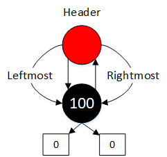

红黑树很复杂，今天就要整理学习这部分内容。
[TOC]

## 定义
红黑树是一种平衡二叉搜索树，而且满足以下规则：
1. 每个节点不是红色就是黑色
2. 根节点是黑色
3. 如果节点是红色，那么他的子节点一定是黑色-->新节点的父节点一定为黑色
4. 任何一个节点到NULL(树尾端)的任何路径，所包含的黑节点数目必须相同-->新节点必须为红色
5. 每个叶子节点都是黑色的空节点（NIL节点）
## 操作
### 插入节点
在原来的红黑树上插入四个节点。分别为3,8,35,75。应该都为红色的节点，但是由于破坏了红黑树的规则，我们需要对树形进行调整，旋转树形来改变节点的颜色。

**情况1**

- 条件：新插入节点X的叔叔节点为黑，节点X为外侧插入
- 执行操作：我们对父节点和祖父节点进行一次单旋转，并且改变P、G的颜色。
- 注意：可能会造成不平衡情况(高度相差1以上)。但是RB-tree的平衡性本来就比AVL-tree弱。

情况2:
- 条件：新插入节点X的叔叔节点为黑，节点X为内侧插入
- 操作：双旋，首先父节点、新插入节点进行旋转，更改节点G，X的颜色；然后祖父节点进行右旋，不用修改颜色

情况3：
- 条件：新插入节点X的叔叔节点为红，且X为外侧插入
- 操作：对P和G进行单旋，然后改变X的颜色
- 注意：如果GG为黑色，那么结束调整。如果GG节点为红色，那么我们需要再继续调整

情况4：
- 条件：新插入节点X的叔叔节点为红，且X为外侧插入，并且GG节点为红色。
- 操作：自上而下，沿着新增节点A，到根节点的路径上，如果有一个节点，他的两个子节点为红色，它本身为黑色，那么就将子节点修改为黑色，它本身颜色修改为红色

### 删除节点
情况1： 删除的节点没有孩子

- 如果删除的节点为红色，则直接删除即可
- 如果删除的节点为黑色，则需要调整树形

情况2： 删除的节点有一个孩子
如果一个元素只有一个孩子，那么这个元素一定是黑色，并且它的孩子一定是红色，那么只需要将该节点删掉，用它的孩子来替代它。也就是说他的孩子节点修改颜色。
情况3：删除的节点有两个孩子
如果删除一个有两个孩子的元素，可以使用它的前驱或者后继结点代替它。因为它的前驱或者后继结点最多只会有一个孩子，所以这种情况可以转为上述两种情况进行处理。
## 结构
- 基本的数据结构：
    color：节点的颜色，非红即黑
    parent：RB树的许多操作都需要知道父节点
    left：指向左节点
    right：指向右节点
- 实现技巧
    link_type header：用于得到root，leftmost以及rightmost
    

- 迭代器：
实现分为两层，双层架构与slist类似
双向迭代器，不具备随机定位能力
increment()与decrement()的实现，用于operator++与operator--

- 元素插入操作
insert_equal()，用于multiset、multimap的插入方法调用
insert_unique()，用于set、map的插入方法调用
真正执行插入操作的函数: `__insert()`
调整树形： `__rb_tree_rebalance()`, `__rb_tree_rotate_left`,`__rb_tree_rotate_right`

## 应用
关联式容器中有以RB-tree作为底层实现机制的，当然也有以hash_table作为底层实现机制的。前者的容器实现在源码中可以看到，直接调用了RB-TREE的函数，从而实现该数据结构。
- 关联式容器(缩进表示基层与衍生层的关系，衍生是内含关系)
    - RB-tree(非公开)
        - set(insert_unique)
        - map(insert_unique)
        - multisett(insert_equal)
        - multimapt(insert_equal)
## 对比
**为什么数据库索引不用红黑树而用了B-TREE**
红黑树——二叉平衡搜索树，B-TREE——多叉平衡搜索树
在B-TREE中，磁盘按需读取，每次都会预读的长度一般为页的整数倍，并且数据库把一个节点的大小设置为一个页，每个节点只需要一次IO就可以完全载入。B-tree的m值设置为很大，那么让树的高度降低，有利于一次完全载入。在红黑树结构中，逻辑相邻的节点物理上不一定相邻，也就是说读取同等的数据红黑树需要多次I/O。所以选择B-树效率更好。
红黑树结构，h明显要深得多。由于逻辑上很近的结点（父子结点）物理上可能离得很远，无法利用局部性原理。所以即使红黑树的I/O渐进复杂度也为O(h)
