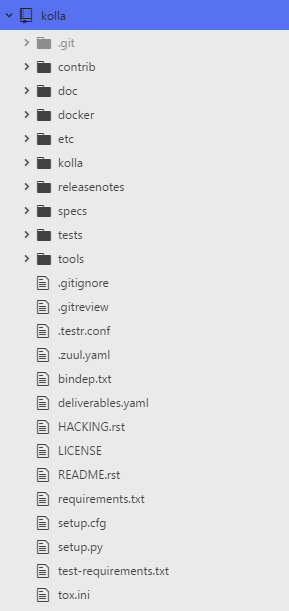
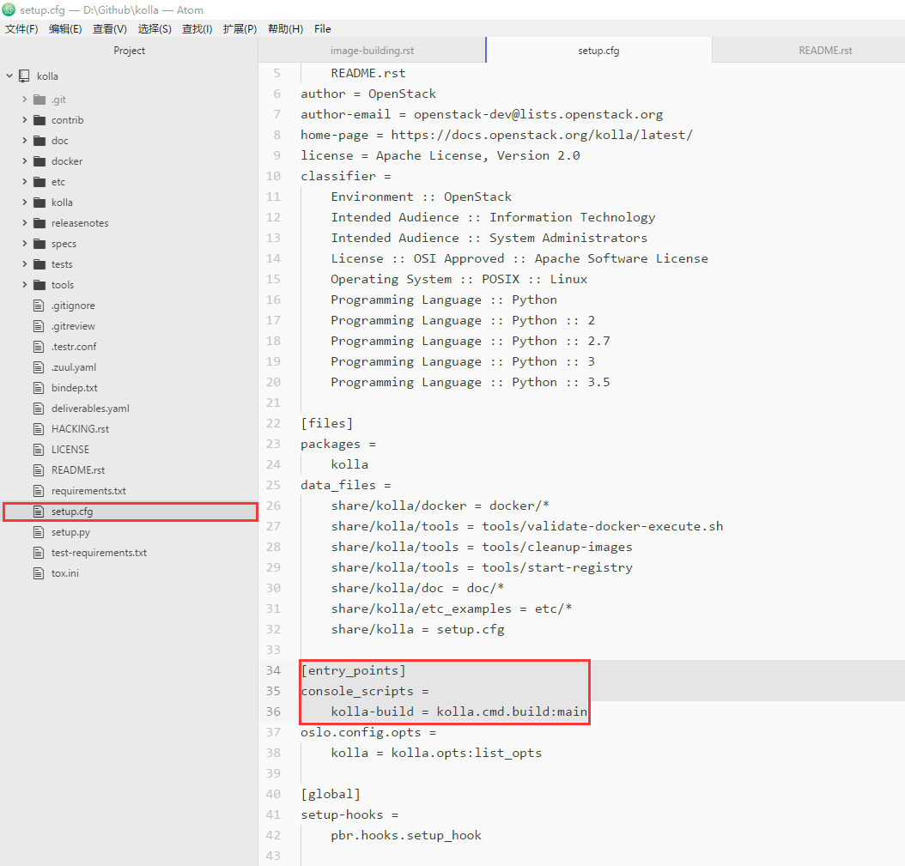
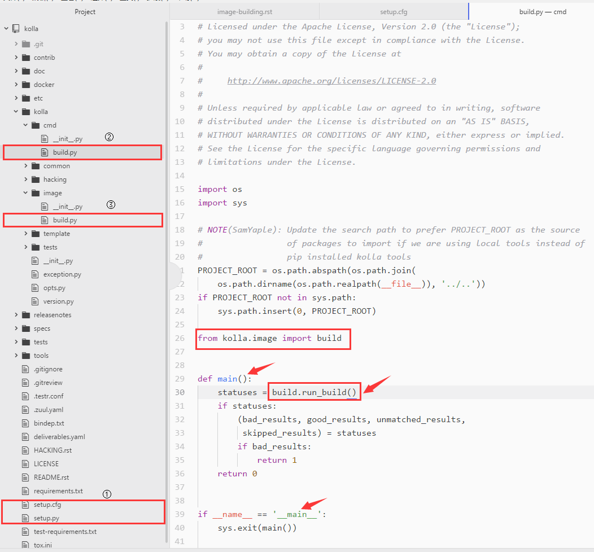
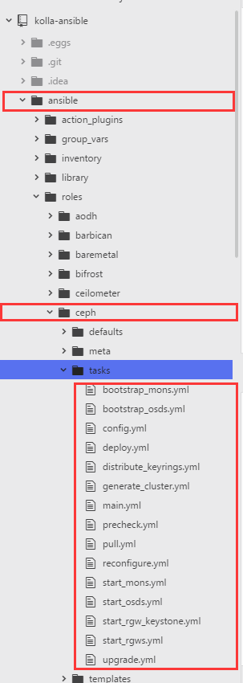
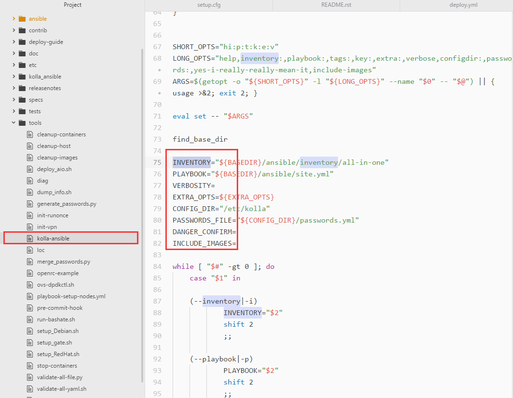
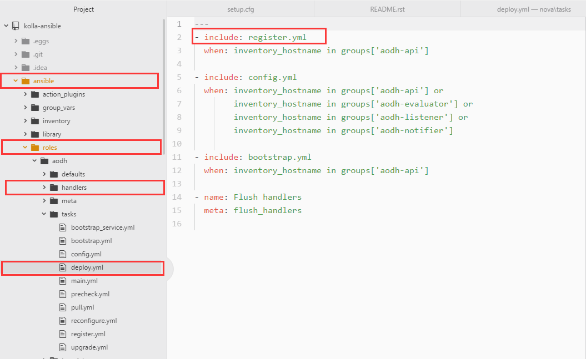

[TOC]
## kolla源码阅读
### 项目目标
    To provide production-ready containers and deployment tools for operating
    OpenStack clouds.

kolla项目的目标：提供生产环境可用的容器镜像
kolla项目主要是对镜像容器进行构建，根据每个项目-服务中的dockerfile来创建各个服务的容器，然后构建私有仓库，也就是实现build的功能
### 目录结构
1. 首先来看一下目录结构

其中比较重要的几个文件夹简单介绍一下：
- doc/
一些说明性文档。比如说`image-building.rst`，介绍了`kolla-build`这个命令行怎么构建docker镜像，介绍这个命令行的传入参数以及示例如何使用这个命令。
再细说一下`kolla-build`，它会根据DockerFile来制作镜像，然后放入本地的镜像仓库（Local Docker Registry）。在Deploy阶段，会根据用户的配置（比如multinode, allinone)，自动生成配置文件，并且把配置文件和镜像仓库中的镜像一起部署到对应的节点上。
- docker/
这个目录下主要是DockerFile，安装项目来划分，然后每个项目下又划分为一个或多个服务，每个服务对应一个docker image。
- kolla/
python实现的kolla命令，这里主要是build命令。后面详细说。原本的genpwd已经移植到了kolla-ansible中。
- tools/
一些脚本工具的集合。包括`cleanup-images`, `validate-docker-execute` ,`validate-maintainer`等等。
- setup.cfg
文件的内容由很多个section组成，比如global、metadata、file等，提供了这个软件包的名称、作者等有用的信息，能够更好地理解代码的section唯有的entry_points。简单的理解，这些entry_points是项目所提供的服务的入口点。
- setup.py
仅仅调用setup函数，但是它有大量的参数需要配置，包括项目名称、作者、版本等，而setup.cfg就是存了这些参数。setup函数利用pbr工具去读取和过来setup.cfg中的数据，将解析后的结果作为自己的参数。

### kolla-build 代码分析

我们从这个entry_points入手。
entry_points可以简单理解为它通过setuptools注册的外部可以直接调用的接口。
循着entry_points，我们可以找到kolla-build的入口函数。

step1:模块入口
step2:调用kolla.cmd.build的main()函数
step3:调用kolla.image.build的run_build()函数，建立working_dir, 创建dockerfile，构建容器镜像，并且输出安装过程的日志，最终删除临时文件，返回结果（build, failed, not_matched, skipped）

这里比较重要的是有一个 `KollaWorker`
- 初始化的参数值设置，读取自配置文件，包括rh_base, rh_type, deb_base(操作系统类型ubuntu/centos), deb_type(源码还是二进制文件）...
- `get_images_dir`获取镜像的目录，其实就是找docker目录下的文件
- `setup_working_dir`在建立容器镜像时创建一个工作目录
- `create_dockerfiles`根据jinja2的模板、kolla.conf传入的参数来渲染dockerFile

### 容器镜像
- 镜像的构建
举例： base -> openstack-base -> nova-base
openstack-base容器基于之前的base， nova-base容器基于openstack-base， nova的其他服务容器又基于nova-base。
简单来说其实就是执行DockerFile的过程，然后构建出许多容器镜像的过程。
```
//base的DockerFile.j2
FROM {{ base_image }}:{{ base_distro_tag }}
//openstack-base的DockerFIle.j2
FROM {{ namespace }}/{{ image_prefix }}base:{{ tag }}
//nova-base的DockerFile.j2
FROM {{ namespace }}/{{ image_prefix }}openstack-base:{{ tag }}
//nova的其他服务容器的DockerFile.j2
FROM {{ namespace }}/{{ image_prefix }}nova-base:{{ tag }}
```
base镜像做的工作：
1. 基本检查和初始化环境
2. 设置apt source.list
3. 安装基本包
4. 赋值脚本kolla_set_configs和启动脚本kolla_start

- 镜像的配置文件
kolla生成的镜像是没有配置文件的，各个项目的配置文件需要在部署的时候传入。
`/docker/base/set_configs.py`用来启动镜像时产生正确的配置文件

- 镜像的启动
`/docker/base/start.sh`容器的默认启动指令。每个容器的启动方式不同，kolla要求每个容器把自己的启动命令放在“/run_command”里，由kolla_start来统一调用。如果有额外的启动步骤，就传入一个`kolla_extend_start`文件。
找到一个nova-api容器启动的例子
```
COPY extend_start.sh /usr/local/bin/kolla_nova_extend_start
RUN chmod 755 /usr/local/bin/kolla_nova_extend_start
```

## kolla-ansible源码阅读
### 目标
```
    To provide production-ready containers and deployment tools for operating OpenStack clouds.
```
kolla-ansible项目的目标：提供部署工具可以快速的部署容器并且对便捷地管理容器。
kolla-ansible项目将之前生成好的image部署到目标机上，生成正确的配置文件，然后启动service。

### 目录结构
下面介绍一些比较重要的目录
-  ``ansible/`` - 包含部署openstack服务要用到的playbooks以及docker容器的基础设置组件。
-  ``contrib/`` - Contains demos scenarios for Heat and Murano and a development
   environment for Vagrant
-  ``doc/`` - 包含一些文档
-  ``etc/`` - 给出了global.yml和password.yml的节点配置文件。通过修改这些文件里面的内容来改变集群的部署结构。
-  ``tests/`` - 包含一些功能测试的工具
-  ``tools/`` - 提供一些工具，与kolla-ansible进行交互，也有一些.sh脚本，包括`cleanup-containers`等。一般我们常用的是kolla-ansible这个脚本，传入常用的参数有`prechecks`，`deploy`,`stop`,`destroy`...

### Ansible Playbooks
按照项目，把针对每个项目要做的动作用role来划分，可以看到/etc/roles/...

- ``config.yml`` - 生成openstack各个service所需要的配置文件
- ``bootstrap.yml`` - 对于一些容器，在启动时做一些初始化工作，比如创建数据库、用户名和密码等。
- ``start.yml`` - 启动容器
- ``deploy.yml`` - config、bootstrap和start的集合
- ``reconfigure.yml`` - 配置发生变化时重新启动service
- ``upgrade.yml`` - 对openstack集群进行升级
其中 config、 deploy和upgrade是部署和维护openstack集群的主要任务。可以看到其他role的task文件夹都是一样的结构。
这些yml的文件中用了大量的变量，变量的定义在`/ansible/group_vars/all.yml`文件。然后一些需要管理员修改的变量会放在`/etc/ansible/global.yml`中，如果我们修改了`global.yml`中的默认值，会覆盖`all.yml`中的默认值。

### 分析kolla-ansible

这里主要是对参数值进行设置。根据命令行传入的参数来设置以下几个参数：
- INVENTORY
- PLAYBOOK
- VERBOSITY
- EXTRA_OPTS
- CONFIG_DIR
- PASSWORDS_FILE
- ...
```
...
(prechecks)
        ACTION="Pre-deployment checking"
        EXTRA_OPTS="$EXTRA_OPTS -e action=precheck"
        ;;
...
(bootstrap-servers)
        ACTION="Bootstraping servers"
        PLAYBOOK="${BASEDIR}/ansible/kolla-host.yml"
        EXTRA_OPTS="$EXTRA_OPTS -e action=bootstrap-servers"
        ;;
(deploy)
        ACTION="Deploying Playbooks"
        EXTRA_OPTS="$EXTRA_OPTS -e action=deploy"
        ;;
(deploy-bifrost)
        ACTION="Deploying Bifrost"
        PLAYBOOK="${BASEDIR}/ansible/bifrost.yml"
        EXTRA_OPTS="$EXTRA_OPTS -e action=deploy"
        ;;
(deploy-servers)
        ACTION="Deploying servers with bifrost"
        PLAYBOOK="${BASEDIR}/ansible/bifrost.yml"
        EXTRA_OPTS="$EXTRA_OPTS -e action=deploy-servers"
        ;;
```
从代码中可以看到，根据我们传入的参数命令，kolla-ansible帮助我们找到对应的playbooks，然后执行。

我们来分析下deploy，它使用默认的PLAYBOOK=`ansible\site.yml`,
```
...
- name: Apply role nova
  hosts:
    - ceph-mon
    - compute
    - nova-api
    - nova-conductor
    - nova-consoleauth
    - nova-novncproxy
    - nova-scheduler
  serial: '{{ serial|default("0") }}'
  roles:
    - { role: nova,
        tags: nova,
        when: enable_nova | bool }
...
```
- hosts
表示这个play要在哪些主机上执行，可以包含一台或者多台主机，也可以包含一个或者多个主机组
- task
task就是要在目标机器上执行的一个最小任务，一个play可以包含多个task，每个task会按顺序执行
- serial
- roles 这里的作用是对于所有的host机器，执行角色nova对应的task

下面来看下角色nova对应的task是怎样子的。

当nova role被赋给一台服务器后，如果用户指定的action是deploy，ansible会引入deploy.yml，如果是upgrade,则引入upgrade.yml。这样根据用户参数的不同，include不同的playbook，从而实现一个role支持多种功能。deploy playbook又由多个不同的playbook组成，根据用户的配置的参数，有不同的组合方式。
**role结构分析**：
这里首先是将handler提取出来，放到`/handler/`中, task提取出来，放到`/task/`下，这里`main.yml`是所有task的入口。默认变量放到`default/`中，可能还会有`template/`目录。由此，我们组成了一个role。

理解这里的重点是要理解ansible的语法。后面会继续补充相关的内容。
