## 如何验证openstack是否安装成功

很多情况下，我们可以在网络上找到openstack部署安装的教程，但是装完之后要干嘛，还是不知道openstack是什么，有什么用。
下面让我们走进openstack的世界。
1. 首先当然是打开`dashboard`的界面,能成功登陆的话，说明用户创建成功。接下来就可以使用可视化界面来进行一些简单的操作。网页做的是将你的请求发送到`openstack`后端，然后由`openstack`后端来处理你的请求。
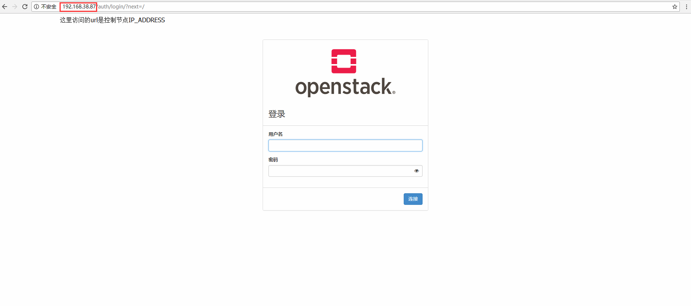
2. 成功登陆后，看到一个很简洁的界面，分为三个部分，分别是项目、管理员、身份管理。
    - 项目，根据登陆的用户来显示用户拥有的镜像、实例、网络等信息
        - 计算：上传镜像、增删改查实例等
        - 网络：可以增删改查网络配置，创建、配置内部网络、外部网络，路由器等
        - 云编排
    - 管理员，由于我登陆的是管理员账号，会有这个部分显示。可以利用管理员权限来修改这些信息。
        - 概况：有点像监控的功能，看内存啊、实例数量啊之类的信息
        - 虚拟机管理
        - 主机聚合
        - 实例
        - 卷
        - 网络
        - 路由
        - ...
        - 系统信息：可以看启动了什么服务
    - 身份管理，管理员还可以对用户的身份、组和角色进行修改
        - 用户：包括neutron、heat、cinder等等，用于keystone验证身份。
        - 组：对用户进行分组，限制权限之类的。
        - 角色：不同角色拥有的权限也是不一样的
3. 如果说刚刚那一步是走马观花的看一遍的话，下面就是实际操作了。首先我们可以试下上传一个镜像，这里推荐cirror,大概12MB左右的镜像，我们用它来创建实例，并且测试实例之间的网络。

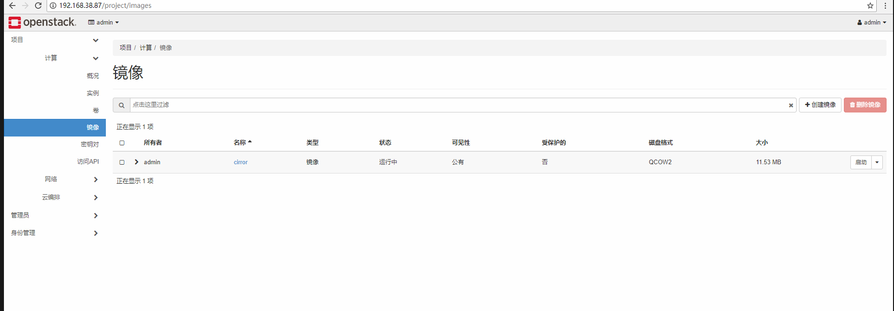
**注意**：
- 上传镜像的类型选择为qcow2
- 如果是虚拟机创建，如果最后开启实例不成功，可能启动实例会一直停留在GRUB阶段，我们需要修改`nova-api`和`nova-compute`，并且虚拟机设置需要支持Intel VT-x/EPT 或 AMD-V/RVI(V)，
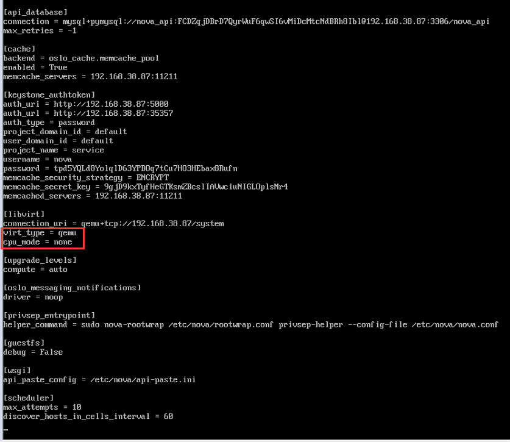
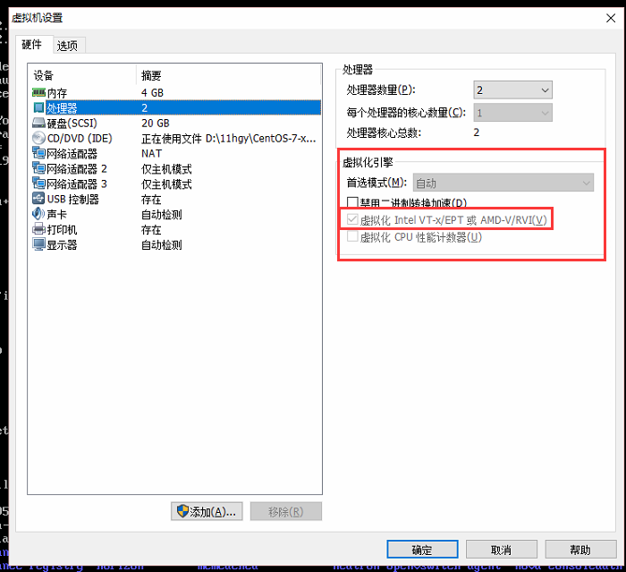
cirrors镜像的下载地址在网络都可以找到：(这里提供一个)
 http://download.cirros-cloud.net/

 4. 接下来创建网络，为了测试，我们分别创建内部网络和外部网络。并且为这两个网络建立子网。两个网络用路由器进行连接，进行数据通信。路由器关联两个接口，一个是关联内部网络的接口，一个是关联外部网络的接口。
 实例可以建立在内部网络上，也可以建立在外部网络上，如果内部网络之间的实例需要通信，用的是内部网络的ip进行通信，如果内部网络的一个实例要与外部网络的一个实例进行通信，我们需要为内部网络的实例分配浮动ip，简单来说就是分配一个外部网络的ip，然后两个不同网络的实例就可以进行通信了。

 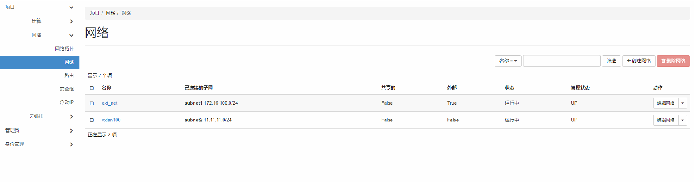
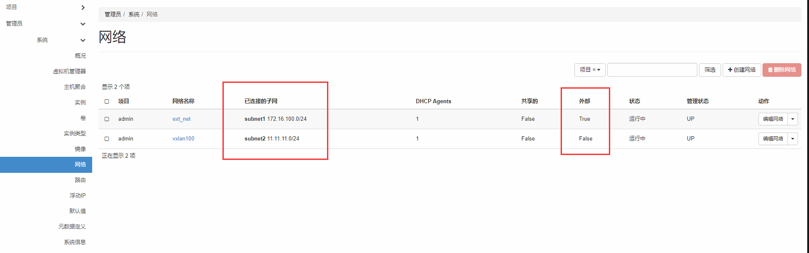
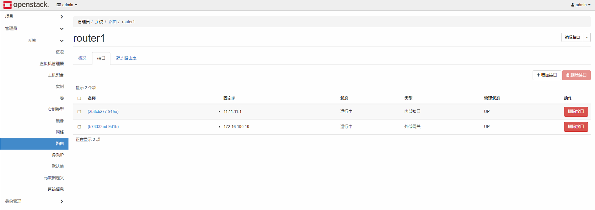
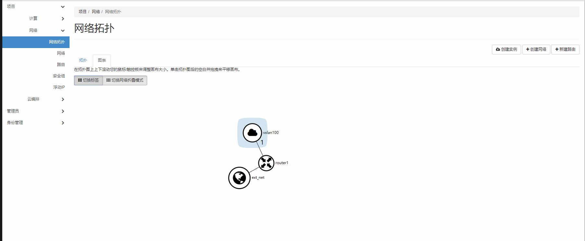

5. 管理安全组规则，其实有点像在配置iptable，设置入口和出口。这里设置了两组规则，icmp和ssh，用于后面的测试。
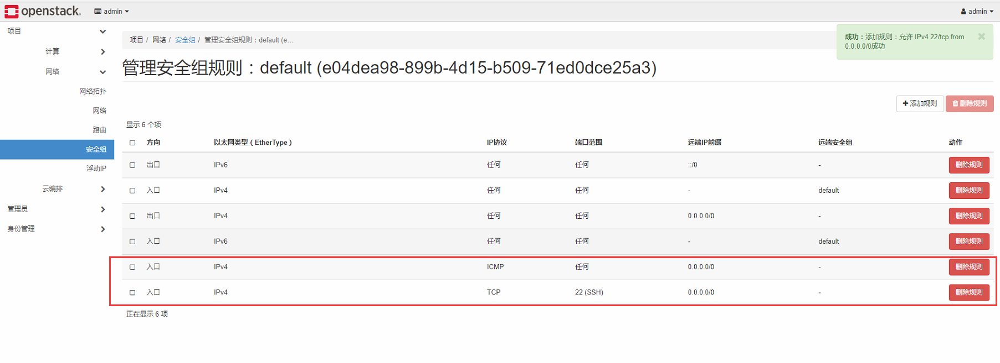

6. 创建实例
`*`是必须填的，也就是配置实例之前你要现有这些配置可以选才行。缺了其中一个都不能创建成功。
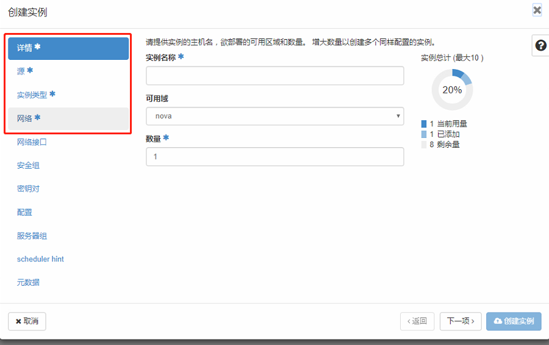
创建成功后，我们可以通过控制台连入实例，进行命令行交互。也可以查看相关的日志、操作日志。
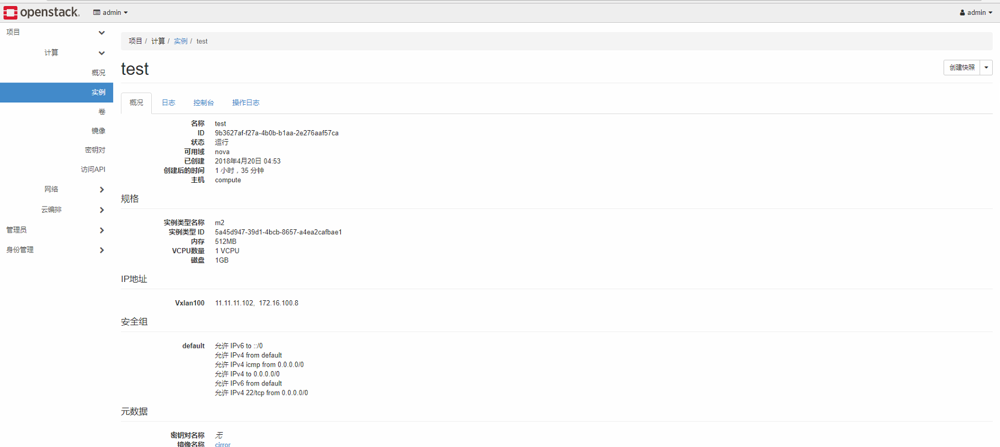
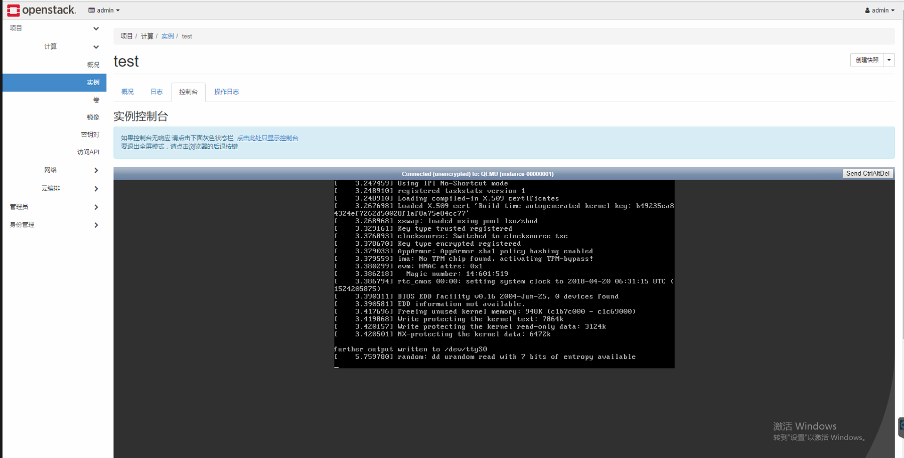

7. 然后就是看实例之间的通信情况。
    - 外部网络
        - test0
    - 内部网络
        - test1（分配浮动ip）
        - test2

**可做操作**：
用实例test1来ping实例test2
用实例test2来ping实例test0
用实例test1来ping实例test0
尝试用ssh来链接test0，test1，test2
