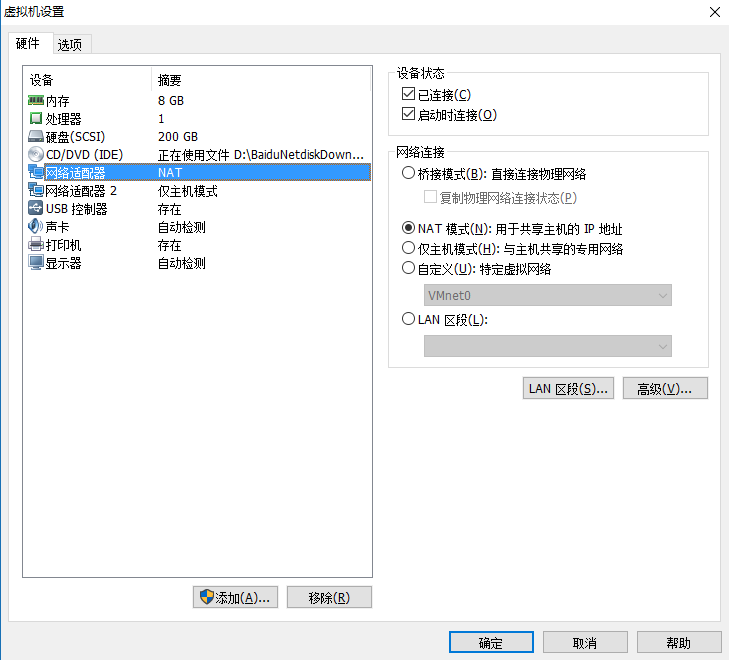
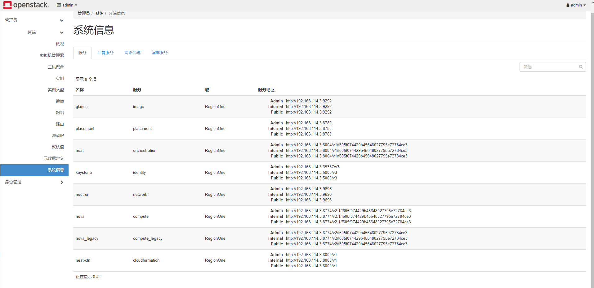
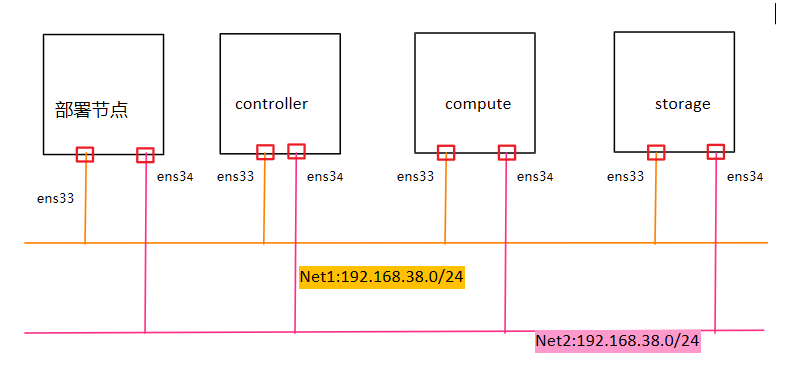

# kolla部署openstack

## 单节点
- **下载镜像 kolla-ocata**(来自 http://www.chenshake.com/kolla-ocata-iso-release-notes/)
- **vmware + kolla-ocata**

从图中可以看到网卡配置了两个（一个为NAT模式，一个为仅主机模式）。内存分配了8G，硬盘分配了200GB。

- **通过iso引导**，启动镜像，选择`install centos7.2 and kolla`
- **经过漫长的等待，成功开机**
- **修改虚拟机的网络**
    - 修改centOS 7的网络配置
        1. 进入目录`cd  /etc/sysconfig/network-scripts/`
        2. 然后查看对应网卡的文件`vi  ifcfg-ens33`
        3. 接着就是修改`IPADDR`,`GATEWAY0`,`BOOTPROTO`,`ONBOOT`, `DNS`,`PREFIXO0`等信息。修改的参考来自于vmware的虚拟网络编辑器
        4. 重启网络：`service network restart`
        5. 通过`ip addr`看自己的网络配置
- **修改部分配置文件以适应自己的环境**
    - 修改`/etc/hosts`文件，`10.99.0.2 control01`修改为`ens33_IPADDR control01`
    - 修改`/etc/kolla/globals.yml`文件，将出现的`10.99.0.2`改为`ens33_IPADDR`

- **执行部署**（这里默认用的配置文件是all-in-one）
```shell
 /root/kolla-ansible-4.0.3.dev36/tools/kolla-ansible deploy
 ```
 - **测试是否成功**
dashboard访问地址 http://ens33_IPADDR/
username admin
password 99cloud

后续的工作是ubuntu上尝试Kolla安装Ocata 单节点。

- **查看启动的容器**
    ```shell
    docker ps -a
    ```
- 所有的日志都存放在fulentd容器中
    ```shell
    docker exec -it fluentd bash
    ```


参考：
http://blog.csdn.net/dylloveyou/article/details/77148560

## 多节点
多节点环境，我们采用一个部署节点，一个controller节点，一个compute节点，一个storage节点
步骤：
- 设置网络、主机名

- ssh互相ping通，将部署节点的公钥放到其他节点上
    ```
    ssh-keygen -t -rsa//生成公钥
    ssh-copy-id controller//分发公钥给controller节点
    ssh-copy-id compute//分发公钥给compute节点
    ssh-copy-id storage//分发公钥给storage节点
    ```
- 设置网络代理（这里我用的是shadowsocks+privoxy)
如果不设置网络代理，无法获取许多资源。后面如果docker安装的版本不对，也不能安装成功。因此经过一番挣扎之后，设置了网络代理来获取资源。
- 设置selinux, firewalld
关闭selinux、firewalld
- 加入docker.repo源
- 安装docker-1.12.6，并且配置kolla.conf
- 安装
- 设置docker的私有仓库的源，编辑`/usr/lib/systemd/system/docker.service`文件
    ```
    ExecStart=/usr/bin/dockerd --insecure-registry 部署节点IP:4000
    ```
- 部署节点运行stop指令停止openstack容器，然后配置multinode，修改global.yml以及password.yml，进行prechecks，然后deploy
这里如果prechecks全部都通过了，deploy也不一定会成功，还是要看部署的时候的输出，然后根据日志来修改相关的配置，缺哪补哪。
    ```
    cd /root/kolla-ansible-4.0.3.dev36/tools/
    ./kolla-ansible stop//停止相关的容器
    ./kolla-ansible prechecks -i /home/mymultinode//安装前检查
    ./kolla-ansible deploy -i /home/mymultinode//开始部署
    ```
- 在浏览器中打开http://controller_ipaddr,成功打开dashboard，并且进行一些简单的功能测试
- 在各个节点上也可以查看docker容器的运行情况
```
    docker ps -a
```
这里注意哦，如果你是像我一样在虚拟机上建openstack环境的话，还要改两个地方，在controller节点，找到nova-api的配置文件`nova.conf`,在compute节点，找到nova-compute的配置文件`nova.conf`，然后添加一些内容.

    [libvirt]

    virt_type=qumu
    cpu_mode=none

    ```
