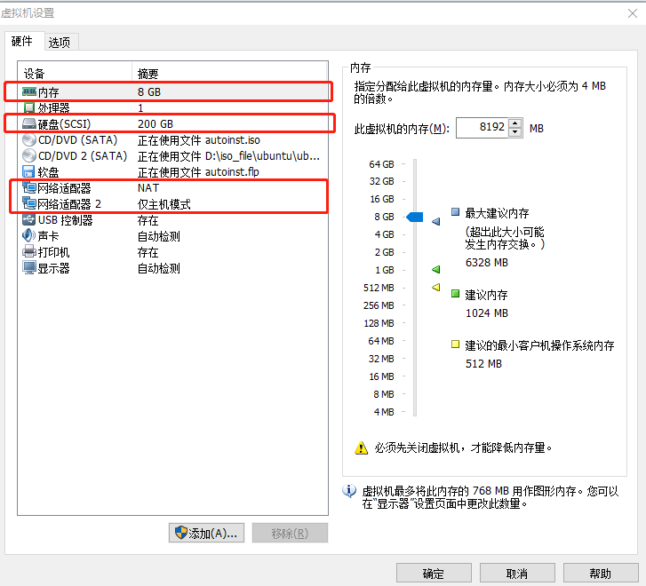

#记录ubuntu安装kolla单节点（all in one)过程
- vmawar + ubuntu16.04
虚拟机系统配置如下图所示：

- 部署文档，参考官网上提供的文档：
https://docs.openstack.org/kolla-ansible/latest/user/quickstart.html
1. **安装pip包管理并且确保它是最新的版本，以及pip的相关依赖**
```shell
apt-get update
apt-get install python-pip
pip install -U pip
apt-get install python-dev libffi-dev gcc libssl-dev python-selinux
```
2. **安装ansible**
ansible版本要大于2.0
```shell
pip install -U ansible
or
apt-get install ansible
```
3. **修改文件`/etc/ansible/ansible.cfg`**
```
[defaults]
host_key_checking=False
pipelining=True
forks=100
```
4. **Install Kolla-ansible for deployment or evaluation**
安装kolla-ansible
```
pip install kolla-ansible
```
复制相关的文件`global.yml`和`password.yml`到`/etc/kolla/`目录下
```
cp -r /usr/local/share/kolla-ansible/etc_examples/kolla /etc/kolla/
```
复制all-in-one和multinode的inventory文件到当前目录里下
```
cp /usr/local/share/kolla-ansible/ansible/inventory/* .
```
5. **Install Kolla for development**
- 从git上获取Kolla和kolla-ansible的仓库
```
git clone https://github.com/openstack/kolla
git clone https://github.com/openstack/kolla-ansible
```
- 把配置文件(`global.yml`和`passwords.yml`)复制到`/etc/kolla`目录下
- 复制`all-in-one`和`multinode`的`inventory`文件到`/etc/kolla`目录里下
```
cp -r kolla-ansible/etc/kolla /etc/kolla/
cp kolla-ansible/ansible/inventory/* .
```
6. **准备初始化配置**
- 下一步是准备我们的Inventory文件。Inventory是一个可编辑的文件，其中我们指定节点角色和访问凭证。
    - all in one:在本地主机上部署单个节点OpenStack。
    - multinode:支持分开的主机或者多节点
- 生成kolla passwords
```
//针对第4步(deployment or evaluation)
kolla-genpwd
//针对第5步(development)
cd kolla-ansible/tools
./generate_passwords.py
```
7. **Kolla globals.yml**
```
kolla_base_distro: "ubuntu"//centos, ubuntu, debian...
kolla_install_type: "source"//binary，source
openstack_release: "pike"

```
