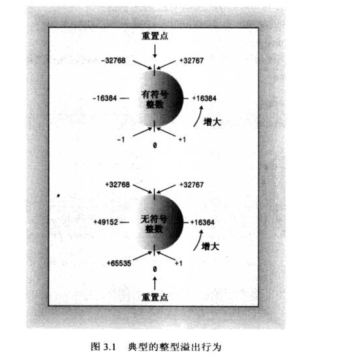

#目录

[TOC]
## C++基本类型分类
- 整型
    - 符号整型：signed char, short, int, long, long long
    - 无符号整型：unsigned ...
- 浮点型：float, double, long double

## 整形
根据宽度**width**来排序
char < short < int < long < long long
- short 至少16位
- int至少和short一样长
- long至少32位，且至少与int一样长
- long long 至少64位，且至少与long一样长

### 整型 short,int,long和long long
**宽度，表示范围**
很多系统直接用最小长度，short为16位，long为32位，但int可以有很多选择：16、24、32
short,int, long, long long 都是符号类型，因此在每种类型的取值范围中，负值和正值几乎相同，例如，16位的int的取值范围为-32768到+32767

sizeof()返回类型或变量的长度，单位为byte
位数=8*sizeof(),MAX = 2^(位数)/2-1; MIN = -2^(位数)/2
以下结果来自64位windows10系统：
|符号类型|sizeof()|MAX|MIN|
|---|---|----|--|--|
|char|1 byte|CHAR_MAX = 127|CHAR_MIN = -128|
|short|2 bytes|SHRT_MAX = 32767|SHRT_MAX = -32768|
|int|4 bytes|INT_MAX = 2147483647|INT_MIN = -2147483648|
|long|4 bytes (根据系统和编译器来定)|LONG_MAX = 2147483647|LONG_MIN = -2147483648|
|long long|8 bytes|LLONG_MAX = 9223372036854775807|LLONG_MIN = -9223372036854775809|
sizeof(char) <= sizeof(short) <= sizeof(int) <= sizeof(long) <= sizeof(long long)

**无符号类型**
unsigned short与short

```
short a = SHRT_MAX;
unsigned short b = a;
a = a+1;//越界，signed无法表示大于SHRT_MAX的数
b = b+1;
cout<<a<<" "<<b<<endl;
//输出结果显示//
-32768 32768

a = b = 0;
a = a-1;
b = b-1;//越界，unsigned无法表示负数
cout<<a<<" "<<b<<endl;
//输出结果显示//
-1 65535
```
unsigned short: ->[1,32767]->[-32768,-1]->[1,32767]->[-32768,-1]->
short: ->[1,32767]->[32768,65535]->[1,32767]->[32768,65535]->


### 其他整型类型
**char类型：字符和小数点**
char类型专为存储字符（如字母和数字）而设计。
常用的符号集为ASCII字符集。举例：字母A为65,字母M为77
**bool类型**
bool is_ready = ture;
bool is_ready = false;
sizeof(bool) 为 1

## CONST限定符
常量被初始化之后，其值被固定了，编译器不允许修改该常量的值。
```
const int Months = 12;//可以在程序中作为常量使用Months，Months只读，不能修改该值
```
## 浮点数
C++第二种基本类型。可以表示带小数部分的数字。
特别地，E表示法，
>
    3.45E+6等价于3.45*(10^(6))
    3.45E-6等价于3.45*(10^(-6))

float < double < long double
float 至少32位
double 至少48位，且不少于float,
long double 至少和double一样多。通常为80、96或128位
```
#include<iostream>
#include<iomanip>
using namespace std;
int main(){
	cout<<fixed<<setprecision(6)<<3E2<<endl;//保留6位小数
	return 0;
}
//输出结果
300.000000
```

##sizeof()部分问题
```
带有虚函数的struct结构体
struct A{
    virtual fun(){}
}
sizeof(A) = 8（因为有个指向虚函数表的地址）
不带有虚函数的struct结构体
struct B{
    fun(){}
}
sizeof(B) = 1
```
```
#include<iostream>
using namespace std;
struct st_t {
	int status;
	short *pdata;
	char errstr[32];
};
int main(){
	st_t st[16];
	char *p = (char *)(st[2].errstr+32*16);
	cout<<sizeof(st_t)<<endl;
	cout<<sizeof(st[0].status)<<endl;
	cout<<sizeof(st[0].pdata)<<endl;
	cout<<sizeof(st[0].errstr)<<endl;
	return 0;
}
//输出结果（64位系统）
结构体的大小：8+8+32*1=48
4(int原本为4个字节，然后要与后面对齐，因此补全为8)
8(指针为8bytes)
32(char为1bytes)
//32位系统
结构体的大小：4+4+32 = 40
4(int原本为4个字节)
4(指针为4bytes)
32(char为1bytes)
```
**内存对齐问题**
```
struct A{
    int a;
    char b;
    short c;
}
struct B{
    char b;
    int a;
    short c;
}
//输出结果
sizeof(A) = 8
sizeof(B) = 12
```
**原因：**
1. **平台原因(移植原因)**：不是所有的硬件平台都能访问任意地址上的任意数据的；某些硬件平台只能在某些地址处取某些特定类型的数据，否则抛出硬件异常。
2. **性能原因**：数据结构(尤其是栈)应该尽可能地在自然边界上对齐。原因在于，为了访问未对齐的内存，处理器需要作两次内存访问；而对齐的内存访问仅需要一次访问。——内存访问速度提升

**规则：**
1. 对于结构的各个成员，第一个成员位于偏移为0的位置，以后每个数据成员的偏移量必须是min(#pragma pack()指定的数，这个数据成员的自身长度) 的倍数。
2. 在数据成员完成各自对齐之后，结构(或联合)本身也要进行对齐，对齐将按照#pragma pack指定的数值和结构(或联合)最大数据成员长度中，比较小的那个进行。
pragma pack(n) 表示设置为n字节对齐。 VC6默认8字节对齐
32位默认4字节对齐
64位默认8字节对齐

**分析：**
分析struct B: char占一个字节，起始偏移为0 ，int 占4个字节，min(#pragma pack()指定的数，这个数据成员的自身长度) = 4（默认8字节对齐），所以int按4字节对齐，起始偏移必须为4的倍数，所以起始偏移为4，在char后编译器会添加3个字节的额外字节，不存放任意数据。short占2个字节，按2字节对齐，起始偏移为8，正好是2的倍数，无须添加额外字节。到此规则1的数据成员对齐结束，此时的内存状态为：（x表示额外添加的字节）
```
oxxx|oooo|oo
0123 4567 89 （地址）
```
共占10个字节。还要继续进行**结构本身的对齐**，对齐将按照#pragma pack指定的数值和结构(或联合)最大数据成员长度中，比较小的那个进行，st1结构中最大数据成员长度为int，占4字节，而默认的#pragma pack 指定的值为8，所以结果本身按照4字节对齐，结构总大小必须为4的倍数，需添加2个额外字节使结构的总大小为12 。此时的内存状态为：
```
oxxx|oooo|ooxx
0123 4567 89ab  （地址）
```
到此内存对齐结束。所以是占用了12个字节而非7个字节


## 总结
- C++基本类型分为两类
- 整型从最小到最大的排序：bool, char, short, int, long, long long
- 字符通过数值编码来表示。ASCII中A表示65
- 强制类型转换的时候，如果无损和不改变数据的话，是‘安全’的，例如int转为long；但是如果是long转为int的时候要注意。
