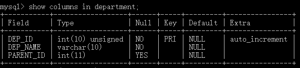
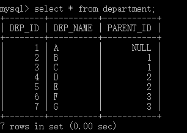
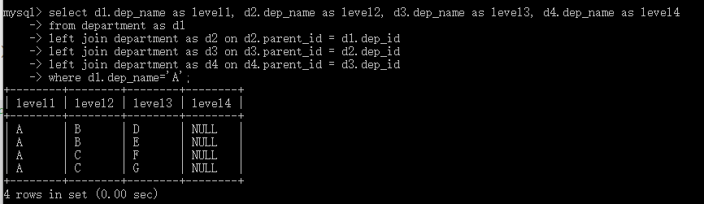
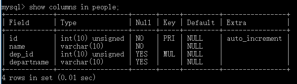
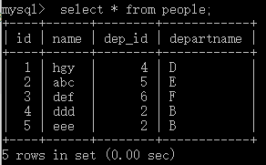
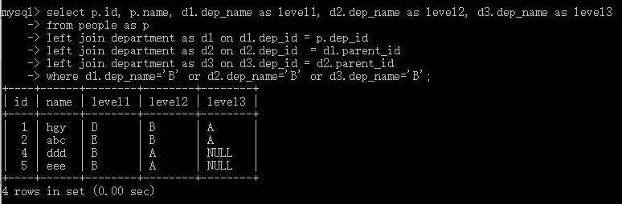
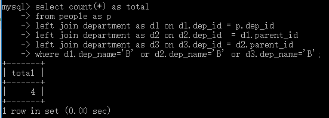
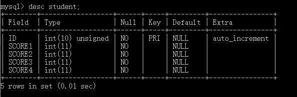
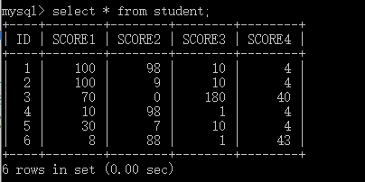
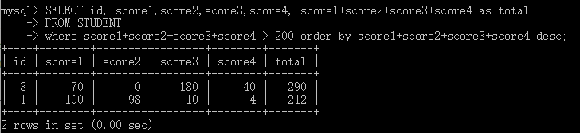

面试的时候遇到了两道数据库设计的题，当时没有回答完全正确，现在将思考和实践的结果复现一下，查漏补缺。
# 第一题：层级数据库设计
题目描述：现在有10万条左右的数据，记录一个部门的员工。大部门下是层级结构，有许多个子部门。比如，一级部分A，二级部门A',B',C'，三级部门A'',B'',C''。试问如何设计数据库，我们需要统计二级部分A'下的所有人数。
分析：
这里用到了一个层级数据库的设计。
```
CREATE TABLE DEPARTMENT(
    DEP_ID INT UNSIGNED AUTO_INCREMENT,
    DEP_NAME VARCHAR(10) NOT NULL,
    PARENT_ID INT,
    PRIMARY KEY(DEP_ID)
)CHARSET=utf8;
```

插入数据
```
INSERT INTO DEPARTMENT (DEP_NAME, PARENT_ID)
VALUES
('A',NULL);
INSERT INTO department VALUES(1,'A',NULL),(2,'B',1),(3,'C',1),
        (4,'D',2),(5,'E',2),(6,'F',3),(7,'G',3);
```
|dep_id|dep_name|parent_id|
|--|--|--|--|
|1|A|NULL|
|2|B|1|
|3|C|1|
|4|D|2|
|5|E|2|
|6|F|3|
|7|G|3|

显示层级
```
select d1.dep_name as level1, d2.dep_name as level2, d3.dep_name as level3, d4.dep_name as level4
from department as d1
left join department as d2 on d2.parent_id = d1.dep_id
left join department as d3 on d3.parent_id = d2.dep_id
left join department as d4 on d4.parent_id = d3.dep_id
where d1.dep_name='A';
```


然后再存储部门人员的信息
```
create table people(
    id INT UNSIGNED AUTO_INCREMENT,
    name varchar(10) not null,
    dep_id INT UNSIGNED,
    departname varchar(10),
    FOREIGN KEY (dep_id) REFERENCES department(dep_id),
    primary key(id)
    )charset=utf8;
```

```
INSERT INTO people VALUES(1,'hgy',4,'D'),(2,'abc',5,'E'),(3,'def',6,'F'),
        (4,'ddd',2,'B'),(5,'eee',2,'B');
```

查找二级部门为B的人，并且列出了他的上级部门信息
```
select p.id, p.name, d1.dep_name as level1, d2.dep_name as level2, d3.dep_name as level3
from people as p
left join department as d1 on d1.dep_id = p.dep_id
left join department as d2 on d2.dep_id  = d1.parent_id
left join department as d3 on d3.dep_id = d2.parent_id
where d1.dep_name='B' or d2.dep_name='B' or d3.dep_name='B';
```

查找二级部门为B的总人数
```
select count(*) as total
from people as p
left join department as d1 on d1.dep_id = p.dep_id
left join department as d2 on d2.dep_id  = d1.parent_id
left join department as d3 on d3.dep_id = d2.parent_id
where d1.dep_name='B' or d2.dep_name='B' or d3.dep_name='B';
```
|id|name|department_id|departname|
|---|--|--|--|
|1|hgy|4|D|
|2|abc|5|E|
|3|def|6|F|
|4|ddd|2|B|
|5|eee|2|B|
应该考虑到有的人在二级部门（可能没有三级部门，没有四级部门），有的人在一级部门，有的人在四级部门（有一级部门，二级部门，三级部门，四级部门）。

# 第二题：简单的统计
题目描述：现在有一批学生的成绩，求四门学科总分大于200的学生，并且按逆序排列。
```
CREATE TABLE STUDENT(
    ID INT UNSIGNED AUTO_INCREMENT,
    SCORE1 INT NOT NULL,
    SCORE2 INT NOT NULL,
    SCORE3 INT NOT NULL,
    SCORE4 INT NOT NULL,
    PRIMARY KEY(ID)
)CHARSET=utf8;
```

```
INSERT INTO STUDENT VALUES(1,100,98,10,4),(2,100,9,10,4),(3,70,0,180,40),(4,10,98,1,4),(5,30,7,10,4),(6,8,88,1,43);
```

根据四门成绩的总分进行排序
```
SELECT id, score1,score2,score3,score4, score1+score2+score3+score4 as total
FROM STUDENT
where score1+score2+score3+score4 > 200 order by score1+score2+score3+score4 desc;
```

这里其实考察了一个不能直接用别名来排序的知识点，当时直接没有反应过来，现在想想实在是对于知识点不太熟悉。
