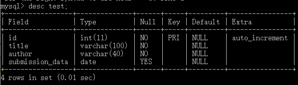
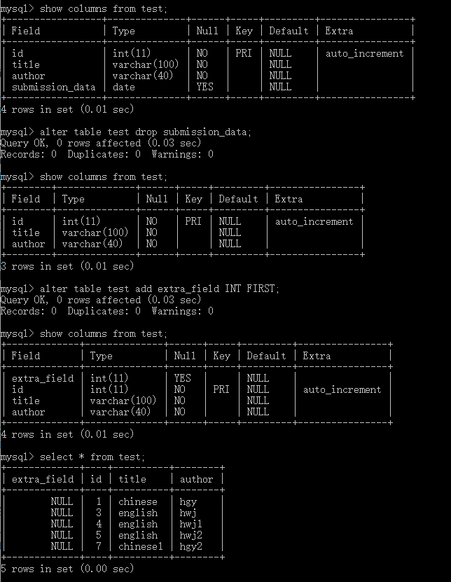

[TOC]

## 数据类型
分为三种： 数值、字符串、日期
记录一些用过的、比较特殊的吧：
- VARCHAR: 0-65535字节，变长字符串
- BLOB: 0-65535字节，二进制形式的长文本
- DATATIME: YYYY-MM-DD HH:MM:SS 混合日期和时间值
- TIMESTAMP:YYYYMMDD HHMMSS 混合日期和时间值、时间戳
- `PRIMARY KEY()`或者`UNIQUE`能够保证数据的唯一性

## 数据库database操作
### 创建数据库
```
create DATABASE DATABASE_NAME;
```
### 使用数据库
```
use DATABASE_NAME;
```
### 删除数据库
```
drop database TABLE_NAME
```

### 建表语句
```
CREATE TABLE test(
   id INT UNSIGNED AUTO_INCREMENT,
   title VARCHAR(100) NOT NULL,
   author VARCHAR(40) NOT NULL,
   submission_date DATE,
   PRIMARY KEY (id)
)ENGINE=InnoDB DEFAULT CHARSET=utf8;
```


```
desc test;
```

- 如果你不想字段为 NULL 可以设置字段的属性为 **NOT NULL**， 在操作数据库时如果输入该字段的数据为 **NULL**，就会报错。
- **AUTO_INCREMENT** 定义列为自增的属性，一般用于主键，数值会自动加1。
- **PRIMARY KEY**关键字用于定义列为主键。 您可以使用多列来定义主键，列间以逗号分隔。
- **ENGINE** 设置存储引擎，**CHARSET** 设置编码。


### 插入表
```
INSERT INTO TEST1(title, author,submission_date)
VALUES
("chinese","hgy",now() );
```


### 查询数据库库表
```
SELECT * FROM test
WHERE test.title = "chinese"
LIMIT 1 OFFSET 2;
```
**LIMIT** 属性设定返回的记录数
**OFFSET** 指定SELECT语句开始查询的数据偏移量
```
limit 2 offset 1
```
从第2条开始(OFFSET)，读取2条数据(LIMIT)，即取的是第2条和第3条数据。（offset是从第几条开始，mysql中实际取值的行在当前值的基础上+1，即mysql的记行从0开始）
```
limit 2,1
```
从第3条开始读取1条数据，即取的是第3条数据（limit中较为前面的值是从第几条开始，同上，mysql中实际取的是当前值基础上+1的行）

**WHERE子句**
- `AND`,`OR`
- `=`,`<>`,`!=`,`>`,`<=`,`>=`
- WHERE 子句也可以运用于 SQL 的 **DELETE** 或者 **UPDATE** 命令。
- WHERE 子句类似于程序语言中的 **if 条件**，根据 MySQL 表中的字段值来读取指定的数据。

: 注意：
**BINARY** 关键字区分大小写
```
SELECT * FROM `TABLE_NAME` [WHERE BINARY Clause]
```


**LIKE** 包含某些字符的所有记录
```
SELECT * FROM `TABLE_NAME` [WHERE ... LIKE ...]
```


- 如果没有`%`的时候，`like`可以跟等号`=`进行替换，

- 可以尝试用`%`，表示任意字符

**REGEXP**操作符来进行正则化表达式的匹配

|符号|描述|
|-----|-----|
|`^`	|匹配输入**字符串的开始位置**。如果设置了 RegExp 对象的 Multiline 属性，`^` 也匹配 `\n` 或 `\r` 之后的位置。|
|`$`|匹配输入**字符串的结束位置**。如果设置了RegExp 对象的 Multiline 属性，`$` 也匹配 `\n` 或 `\r` 之前的位置。|
|`.`|匹配除 `\n` 之外的任何单个字符。要匹配包括 `\n` 在内的任何字符，请使用象 `[.\n]` 的模式。|
|`[...]`|字符集合。匹配所包含的任意一个字符。例如， `'[abc]'` 可以匹配 `plain` 中的 `a`。|
|`[^...]	`|负值字符集合。匹配未包含的任意字符。例如， `[^abc]` 可以匹配 `plain `中的`p`。|
| `p1|p2|p3`|	匹配 p1 或 p2 或 p3。例如，`z|food` 能匹配 `z` 或 `food`。`(z|f)ood` 则匹配 `"zood"` 或 `"food"`。|
|`*`|	匹配前面的子表达式**零次或多次**。例如，zo* 能匹配 "z" 以及 "zoo"。* 等价于{0,}。|
|`+`|匹配前面的子表达式**一次或多次**。例如，'zo+' 能匹配 "zo" 以及 "zoo"，但不能匹配 "z"。+ 等价于 {1,}。|
|`{n}`|n 是一个非负整数。**匹配确定的 n 次**。例如，'o{2}' 不能匹配 "Bob" 中的 'o'，但是能匹配 "food" 中的两个 o。|
|`{n,m}`|	m 和 n 均为非负整数，其中n <= m。**最少匹配 n 次且最多匹配 m 次。**|

### 更新数据库表
```
UPDATE TABLE_NAME SET field1= new_Value, field2=new_Value [WHERE Clause]
```


### 删除表
- delete：删除表中某些数据
- drop： 删除表
- truncate: 清除表内数据，但是保留表结构
```
DELETE FROM `TABLE_NAME` [WHERE Clause];//如果没有WHERE Clause,会把所有记录都删除
TRUNCATE TABLE `TABLE_NAME`;
drop table `TABLE_NAME`;
```


### 并集
MySQL **UNION** 操作符用于连接两个以上的 SELECT 语句的结果组合到一个结果集合中。多个 SELECT 语句会删除重复的数据。
```
SELECT expression1, expression2, ... expression_n
FROM tables
[WHERE conditions]
UNION [ALL | DISTINCT]
SELECT expression1, expression2, ... expression_n
FROM tables
[WHERE conditions];
```
默认是 **UNION DISTINCT** 的,去除重复的部分。如果不想去重，加上 **UNION ALL**


### 排序
```
SELECT field1, field2,...fieldN table_name1, table_name2...
ORDER BY field1, [field2...] [ASC [DESC]]
```
默认是升序排列


### 分组
GROUP BY根据某些属性进行分组统计，可以使用COUNT(),AVG(),SUM()等函数


用**WITH ROLLUP**来进行对统计出来的值再进行相同的统计
利用coalesce设置一个可以取代NULL的名称


### 连接
- **INNER JOIN**:获取两个表中字段匹配关系的记录。感觉有点像交集。
两种方法等价：

- **LEFT JOIN**:获取左表所有记录，即使右表没有对应匹配的记录。左表没有的属性，但在右表有的话就补充进去。如果右表没有的话，就填充为NULL。
- **RIGHT JOIN**: 与 LEFT JOIN 相反，用于获取右表所有记录，即使左表没有对应匹配的记录。


### 修改
```
ALTER TABLE testalter_tbl DROP i;//删除某个属性
ALTER TABLE testalter_tbl ADD i INT FIRST;//添加某个属性
```


## 事务
MYSQL事务用于处理操作量大，复杂度高的数据。比如说你在管理系统里面删除一个人员，需要删除他的相关信息，涉及到其他表其他属性，这些sql语句构成了一个事务。如果删到一半失败了，那么事务将执行不成功，数据库会ROLL BACK。
四个特性**ACID**：原子性(**A**-tomicity)、一致性(**C**-onsistency)、隔离性(**I**-solation)、持久性(**D**-urability)

- 原子性：一个事务中的所有操作要么执行，要么不执行，如果中途某个操作执行失败了，就会回滚到事务开始的状态
- 一致性：在事务的开始和结束后，数据库的完整性没有被破坏。
- 隔离性：数据库允许多个并发事务同时对其数据进行读写和修改的能力，隔离性可以防止多个事务并发执行时由于交叉执行而导致数据的不一致。事务隔离分为不同级别，包括读未提交（Read uncommitted）、读提交（read committed）、可重复读（repeatable read）和串行化（Serializable）。
- 持久性：处理成功事务后，对数据库的修改是持久的。

**控制语句**
`BEGIN`或者`START TRANSACTION`
`COMMIT`
`ROLLBACK`
`SAVEPOINT identifier`
`RELEASE SAVEPOINT identifier`
`ROLLBACK TO identifier`
`SET TRANSACTION`

**MYSQL 事务处理主要有两种方法**
1. 用 BEGIN, ROLLBACK, COMMIT来实现
BEGIN 开始一个事务
ROLLBACK 事务回滚
COMMIT 事务确认
2. 直接用 SET 来改变 MySQL 的自动提交模式:
SET AUTOCOMMIT=0 禁止自动提交
SET AUTOCOMMIT=1 开启自动提交

## 索引
索引可以提高MYSQL的检索速度。
索引是应用在	SQL 查询语句的条件(一般作为 WHERE 子句的条件)。
索引也是一张表，该表保存了主键与索引字段，并指向实体表的记录。
- 单列索引（一个表可以有多个单列索引）
- 组合索引（一个索引包含多列）
- 唯一索引，索引列的值必须唯一，但允许有空值

优点：
提高数据检索效率，降低数据库的IO成本
通过索引来排序，降低数据排序的成本，降低CPU消耗

缺点：
1. 索引降低了更新表的速度（insert、update和delete），不仅要保存数据，还要保存索引文件。
2. 建立索引会占用磁盘空间的索引文件。

MySQL索引结构
- BTree索引
- Hash索引
- full-text全文索引
- R-Tree索引

```
ALTER table `tableName` ADD INDEX `indexName`(`columnName`);//建表后，创建索引
CREATE TABLE mytable(  
    ID INT NOT NULL,   
    username VARCHAR(16) NOT NULL,  
    INDEX `indexName` (username(length))  
);  
DROP INDEX `indexName` ON mytable; //删除索引
CREATE UNIQUE INDEX `indexName` ON mytable(username(length))
SHOW INDEX FROM `table_name`;//显示所有的索引
```
## 场景分析（对重复数据的处理）

### 表中不能有重复的数据
- 设置为主键
- 设置为UNIQUE

### 过滤重复数据
```
SELECT DISTINCT first_name, last_name FROM person_tbl;
SELECT first_name, last_name FROM person_tbl GROUP BY first_name, last_name;
```

### 统计表中重复数据
```
SELECT count(*) as num , first_name, last_name
from person_tbl
GROUP BY first_name, last_name
HAVING num >1;
```

### 删除重复数据
- 建立临时表
```
CREATE TABLE tmp SELECT last_name, first_name, sex FROM person_tbl  GROUP BY (last_name, first_name, sex);
DROP TABLE person_tbl;
ALTER TABLE tmp RENAME TO person_tbl;
```
- 添加索引或者PRIMARY KEY
```
ALTER IGNORE TABLE person_tbl
ADD PRIMARY KEY (last_name, first_name);
```

## SQL注入
定义：把sql语句插入到web表单递交输入域名或页面请求的查询字符串，最终达到欺骗服务器执行的恶意SQL命令。

**防止SQL注入**，我们需要注意以下几个要点：

1.永远 **不要信任用户的输入。对用户的输入进行校验**，可以通过正则表达式，或限制长度；对单引号和 双"-"进行转换等。
2.永远 **不要使用动态拼装sql**，可以使用参数化的sql或者直接使用存储过程进行数据查询存取。
3.永远 **不要使用管理员权限的数据库连接**，为每个应用使用单独的权限有限的数据库连接。
4.**不要把机密信息直接存放**，加密或者hash掉密码和敏感的信息。
5.应用的异常信息应该给出尽可能少的提示，最好 **使用自定义的错误信息对原始错误信息进行包装**
6.**sql注入的检测方法一般采取辅助软件或网站平台来检测**，软件一般采用sql注入检测工具jsky，网站平台就有亿思网站安全平台检测工具。MDCSOFT SCAN等。采用MDCSOFT-IPS可以有效的防御SQL注入，XSS攻击等。

**LIKE语句注入**
like查询时，如果用户输入的值有`_`和`%`，则会出现这种情况：用户本来只是想查询"abcd_"，查询结果中却有"abcd_"、"abcde"、"abcdf"等等
