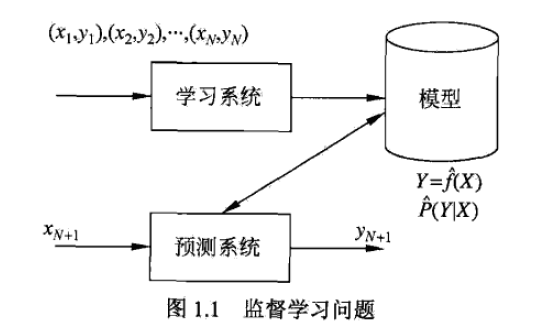

# 统计学习简述
[TOC]
## 目标
考虑学习什么样的模型和如何学习模型，以使得、模型能对数据进行准确的预测与分析，同时也要考虑尽可能的提高学习效率。
## 组成成分
- **监督学习**（本书重点）：模型的假设空间、模型选择的准则和模型学习的方法
    - 从给定的、有限的、用于学习的训练数据集合出发，假设数据是独立同分布产生的，并且假设学习的模型属于某个函数的集合，称为**假设空间**，应用于某个**评价准则**，从假设空间中选取一个最优的模型，使得它对已知训练数据以及未知测试数据在给定的评价准则下有最优的预测；最优模型的选取由**算法**来实现。
    - 学习一个模型，使模型能够对任意的给定的输入，对其对应的输出做出一个好的预测。
    - 基本假设：输入和输出的随机变量X和Y遵循联合概率分布P(X,Y)。但具体定义是未知的。训练数据和测试数据被看做是依联合概率分布P(X,Y)独立同分布产生的。
- 非监督学习
- 半监督学习
- 强化学习
- ...
## 应用
分类、标注与回归问题
- 回归问题
输入变量和输出变量均为连续变量的预测问题
应用于预测输入变量和输出变量之间的关系。回归模型是表示从输入变量到输出变量之间的映射关系，回归问题的学习等价于函数拟合：选择一条函数曲线使其很好的拟合自知数据且很好的预测未知数据。
常用的损失函数是平方损失函数，可以由最小二乘法来求解。

- 分类问题
输出变量为有限个离散变量的预测问题
评价分类器的性能指标的是分类准确度，给定的测试数据集，分类器正确分类的样本数和总样本数之比。
    - TP 将正类预测为正类数
    - FN 将正类预测为负类数
    - FP 将负类预测为正类数
    - TN 将负类预测为负类数
精确率P
$P =TP/(TP+FP)$
召回率R
$R =TP/(TP+FN)$
F1值
$2/F1 =1/P+1/R$
$F1 =2TP/(2TP+FP+FN)$

- 标注问题
输入变量和输出变量均为变量序列的预测问题
标注问题分为学习和标注两个过程。
输入是一个观测序列
输出是一个标记序列或者状态序列
目标在于学习一个模型，使它能够对观测序列给出标记序列作为预测
应用：词性标注、信息抽取

## 基本概念
### 输入空间、特征空间和输出空间
输入空间会比输出空间大得多
$x$ =($x(1)$,$x(2)$,$x(3)$,...,$x(n)$,)
$x(i)$表示x的第i个特征
$x_i$ =($x_i(1)$,$x_i(2)$,$x_i(3)$,...,$x_i(n)$,)
$x_i$表示第i个输入向量
### 联合概率分布
监督学习的基本假设：输入和输出的随机变量X和Y遵循联合概率分布P(X,Y)。但具体定义是未知的。训练数据和测试数据被看做是依联合概率分布P(X,Y)独立同分布产生的。
### 假设空间
监督学习的目的就是学习输入空间到输出空间的一个映射，这个映射由模型来表示。模型属于由输入空间到输出空间的映射的集合，这个集合就是假设空间(hypothesis space)。模型的类型有两种，一种是概率模型P(y|x)，一种是决策函数y=f(x)

分成学习和预测两个过程

## 三要素
### 模型
模型的假设空间包含所有可能的条件概率分布或决策函数
- 空间定义为决策函数的集合
$$F = \{f|Y=f(X)\}$$
$$F = \{f|Y=f_{theta}(X), {theta}∈R\}$$
    - 生成方法 对应 生成模型
    $$P(Y|X) = P(X,Y)/P(X)$$
    典型例子：朴素贝叶斯法，隐马尔可夫模型
    特点：生成方法可以还原出P(X,Y);当样本容量增加时，学到的模型可以更快地收敛于真实模型；当存在隐变量时，仍然可以用生成方法学习

- 空间定义为条件概率的集合
$$F = \{P|P(Y|X)\}$$
$$F = \{P|P_{theta}(Y|X), {theta}∈R\}$$
    - 决策方法 对应 判别模型
    关心给定的输入X，应该预测什么的输出Y
    典型例子：K近邻、感知器、决策树、逻辑斯底回归模型，最大熵模型、支持向量机、提升方法和条件随机场等
    特点：直接学习条件概率P(Y|X)或者决策函数f(X),直接面对预测，学习的准确率更高；可以对数据进行各种程度上的抽象、定义特征并使用特征，可以简化学习问题
### 策略
- 损失函数和风险函数
0-1损失函数、平方损失函数、绝对损失函数、对数损失函数
损失函数数值越小，模型就越好
损失函数的期望：
$$R_{exp}(f) = E_p[L(Y, f(X))] = ∫_ {x*y}L(y,f(x))P(x,y)dxdy$$
$R_{exp}(f)$是模型关于联合分布的期望损失。因为不知道联合概率分布P(X,Y)，所以才要学习。
$$R_{emp}(f) ={1/N}* (L(y_1,f(x_1))+(L(y_2,f(x_2))+(L(y_3,f(x_3))+...+(L(y_N,f(x_N)))$$
$R_{emp}(f)$是模型关于训练样本集的平均损失。
我们的做法：用经验风险估计期望风险，但是结果并不理想，需要对经验风险进行一定的矫正。包含经验风险最小值ERM(样本容量足够大，例子就是最大似然估计，样本容量小的时候出现的问题就是过拟合)和结构风险最小化(SRM, 为了防止过拟合而提出了正则化项)。
$$R_{emp}(f) ={1/N}* (L(y_1,f(x_1))+...+(L(y_N,f(x_N)))+λJ(f)$$
总结：
监督学习问题变为经验风险以及结构风险的最优化问题，最优化的目标函数就是经验风险函数和结构风险函数。
### 算法
求解最优解的算法。通常解析解是不存在的，需要用数值计算的方法求解，其实就是不断去调整模型参数，从而让目标函数尽可能最优，逼近最优解。

## 模型评估与模型选择
- 训练误差和测试误差
- 过拟合和模型选择
过拟合就是一味追求提高训练数据的预测能力，但是所选的模型的复杂度远高于真实模型。表现就是训练误差很小，但是测试误差很大。
- 正则化和交叉验证
正则化项就是在经验风险中加上一个正则化项，正则化项一般是模型复杂度的单调增函数。
交叉验证又分为简单交叉验证、S折交叉验证、留一交叉验证
