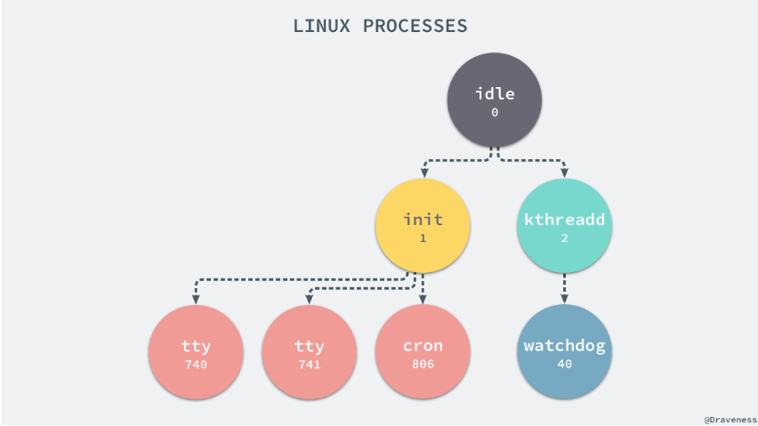
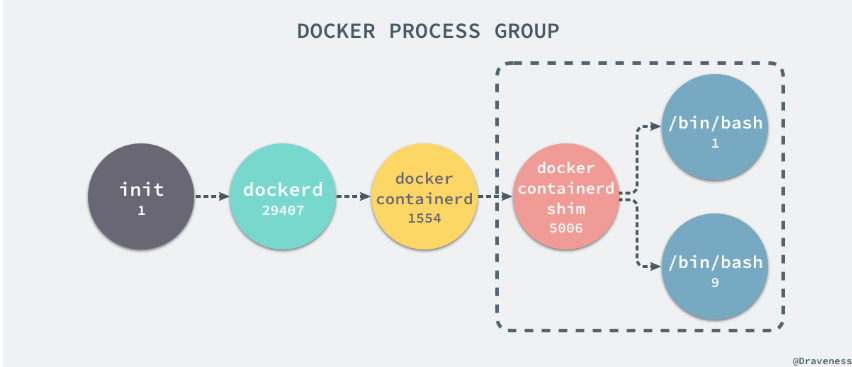
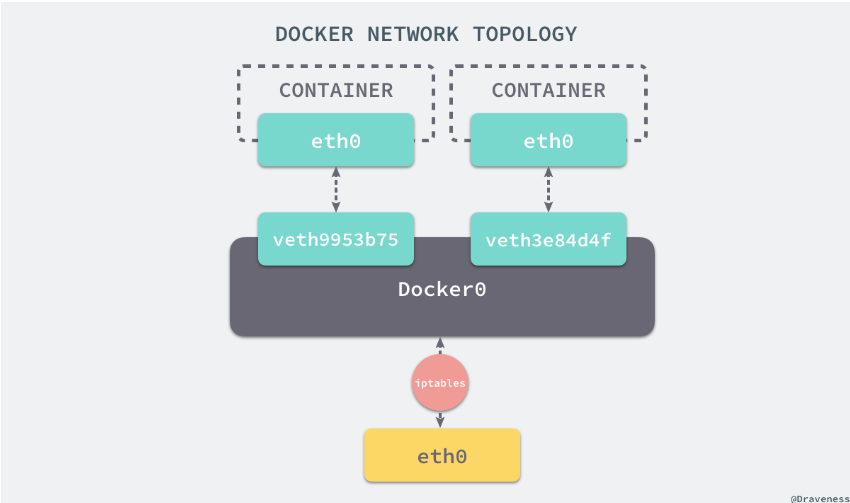
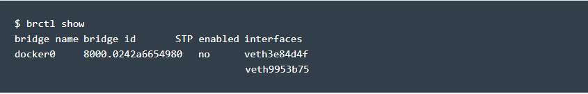
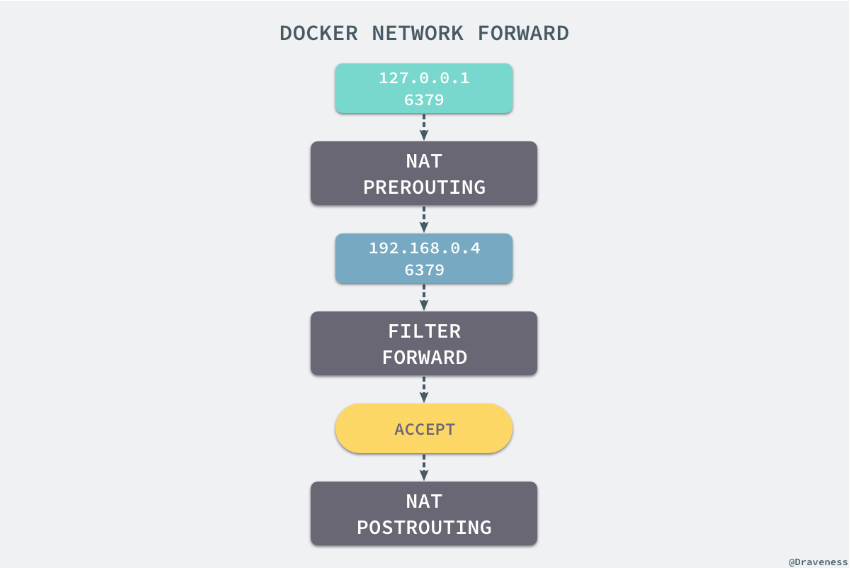
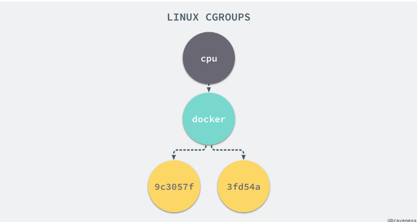
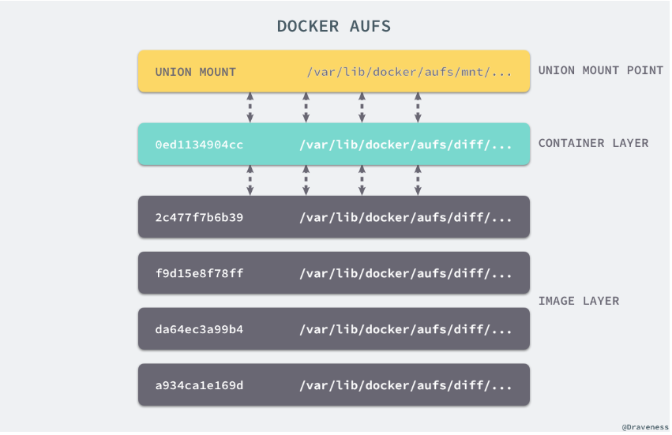
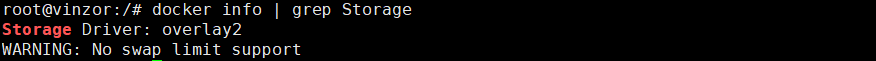

## 核心技术
- cgroup
- namespace
- union file system

## namespace
- 进程
是 Linux 为我们提供的用于分离进程树、网络接口、挂载点以及进程间通信等资源的方法。
Linux 的命名空间机制提供了以下七种不同的命名空间，包括 `CLONE_NEWCGROUP`、`CLONE_NEWIPC`、`CLONE_NEWNET`、`CLONE_NEWNS`、`CLONE_NEWPID`、`CLONE_NEWUSER` 和 `CLONE_NEWUTS`，通过这七个选项我们能在创建新的进程时设置新进程应该在哪些资源上与宿主机器进行隔离。
当前机器上有很多的进程正在执行，在上述进程中有两个非常特殊，一个是 pid 为 1 的 /sbin/init 进程，另一个是 pid 为 2 的 kthreadd 进程，这两个进程都是被 Linux 中的上帝进程 idle 创建出来的，其中前者负责执行内核的一部分初始化工作和系统配置，也会创建一些类似 getty 的注册进程，而后者负责管理和调度其他的内核进程。

在容器里与在容器外查看进程信息得到的结果不一样， Docker 容器成功将容器内的进程与宿主机器中的进程隔离，
在当前的宿主机器上，可能就存在由上述的不同进程构成的进程树：

就是在使用 clone(2) 创建新进程时传入 CLONE_NEWPID 实现的，也就是使用 Linux 的命名空间实现进程的隔离，Docker 容器内部的任意进程都对宿主机器的进程一无所知。
Docker 的容器就是使用上述技术实现与宿主机器的进程隔离，当我们每次运行 docker run 或者 docker start 时，都会在下面的方法中创建一个用于设置进程间隔离的 Spec：
在 setNamespaces 方法中不仅会设置进程相关的命名空间，还会设置与用户、网络、IPC 以及 UTS 相关的命名空间：

- 网络
如果 Docker 的容器通过 Linux 的命名空间完成了与宿主机进程的网络隔离，但是却有没有办法通过宿主机的网络与整个互联网相连，就会产生很多限制，所以 Docker 虽然可以通过命名空间创建一个隔离的网络环境，但是 Docker 中的服务仍然需要与外界相连才能发挥作用。

每一个使用 docker run 启动的容器其实都具有单独的网络命名空间，Docker 为我们提供了四种不同的网络模式，Host、Container、None 和 Bridge 模式。
    - host模式
    - container模式
    - none模式
    - bridge模式
    在这种模式下，除了分配隔离的网络命名空间之外，Docker 还会为所有的容器设置 IP 地址。当 Docker 服务器在主机上启动之后会创建新的虚拟网桥 docker0，随后在该主机上启动的全部服务在默认情况下都与该网桥相连。
 
    在默认情况下，每一个容器在创建时都会创建一对虚拟网卡，两个虚拟网卡组成了数据的通道，其中一个会放在创建的容器中，会加入到名为 docker0 网桥中。
    
    docker0 会为每一个容器分配一个新的 IP 地址并将 docker0 的 IP 地址设置为默认的网关。网桥 docker0 通过 iptables 中的配置与宿主机器上的网卡相连，所有符合条件的请求都会通过 iptables 转发到 docker0 并由网桥分发给对应的机器。
    当有 Docker 的容器需要将服务暴露给宿主机器，就会为容器分配一个 IP 地址，同时向 iptables 中追加一条新的规则。
    
    Docker 通过 Linux 的命名空间实现了网络的隔离，又通过 iptables 进行数据包转发，让 Docker 容器能够优雅地为宿主机器或者其他容器提供服务。
    当我们使用 redis-cli 在宿主机器的命令行中访问 127.0.0.1:6379 的地址时，经过 iptables 的 NAT PREROUTING 将 ip 地址定向到了 192.168.0.4，重定向过的数据包就可以通过 iptables 中的 FILTER 配置，最终在 NAT POSTROUTING 阶段将 ip 地址伪装成 127.0.0.1，到这里虽然从外面看起来我们请求的是 127.0.0.1:6379，但是实际上请求的已经是 Docker 容器暴露出的端口了。
- libnetwork
在容器网络模型中，每一个容器内部都包含一个 Sandbox，其中存储着当前容器的网络栈配置，包括容器的接口、路由表和 DNS 设置，Linux 使用网络命名空间实现这个 Sandbox，每一个 Sandbox 中都可能会有一个或多个 Endpoint，在 Linux 上就是一个虚拟的网卡 veth，Sandbox 通过 Endpoint 加入到对应的网络中，这里的网络可能就是我们在上面提到的 Linux 网桥或者 VLAN。

- 挂载点
在新的进程中创建隔离的挂载点命名空间需要在 clone 函数中传入 CLONE_NEWNS，这样子进程就能得到父进程挂载点的拷贝，如果不传入这个参数子进程对文件系统的读写都会同步回父进程以及整个主机的文件系统。
如果一个容器需要启动，那么它一定需要提供一个根文件系统（rootfs），容器需要使用这个文件系统来创建一个新的进程，所有二进制的执行都必须在这个根文件系统中。
为了保证当前的容器进程没有办法访问宿主机器上其他目录，我们在这里还需要通过 libcontainer 提供的 pivot_root 或者 chroot 函数改变进程能够访问个文件目录的根节点。
到这里我们就将容器需要的目录挂载到了容器中，同时也禁止当前的容器进程访问宿主机器上的其他目录，保证了不同文件系统的隔离。
    - chroot
    chroot 的使用能够改变当前的系统根目录结构，通过改变当前系统的根目录，我们能够限制用户的权利，在新的根目录下并不能够访问旧系统根目录的结构个文件，也就建立了一个与原系统完全隔离的目录结构。

## CGroups
命名空间并不能够为我们提供物理资源上的隔离，比如 CPU 或者内存，如果在同一台机器上运行了多个对彼此以及宿主机器一无所知的『容器』，这些容器却共同占用了宿主机器的物理资源。
而 Control Groups（简称 CGroups）就是能够隔离宿主机器上的物理资源，例如 CPU、内存、磁盘 I/O 和网络带宽。
每一个 CGroup 都是一组被相同的标准和参数限制的进程，不同的 CGroup 之间是有层级关系的，也就是说它们之间可以从父类继承一些用于限制资源使用的标准和参数。
如果我们想要创建一个新的 cgroup 只需要在想要分配或者限制资源的子系统下面创建一个新的文件夹，然后这个文件夹下就会自动出现很多的内容，如果你在 Linux 上安装了 Docker，你就会发现所有子系统的目录下都有一个名为 docker 的文件夹

每一个 CGroup 下面都有一个 tasks 文件，其中存储着属于当前控制组的所有进程的 pid，作为负责 cpu 的子系统，cpu.cfs_quota_us 文件中的内容能够对 CPU 的使用作出限制，如果当前文件的内容为 50000，那么当前控制组中的全部进程的 CPU 占用率不能超过 50%

## UnionFS
Linux 的命名空间和控制组分别解决了不同资源隔离的问题，前者解决了进程、网络以及文件系统的隔离，后者实现了 CPU、内存等资源的隔离
Docker 镜像其实本质就是一个压缩包，我们可以使用下面的命令将一个 Docker 镜像中的文件导出.Docker 镜像就是一个文件。

容器和镜像的区别就在于，所有的镜像都是只读的，而每一个容器其实等于镜像加上一个可读写的层，也就是同一个镜像可以对应多个容器。
容器 =  若干个镜像层+一个容器层
特点：copy on write，只会在容器层进行读写。

- AUFS
UnionFS 其实是一种为 Linux 操作系统设计的用于把多个文件系统『联合』到同一个挂载点的文件系统服务。
AUFS 作为联合文件系统，它能够将不同文件夹中的层联合（Union）到了同一个文件夹中，这些文件夹在 AUFS 中称作分支，整个『联合』的过程被称为联合挂载（Union Mount）：

每一个镜像层或者容器层都是 /var/lib/docker/ 目录下的一个子文件夹；在 Docker 中，所有镜像层和容器层的内容都存储在 /var/lib/docker/aufs/diff/ 目录中
而 /var/lib/docker/aufs/layers/ 中存储着镜像层的元数据，每一个文件都保存着镜像层的元数据，最后的 /var/lib/docker/aufs/mnt/ 包含镜像或者容器层的挂载点，最终会被 Docker 通过联合的方式进行组装。
每一个镜像层都是建立在另一个镜像层之上的，同时所有的镜像层都是只读的，只有每个容器最顶层的容器层才可以被用户直接读写，所有的容器都建立在一些底层服务（Kernel）上，包括命名空间、控制组、rootfs 等等，这种容器的组装方式提供了非常大的灵活性，只读的镜像层通过共享也能够减少磁盘的占用。
- 其他存储驱动：overlay2、zfs和vfs，devicemapper等等

## 问题相关
- 容器是什么
    - 容器是直接运行在操作系统内核上的用户空间，容器技术可以让多个独立的用户空间运行在同一个宿主机上。
    - 容器的虚拟化技术基于linux内核的cgroup与namespace技术，使得容器与宿主机之间的隔离更加彻底。容器有自己独立的网络和存储栈。还拥有自己管理资源的能力，使得同一台主机上的多个容器可以独立友好地共存。
    - docker就是能够将应用程序自动部署到容器的开源引擎。
    - docker客户端和服务器：c/s架构，客户端将请求发送到docker服务端或者守护进程，然后服务端/守护进程完成所有工作并返回结果。
    - docker镜像：镜像是基于联合(union)文件系统的一种层式的结构，由一系列的指令一步步构建。这些指令会写在dockerfile里面。
    - registry ：分两种，公有的docker hub与私有的registry
    - docker容器：容器是基于镜像启动起来，一个容器里可以运行一个或者多个进程

- docker的底层实现原理
    - cgroup(资源限额)：control group控制分配的资源, linux操作系统通过cgroup设置进程使用CPU、内存和IO资源的限额。
    - namespace(资源隔离)：以彼此隔离的命名空间运行，用命名空间作为权限的隔离控制。每个容器中我们都可以查看文件系统、网卡等资源，这些资源就像是容器自己的一样。实现这种方式的技术是namespace，它管理着host中全局唯一的资源，并可以让每个容器都认为自己是唯一使用者。namespace能够实现资源的隔离。
    6种namespace，对应6种资源——mount namespace、UTS namespace、IPC namespace、PID namespace、network namespace、user namespace

- docker存储
docker为容器提供了两种存放数据的资源
    - 由storage driver管理的镜像层和容器层：容器是由一个容器层和若干个镜像层组成，容器的数据是存放在这些层中，最大的特点是copy on write。修改的数据直接存放在最上面的容器层，修改现有的数据会先从镜像层复制到容器层，修改后的数据直接保存在容器层，镜像层不改变，如果多层中有命名相同的文件，用户只会看到最上层的文件
    - data volume(可进行数据共享)：bind mount(将host上已存在的目录或文件mount到容器里)和docker managed volume(不用指定mount源)
    data volume本质上是host文件系统中的目录或者文件，能够直接mount到容器的文件系统中，容器可以读写volume中的数据，volume数据可以被永久地保存，即使容器被销毁

- docker进行网络、cpu资源、存储资源虚拟化
操作系统级虚拟化。内核通过创建多个虚拟的操作系统实例（内核和库）来隔离不同的进程。

- 容器编排是否了解 为什么选择ansible
kubernate, docker compose
项目需求

- 容器与虚拟机的区别
    - 首先明确一点，容器不是虚拟机，虚拟机是一种模拟系统，就是说在软件层面上通过模拟硬件的输入、输出，让虚拟机的操作系统得以运行在没有物理硬件支持的环境中。他的隔离性比较强。
    - 常用的kvm等硬件抽象层的虚拟化方式：基础设施 -> 虚拟机管理系统hypervisor -> 客户机os -> 各种软件依赖-应用
    - 虚拟机的优势：更擅长隔离不同的运行环境。
    - 而容器呢，容器是基于镜像创建的，守护进程/docker服务端取代了hypervisor层，它是运行在操作系统上的后台进程，负责管理docker容器。守护进程直接与操作系统通信，为各个容器分配资源，将容器与操作系统进行隔离
    - 基础设施-> 主操作系统 -> 各种依赖（打包在容器镜像里） -> 应用
    - 容器的优势：容器小巧，启动比较快，迁移部署快，运行高效，可以节省大量的磁盘空间和其他系统资源。更擅长隔离不同的应用。

- docker的特点
打包对象是任何软件及其依赖
硬件依赖：容器无需修改便可运行在几乎所有的平台上-虚拟机、物理机、公有云、私有云
隔离性：资源、网络和库都是隔离的，不会出现依赖问题
自动化：听过run/start/stop等标准化操作，非常适合自动化
高效性：轻量级，能够快速启动和迁移
职责分工：开发人员考虑怎么写代码，运维人员考虑怎么配置基础环境
