## 操作系统
- **进程和线程的区别**
**四个方面**
**调度方面**：进程是操作系统资源分配和独立调度的单位；线程是操作系统独立调度的单位。同一个进程中，线程切换不会引起进程切换；在不同进程中，线程切换会引起进程切换。
**资源拥有**：一个进程可以由多个线程组成，这些线程可以访问所属进程的资源，并且拥有自己的线程ID,当前指令指针，寄存器集合和堆栈。
**并发性**：多进程可以并发，多线程也可以并发。
**系统开销**：进程在创建和撤销时，系统要为之分配和回收资源，操作系统开销比创建、撤销线程要大。线程切换的系统开销比进程切换的系统开销要小。并且线程之间的同步和通信比较容易实现，无需操作系统干预。
- **进程和程序的区别**
    1. 进程是一个动态的概念，是一个程序的一次活动；程序是一个静态的概念，是一组有序的静态指令。
    2. 一个进程可以执行多个程序，一个程序可以被多个进程执行
    3. 程序可以作为一个软件资源并长期保持着，而进程只是一次执行过程，是暂时的。
- **linux下进程通讯的方式**
**管道**：分为有名管道和无名管道，两个限制，半双工，亲缘关系进程间使用（无名管道）。速度慢，无名管道只有父子进程才可以通信；有名管道（FIFO）速度慢，任何进城之间可以通信
**信号**：仅用作通知进程中有某些事情发生
**信号量**：计数器，用来控制多个进程对于共享资源的访问；不传递任何信息，仅用作同步
**消息队列**：是有信息的链表，存放在内存中并由消息队列标识符标识；容量受系统控制，且第一次读的时候要考虑上一次没有读完的数据。
**共享内存**：映射一段能被其他进程访问的内存，由一个进程创建，多个进程访问。能够很容易控制容量，速度快，但是要保持同步，比如一个进程在读的时候，另一个进程要注意读写问题。
**套接字socket**：可用于不同主机的进程间通信
- **同步的方式有哪些**
**线程安全**：可访问的全局变量和堆数据随时会被其他线程改变，因此多线程并发的时候要注意保持数据的一致性。
**同步**：当一个线程访问数据未结束时，其他线程不得对同一个数据进行修改。如此，对数据的访问就被原子化了。
进程间同步的主要方法有原子操作、信号量机制、自旋锁、管程、会合、分布式系统等
- **用户级线程和内核支持的线程的区别**
用户级线程是受内核支持，无需内核管理
内核线程是由OS内核直接支持和管理
**区别**：
    1. **内核能否感知**： 内核线程是os内核可感知的，用户级线程是内核不可感知的。
    2. **创建、撤销和调度是否需要OS内核的支持**：用户线程在创建、撤销和调度都不需要OS内核的支持，是在语言级处理；而内核支持的线程创建、撤销和调度需要OS内核支持，与进程级别的创建、撤销和调度大体上是一样的。
    3. **执行系统调用时所属进程是否会被中断**： 用户线程执行系统调用执行时将导致其所属的进程被中断；而内核支持线程执行系统调用命令时，只会导致该线程被中断。
    4. **CPU调度的单位**：在只有用户级线程的系统中，CPU是以进程为调度单位，而有内核支持的线程的系统中，CPU调度是以线程为单位。
    5. **程序实体的运行状态**：用户级线程的程序实体是运行在用户态的程序，而内核支持线程的程序实体是可以运行在任何状态下的程序。

- **同步机制遵循的原则**
    空闲让进
    忙则等待
    有限等待
    让权等待
- **PV操作**：
    一个初始值为N的信号量允许N个线程并发访问。
    - 线程访问资源的时候先获得信号量：(**P操作**)
        信号量减1
        如果信号量>=0,进程继续执行
        如果信号量<0, 则进入等待状态
    - 访问完资源释放信号量（**V操作**）
        信号量加1
        如果信号量>0进程继续执行
        如果信号量<=0（说明有至少一个被挂起的队列）,则唤醒一个等待中的线程，使其变成就绪状态并插入就绪队列，然后返回原进程继续执行
- **进程死锁的条件**
**概念**：多个进程因为竞争资源而造成互相等待的情况。
**原因**：资源有限，多个进程的推进顺序不合理
**四个必要条件**：
互斥——一次只能有一个进程使用这个资源
请求并等待——一个进程占有至少一个资源，并且等待另一个资源，而该资源被其他资源占用
非抢占式——资源不能被强占，要等到任务完成之后才会释放
循环等待——p1等待p2,p2等待p3，p3等待p1
**预防死锁**：只需要破坏任意一个必要条件即可
    1. 鸵鸟算法：因为死锁发生的概率比较低，不做处理，但这是一种消极的做法
    2. 检测并预防：共享资源不要求互斥条件；当进程申请资源时，它不能占有其他资源；资源可被强占；将资源有序的分配，避免循环等待的“环路”发送。

- **CPU调度的算法**
FCFS（先来先服务）
SJST(最短作业优先， 抢占式、非抢占式)
PRIORITY SCHEDUE（优先级调度）
RR （时间片轮询调度）

- **虚拟内存，页置换算法**
FIFO，先来先置换
OPR，最优置换，往后看，置换最长时间未被使用的页
LRU，least-recently-used，往前看，置换最近最少使用的页

- **系统颠簸**
**是什么**：频繁的页调度
**原因**：操作系统会监控CPU使用率，使用率过低就会向系统引入新的进程，增加多道程序的程度。采用全局置换算法，置换的时候不管页是属于哪个进程。新进来一个进程，由于帧数不够，开始出现页面错误，然后需要用调页设备来换入换出页。随着进程排队等待调页设备，就绪队列变空，cpu使用率降低，cpu调度器发现cpu使用率较低，就会继续引入新的进程，增加多道程序的程度，恶性循环，产生更多的页面错误。
**解决方案**
对页面调度算法添加预取页（要看增加页面的成本是否小于处理相应页面错误的成本）
增加页面大小（随机访问数据、顺序访问数据）

- **磁盘调度算法**
FCFS
SSTF(最短寻道时间优先算法)
SCAN（电梯算法，先到0，再慢慢增加）
C-SCAN（先慢慢增加到最大值，然后立即到0，再慢慢增加）
LOOK（先到最小值，再慢慢增加）
C-LOOK（先慢慢增长到最大值，然后立即跳到最小值，再慢慢增加）
- **文件系统实现，外存分配的算法**
连续分配
链式分配
索引分配

- **时间花费**
寻道时间:磁头定位到磁道
旋转延迟：到达扇区开始的位置
传输时间：传送数据所需的时间

- **内存管理**
物理地址：内存单元所能看到的地址
逻辑地址：cpu生成的地址
外部碎片：尽管所有的内存空间加起来能够满足一个请求，但这些空间是不连续的
内部碎片：内存以固定大小的块为单位来分配，分配的内存比所要的要大，他们之间的差称为内部碎片

- **连续内存分配方式采用的几种算法**
**首次适应算法**：缺点在于低址部分不断被划分，留下许多难以利用、非常小的空闲区，而每次查找又都从低址部分开始，这无疑会增加查找的开销。
**循环首次适应算法**：从上次找到的空闲分区开始查找，直至找到一个能满足需求的空闲分区，并从中划出一块来分给作业。缺点是将会缺乏大的空闲分区。
**最佳适应算法**：既能满足需求，又是最小的空闲分区分配给作业
**最差适应算法**：缺点是保留大的空闲区的可能性减小了，而且空闲区回收也和最佳适应算法相同复杂。

- **分段和分页**
**分段**：把一段与程序所需要的内存空间大小的虚拟空间映射到某个地址空间；按照段名（用户视角）来分，段号+偏移量。
优点：地址隔离（程序A和程序B被映射到两块不同的物理区域）；每个程序被分配到物理地址的哪个区域对程序来说是透明的
缺点：内存使用效率问题，分段对于内存区域的映射是以程序为单位，如果内存不足，被换入换出到磁盘的是整个程序，会造成大量的磁盘访问操作，从而影响速度
**分页**：把地址空间人为地分成固定大小的页，每一页的大小由硬件决定。将主存分为同样大小的小块，将进程中的块（逻辑内存：页）指向内存中的块（物理内存：帧）。
**段页式存储管理方式**
 　　基本原理是分段和分页相结合，其地址结构由：段号、段内页号、页内地址三部分组成。在段页式系统中获得一条指令需要三次访问内存，第一次访问内存中的段表，第二次访问内存中的页表，第三次访问内存中的数据。
*TLB转换表缓冲区*
**区别**：
    1. **页是信息的物理单位**，分页是为实现离散分配方式，以消减内存的外零头，提高内存的利用率；或者说，分页仅仅是由于系统管理的需要，而不是用户的需要。
    2. **段是信息的逻辑单位**，它含有一组其意义相对完整的信息。分段的目的是为了能 更好的满足用户的需要。
    3. **页的大小固定且由系统确定**，把逻辑地址划分为页号和页内地址两部分，是由机器硬件实现的，因而一个系统只能有一种大小的页面。**段的长度却不固定**，决定于用户所编写的程序，通常由编辑程序在对源程序进行编辑时，根据信息的性质来划分。
    4. **分页的作业地址空间是一维的**，即单一的线性空间，程序员只须利用一个记忆符，即可表示一地址。**分段的作业地址空间是二维的**，程序员在标识一个地址时，既需给出段名，又需给出段内地址。

- **常见的linux文件系统**
ext2, ext3, ext4

- **Linux 基本操作**
1. 如何在 Linux 系统下查看 CPU、内存、磁盘、IO、网卡情况？
cpu  top 看进程和cpu的使用率  
uptime 看cpu负载
内存 free 看内存呢虚拟内存 -m 是以兆为单位显示
硬盘 df -hT 查看个各个分区的使用情况，-h是以G为单位显示  -T是显示分区的系统类型
iostat -x 1 可以查看磁盘的IO信息
2. 如何查看一个进程的详细信息，如何追踪一个进程的执行过程
3. awk、sed 等文件处理工具的使用
4. 熟练使用一种 Linux 下的编辑器（VIM、Emacs）

- **动态链接及静态链接**
**静态链接** 就是在编译链接时直接将需要的执行代码拷贝到调用处，优点就是在程序发布的时候就不需要的依赖库，也就是不再需要带着库一块发布，程序可以独立执行，但是体积可能会相对大一些。
**动态链接** 就是在编译的时候不直接拷贝可执行代码，而是通过记录一系列符号和参数，在程序运行或加载时将这些信息传递给操作系统，操作系统负责将需要的动态库加载到内存中，然后程序在运行到指定的代码时，去共享执行内存中已经加载的动态库可执行代码，最终达到运行时连接的目的。优点是多个程序可以共享同一段代码，而不需要在磁盘上存储多个拷贝，缺点是由于是运行时加载，可能会影响程序的前期执行性能。
**动态链接库的两种链接方法**：
(1) **装载时动态链接**(Load-time Dynamic Linking)：这种用法的前提是在编译之前已经明确知道要调用DLL中的哪几个函数，编译时在目标文件中只保留必要的链接信息，而不含DLL函数的代码；当程序执行时，调用函数的时候利用链接信息加载DLL函数代码并在内存中将其链接入调用程序的执行空间中(全部函数加载进内存），其主要目的是便于代码共享。（动态加载程序，处在加载阶段，主要为了共享代码，共享代码内存）
(2) **运行时动态链接**(Run-time Dynamic Linking)：这种方式是指在编译之前并不知道将会调用哪些DLL函数，完全是在运行过程中根据需要决定应调用哪个函数，将其加载到内存中（只加载调用的函数进内存），并标识内存地址，其他程序也可以使用该程序，并用LoadLibrary和GetProcAddress动态获得DLL函数的入口地址。（dll在内存中只存在一份，处在运行阶段）
上述的区别主要在于阶段不同，编译器是否知道进程要调用的dll函数。动态加载在编译时知道所调用的函数，而在运行态时则必须不知道。

- **DMA**
直接内存存取
DMA是指外部设备不通过CPU而直接与系统内存交换数据的接口技术。

- **中断** 　
程序中断通常简称中断，是指CPU在正常运行程序的过程中，由于预先安排或发生了各种随机的内部或外部事件，使CPU中断正在运行的程序，而转到为响应的服务程序去处理。
轮询——效率低，等待时间很长，CPU利用率不高。
中断——容易遗漏一些问题，CPU利用率高。
- **临界区**
每个进程中访问临界资源的那段程序称为临界区，

- 多线程通信的方式，系统产生死锁的原因（四个必要条件）？
循环等待
非抢占式
互斥
请求和保持
死锁预防：打破四个条件
死锁避免：银行家算法

线程和进程的联系和区别
    **四个方面**
    **调度方面**：进程是操作系统资源分配和独立调度的单位；线程是操作系统独立调度的单位。同一个进程中，线程切换不会引起进程切换；在不同进程中，线程切换会引起进程切换。
    **资源拥有**：一个进程可以由多个线程组成，这些线程可以访问所属进程的资源，并且拥有自己的线程ID,当前指令指针，寄存器集合和堆栈。
    **并发性**：多进程可以并发，多线程也可以并发。
    **系统开销**：进程在创建和撤销时，系统要为之分配和回收资源，操作系统开销比创建、撤销线程要大。线程切换的系统开销比进程切换的系统开销要小。并且线程之间的同步和通信比较容易实现，无需操作系统干预。
- linux进程通信ipc

- linux系统的进程怎么查看，怎么看进程占用的系统资源，怎么用命令给一个文件里面的数字按次数排序


- 进程通信的方式，僵尸进程 孤儿进程
僵尸进程：一个进程使用fork创建子进程，如果子进程退出，而父进程并没有调用wait或waitpid获取子进程的状态信息，那么子进程的进程描述符仍然保存在系统中。这种进程称之为僵死进程。
一个进程在调用exit命令结束自己的生命的时候，其实它并没有真正的被销毁，而是留下一个称为僵尸进程（Zombie）的数据结构（系统调用exit，它的作用是使进程退出，但也仅仅限于将一个正常的进程变成一个僵尸进程，并不能将其完全销毁）。在Linux进程的状态中，僵尸进程是非常特殊的一种，它已经放弃了几乎所有内存空间，没有任何可执行代码，也不能被调度，仅仅在进程列表中保留一个位置，记载该进程的退出状态等信息供其他进程收集，除此之外，僵尸进程不再占有任何内存空间。它需要它的父进程来为它收尸，如果他的父进程没安装SIGCHLD信号处理函数调用wait或waitpid()等待子进程结束，又没有显式忽略该信号，那么它就一直保持僵尸状态，如果这时父进程结束了，那么init进程自动会接手这个子进程，为它收尸，它还是能被清除的。但是如果如果父进程是一个循环，不会结束，那么子进程就会一直保持僵尸状态，这就是为什么系统中有时会有很多的僵尸进程。
孤儿进程：一个父进程退出，而它的一个或多个子进程还在运行，那么那些子进程将成为孤儿进程。孤儿进程将被init进程(进程号为1)所收养，并由init进程对它们完成状态收集工作。
但孤儿进程与僵尸进程不同的是，由于父进程已经死亡，系统会帮助父进程回收处理孤儿进程。所以孤儿进程实际上是不占用资源的，因为它终究是被系统回收了。不会像僵尸进程那样占用ID,损害运行系统。

- 僵尸进程的处理
得出结论，孤儿进程不会占资源，僵尸进程会占用资源危害系统。我们应当避免僵尸进程的出现。
解决办法如下：
1）通过信号机制
子进程退出时向父进程发送SIGCHILD信号，父进程处理SIGCHILD信号。调用wait()或者waitpid()，让父进程阻塞等待僵尸进程的出现，处理完在继续运行父进程。
2）杀死父进程
当父进程陷入死循环等无法处理僵尸进程时，强制杀死父进程，那么它的子进程，即僵尸进程会变成孤儿进程，由系统来回收。
3）重启系统
当系统重启时，所有进程在系统关闭时被停止，包括僵尸进程，开启时init进程会重新加载其他进程。

- 说说怎么实现管道，为什么管道都是用于父子进程或兄弟进程（fork机制的原因），我说了子进程完全继承了父进程的内容，又问我信号会继承吗，我说是的，他说真的吗，难道有什么问题吗

- Linux内存管理
- Linux父进程怎么知道子进程结束了
- 进程状态有哪几个
- 守护进程创建
- 怎么查看进程
- 进程和线程区别
- 进程间通信方式
- 生产者消费者的类怎么实现？
- Linux启动过程
- 有个变量i=5,两个线程执行i++5次，i的结果是多少。
- 进程中断
- 进程饥饿

说一下虚拟地址是怎么映射到物理地址的，说一下这个过程

虚拟内存分页了解不？

- linux下进程间通信的几种主要手段简介：
1：管道（Pipe）及有名管道（named pipe）：管道可用于具有亲缘关系进程间的通信，有名管道克服了管道没有名字的限制，因此，除具有管道所具有的功能外，它还允许无亲缘关系进程间的通信；
2：信号（Signal）：信号是比较复杂的通信方式，用于通知接受进程有某种事件发生，除了用于进程间通信外，进程还可以发送信号给进程本身；linux除了支持Unix早期信号语义函数sigal外，还支持语义符合Posix.1标准的信号函数sigaction（实际上，该函数是基于BSD的，BSD为了实现可靠信号机制，又能够统一对外接口，用sigaction函数重新实现了signal函数）；
3：报文（Message）队列（消息队列）：消息队列是消息的链接表，包括Posix消息队列system V消息队列。有足够权限的进程可以向队列中添加消息，被赋予读权限的进程则可以读走队列中的消息。消息队列克服了信号承载信息量少，管道只能承载无格式字节流以及缓冲区大小受限等缺点。
4：共享内存：使得多个进程可以访问同一块内存空间，是最快的可用IPC形式。是针对其他通信机制运行效率较低而设计的。往往与其它通信机制，如信号量结合使用，来达到进程间的同步及互斥。
5：信号量（semaphore）：主要作为进程间以及同一进程不同线程之间的同步手段。
6：套接口（Socket）：更为一般的进程间通信机制，可用于不同机器之间的进程间通信。起初是由Unix系统的BSD分支开发出来的，但现在一般可以移植到其它类Unix系统上：Linux和System V的变种都支持套接字。
http内容。get() 和 post()方法的区别
如何在linux目录下找到最大的三个文件

- 僵尸进程
Q：介绍一下僵尸进程吧
A：僵尸进程就是死掉之后还没有被父进程wait的进程，它们在运行结束之后PCB这些资源还没有被释放，等待父进程wait它们获得它们的状态。如果父进程不wait的话，僵尸进程多了，未被释放的资源就很多，这个时候系统性能就会受到影响。如果父进程早死了的话，子进程就会被托管到pid为1的进程，以前是init现在是systemd好像，它会定时wait掉所有死了的子进程
Q：怎样避免僵尸进程呢
A：单独一个线程wait子进程，或者emmm...有两个信号，一个SIGCHLD、一个SIGCLD，设置这两个信号的处理方式为忽略，它们告诉内核，不关心子进程结束的状态所以当子进程终止的时候直接释放所有资源就行。它们的区别是SIGCLD在安装完信号处理函数的时候还会检查是否已经存在结束的子进程，如果有就调用信号处理函数，而SIGCHLD不会，也就是可能会丢掉已经有子进程已经结束这个事实

- 用户态和内核态切换过程
进程间通信有哪些（有名管道，无名管道、共享内存、信号、信号量、消息队列、socket等），两台计算机间通信有哪些，对应的系统API接口、原理


- 内存那一块：（看书总结）
cpu能访问的是寄存器和主存，也有高速缓存区(cache)
连续分配：
逻辑地址（cpu获得的地址） <-> MMU(内存管理单元) <-> 物理地址（内存储存的地址）
内存分配算法：首次适配，最佳适配，最差适配
问题：外部碎片(首次适配和最佳适配)——随着进程装入和移出内存，空闲内存被分为小片段，并且不连续。解决方案是紧缩，或者是允许物理地址空间不连续（也就是分段和分页）
**分页：**
物理内存分成固定大小的块（帧）
页表
逻辑内存分成固定大小的块（页）
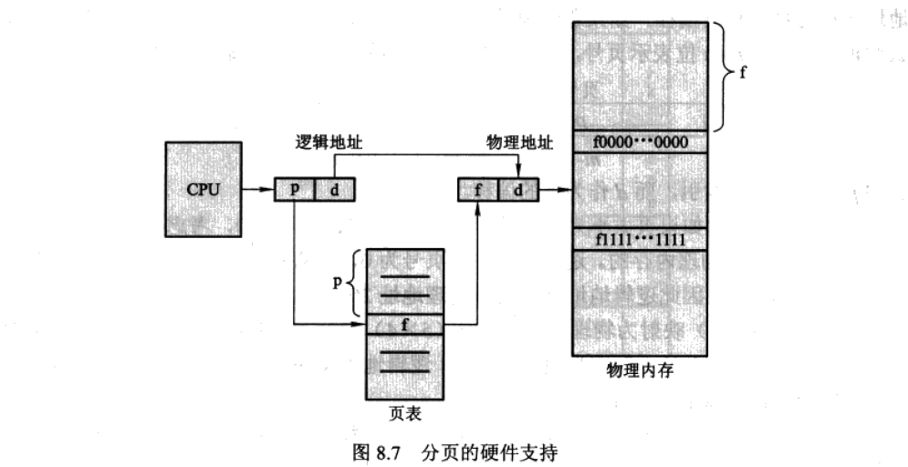
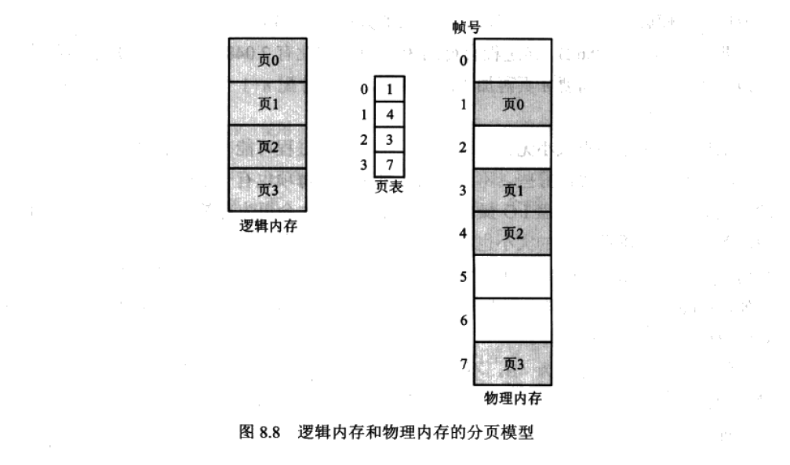
采用分页技术不会有外部碎片，但是有内部碎片(n页+1B，那么要申请n+1个帧，所以产生了内部碎片)
分页的特点：用户视角的内存和实际的物理内存的分离，通过地址转换硬件协调将逻辑地址转为物理地址，受操作系统控制
转换表缓冲区（TLB),关联快速内存。键+值，可与页表一起用。如果TLB失效，再去访问页表，得到帧号再去访问内存。
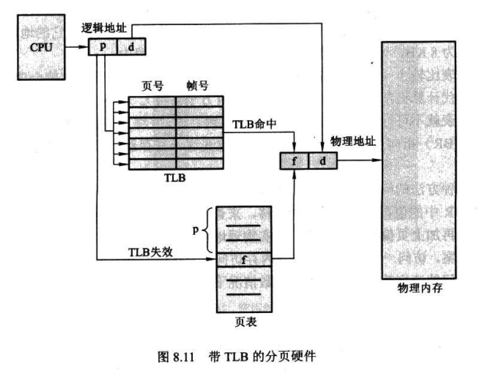
优点：有共享页，可以共享公共代码
**分段：**
用户视角的内存需要映射到实际物理内存，该映射允许区分逻辑内存和物理内存。
每个段都有名称和长度，地址指定了段名称和段内偏移。
<段的编号， 偏移>
实现：通过段表
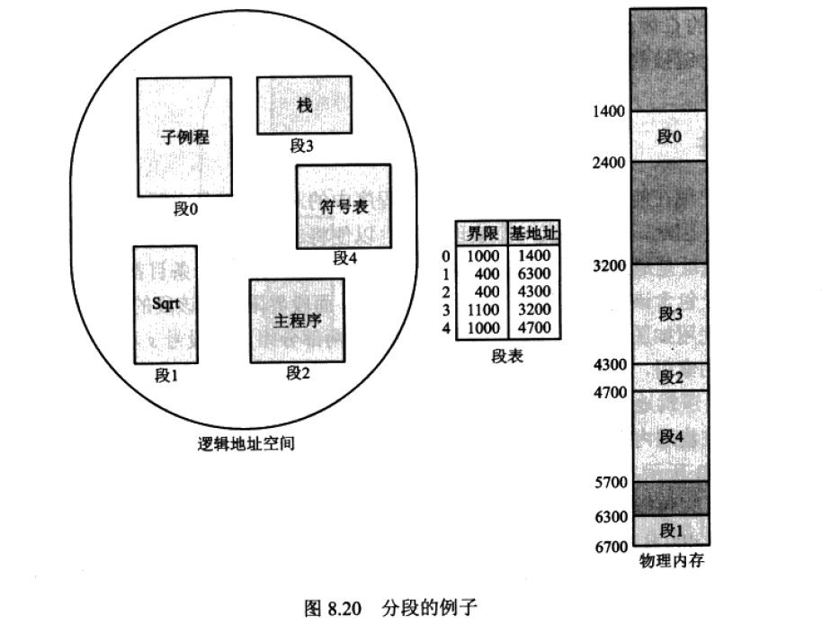
**分段+分页：**
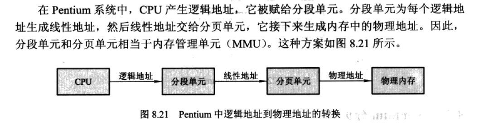

- 虚拟内存：
允许执行进程不必完全在内存中，程序可以比物理内存大，虚拟内存将内存抽象成一个巨大的、统一的存储数组，进而将用户看到的逻辑地址和物理地址分开。
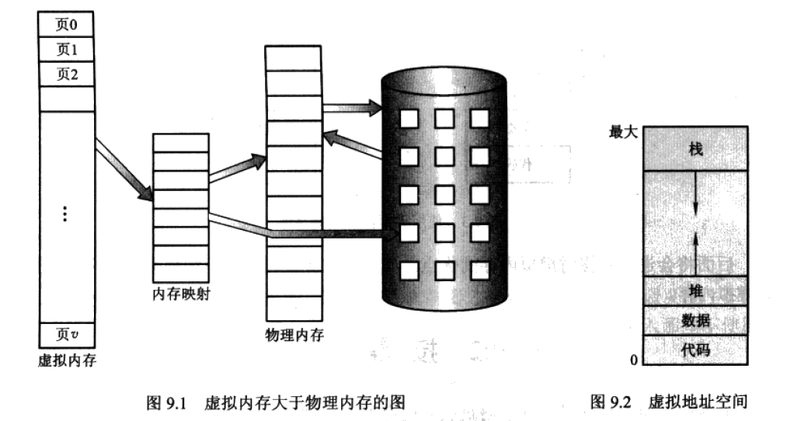
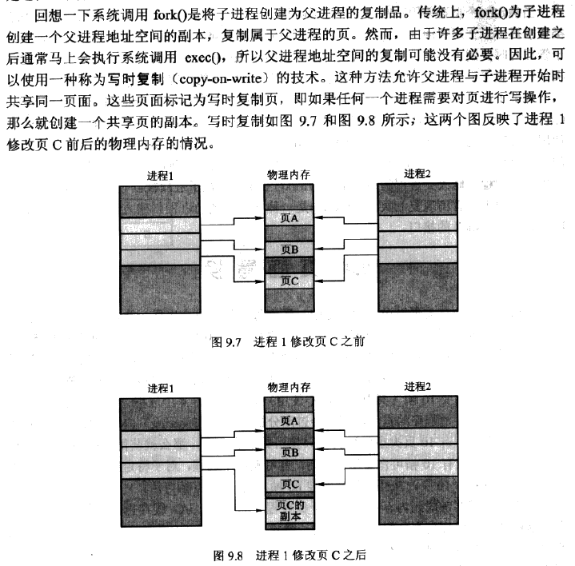

- 按需换页，页面置换的算法：
fifo 先进先出
opt 最优置换
lru 最近最少使用
lfu 最不经常使用也置换算法 基于计数的
mfu 最常使用页置换算法

- 问题：系统颠簸
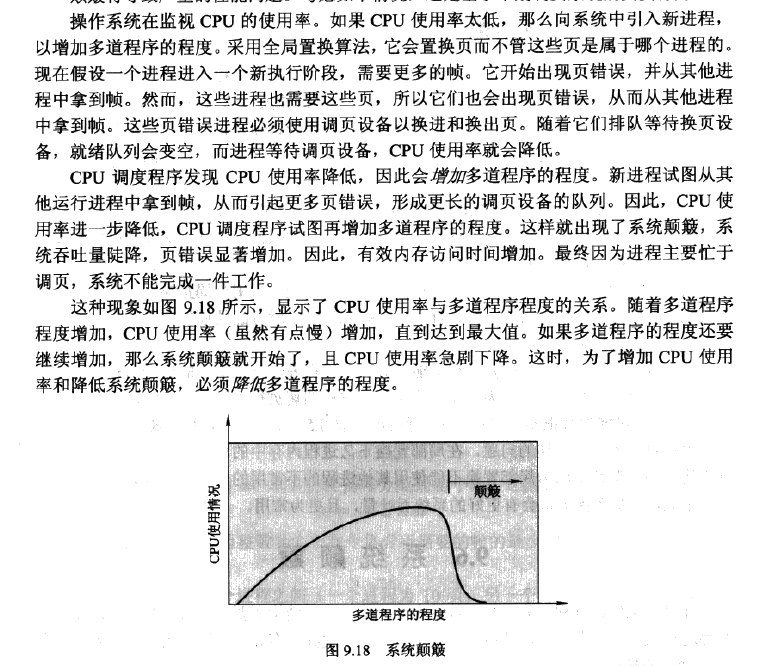


- slab分配
slab是由一个或者多个物理上连续的页组成的。高速缓存含有一个或者多个slab。每个内核数据结构（例如进程描述符，文件对象，信号量等）都有一个cache，每个cache含有内核数据结构的对象实例。
slab的优点：
1. 没有因碎片而引起内存浪费。
内核数据结构- cache-若干个slab-若干个与对象大小相同的部分。当内核申请对象内存时，slab分配器可以返回刚好可以表示对象所需的内存。
2. 内存请求可以快速满足。对于需要经常不端分配内存、释放内存来说特别有效。因为对象预先创建，可从cache上快速分配。当用完对象并释放时，只需标记空闲并归还cache就可以下次继续使用。


- 临界区问题：
```
do{
    进入区
    临界区
    退出区
    剩余区
}while(TRUE)
```
满足的三个要求：互斥、前进、有限等待
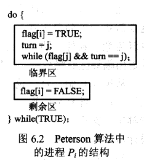
硬件同步，进入临界区前获得锁，退出临界区时释放锁
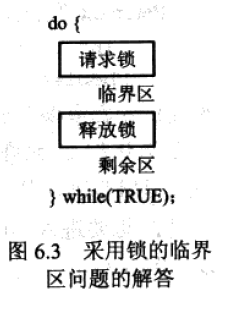
使用信号量
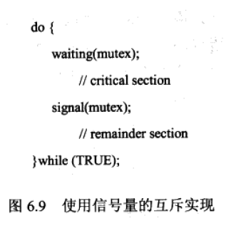
缺点：忙等待，浪费了cpu时钟——当一个进程位于临界区的时候，任何其他想进入临界区的进程都要进入其代码中连续循环，也叫自旋锁，优势在于不用
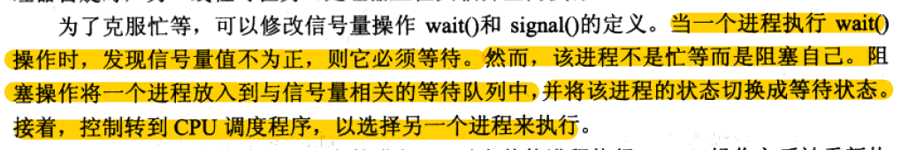
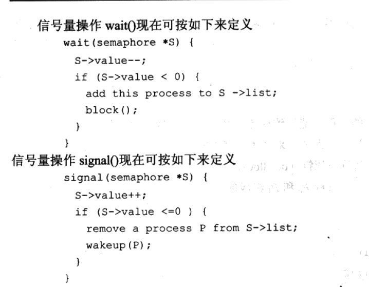
