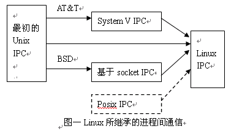

- 多线程通信的方式，系统产生死锁的原因（四个必要条件）？
循环等待
非抢占式
互斥
请求和保持
死锁预防：打破四个条件
死锁避免：银行家算法

线程和进程的联系和区别
    **四个方面**
    **调度方面**：进程是操作系统资源分配和独立调度的单位；线程是操作系统独立调度的单位。同一个进程中，线程切换不会引起进程切换；在不同进程中，线程切换会引起进程切换。
    **资源拥有**：一个进程可以由多个线程组成，这些线程可以访问所属进程的资源，并且拥有自己的线程ID,当前指令指针，寄存器集合和堆栈。
    **并发性**：多进程可以并发，多线程也可以并发。
    **系统开销**：进程在创建和撤销时，系统要为之分配和回收资源，操作系统开销比创建、撤销线程要大。线程切换的系统开销比进程切换的系统开销要小。并且线程之间的同步和通信比较容易实现，无需操作系统干预。
- linux进程通信ipc

- linux系统的进程怎么查看，怎么看进程占用的系统资源，怎么用命令给一个文件里面的数字按次数排序

- 进程通信的方式，僵尸进程 孤儿进程
僵尸进程：一个进程使用fork创建子进程，如果子进程退出，而父进程并没有调用wait或waitpid获取子进程的状态信息，那么子进程的进程描述符仍然保存在系统中。这种进程称之为僵死进程。
一个进程在调用exit命令结束自己的生命的时候，其实它并没有真正的被销毁，而是留下一个称为僵尸进程（Zombie）的数据结构（系统调用exit，它的作用是使进程退出，但也仅仅限于将一个正常的进程变成一个僵尸进程，并不能将其完全销毁）。在Linux进程的状态中，僵尸进程是非常特殊的一种，它已经放弃了几乎所有内存空间，没有任何可执行代码，也不能被调度，仅仅在进程列表中保留一个位置，记载该进程的退出状态等信息供其他进程收集，除此之外，僵尸进程不再占有任何内存空间。它需要它的父进程来为它收尸，如果他的父进程没安装SIGCHLD信号处理函数调用wait或waitpid()等待子进程结束，又没有显式忽略该信号，那么它就一直保持僵尸状态，如果这时父进程结束了，那么init进程自动会接手这个子进程，为它收尸，它还是能被清除的。但是如果如果父进程是一个循环，不会结束，那么子进程就会一直保持僵尸状态，这就是为什么系统中有时会有很多的僵尸进程。

孤儿进程：一个父进程退出，而它的一个或多个子进程还在运行，那么那些子进程将成为孤儿进程。孤儿进程将被init进程(进程号为1)所收养，并由init进程对它们完成状态收集工作。

但孤儿进程与僵尸进程不同的是，由于父进程已经死亡，系统会帮助父进程回收处理孤儿进程。所以孤儿进程实际上是不占用资源的，因为它终究是被系统回收了。不会像僵尸进程那样占用ID,损害运行系统。

僵尸进程的处理
得出结论，孤儿进程不会占资源，僵尸进程会占用资源危害系统。我们应当避免僵尸进程的出现。
解决办法如下：
1）通过信号机制
子进程退出时向父进程发送SIGCHILD信号，父进程处理SIGCHILD信号。调用wait()或者waitpid()，让父进程阻塞等待僵尸进程的出现，处理完在继续运行父进程。
2）杀死父进程
当父进程陷入死循环等无法处理僵尸进程时，强制杀死父进程，那么它的子进程，即僵尸进程会变成孤儿进程，由系统来回收。
3）重启系统
当系统重启时，所有进程在系统关闭时被停止，包括僵尸进程，开启时init进程会重新加载其他进程。

- 说说怎么实现管道，为什么管道都是用于父子进程或兄弟进程（fork机制的原因），我说了子进程完全继承了父进程的内容，又问我信号会继承吗，我说是的，他说真的吗，难道有什么问题吗

- Linux内存管理
- Linux父进程怎么知道子进程结束了
- 进程状态有哪几个
- 守护进程创建
- 怎么查看进程
- 进程和线程区别
- 进程间通信方式
- 生产者消费者的类怎么实现？
- Linux启动过程
- 有个变量i=5,两个线程执行i++5次，i的结果是多少。
- 进程中断
- 进程饥饿

说一下虚拟地址是怎么映射到物理地址的，说一下这个过程

虚拟内存分页了解不？
4、进程和线程区别

- linux下进程间通信的几种主要手段简介：
1：管道（Pipe）及有名管道（named pipe）：管道可用于具有亲缘关系进程间的通信，有名管道克服了管道没有名字的限制，因此，除具有管道所具有的功能外，它还允许无亲缘关系进程间的通信；
2：信号（Signal）：信号是比较复杂的通信方式，用于通知接受进程有某种事件发生，除了用于进程间通信外，进程还可以发送信号给进程本身；linux除了支持Unix早期信号语义函数sigal外，还支持语义符合Posix.1标准的信号函数sigaction（实际上，该函数是基于BSD的，BSD为了实现可靠信号机制，又能够统一对外接口，用sigaction函数重新实现了signal函数）；
3：报文（Message）队列（消息队列）：消息队列是消息的链接表，包括Posix消息队列system V消息队列。有足够权限的进程可以向队列中添加消息，被赋予读权限的进程则可以读走队列中的消息。消息队列克服了信号承载信息量少，管道只能承载无格式字节流以及缓冲区大小受限等缺点。
4：共享内存：使得多个进程可以访问同一块内存空间，是最快的可用IPC形式。是针对其他通信机制运行效率较低而设计的。往往与其它通信机制，如信号量结合使用，来达到进程间的同步及互斥。
5：信号量（semaphore）：主要作为进程间以及同一进程不同线程之间的同步手段。
6：套接口（Socket）：更为一般的进程间通信机制，可用于不同机器之间的进程间通信。起初是由Unix系统的BSD分支开发出来的，但现在一般可以移植到其它类Unix系统上：Linux和System V的变种都支持套接字。
http内容。get() 和 post()方法的区别
如何在linux目录下找到最大的三个文件

什么情况下会发生死锁，解决策略有哪些？

作者：重口味  ぅヾ
链接：https://www.nowcoder.com/discuss/61958?type=2&order=0&pos=15&page=29
来源：牛客网

内存的页面置换算法
进程调度算法
进程间通信方式
进程线程区别
进程之间的通信
父子进程、孤儿进程

fork进程时的操作

这个部分我回答的都不好，只能是死记硬背，建议基础好的同学多看看操作系统这部分，能大大加分。

作者：叫小丁不叫小丁丁
链接：https://www.nowcoder.com/discuss/77507?type=2&order=0&pos=62&page=3
来源：牛客网

僵尸进程

Q：介绍一下僵尸进程吧

A：僵尸进程就是死掉之后还没有被父进程wait的进程，它们在运行结束之后PCB这些资源还没有被释放，等待父进程wait它们获得它们的状态。如果父进程不wait的话，僵尸进程多了，未被释放的资源就很多，这个时候系统性能就会受到影响。如果父进程早死了的话，子进程就会被托管到pid为1的进程，以前是init现在是systemd好像，它会定时wait掉所有死了的子进程

Q：怎样避免僵尸进程呢

A：单独一个线程wait子进程，或者emmm...有两个信号，一个SIGCHLD、一个SIGCLD，设置这两个信号的处理方式为忽略，它们告诉内核，不关心子进程结束的状态所以当子进程终止的时候直接释放所有资源就行。它们的区别是SIGCLD在安装完信号处理函数的时候还会检查是否已经存在结束的子进程，如果有就调用信号处理函数，而SIGCHLD不会，也就是可能会丢掉已经有子进程已经结束这个事实

用户态和内核态切换过程

进程间通信有哪些（有名管道，无名管道、共享内存、信号、信号量、消息队列、socket等），两台计算机间通信有哪些，对应的系统API接口、原理

内存的页面置换算法
进程调度算法
进程间通信方式
进程线程区别
进程之间的通信
父子进程、孤儿进程
fork进程时的操作，
这个部分我回答的都不好，只能是死记硬背，建议基础好的同学多看看操作系统这部分，能大大加分。
