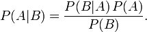

- knn算法
分类时，对于其k个最相邻的训练实例的类别，通过多数表决的方式进行预测
距离公式:欧式距离，曼哈顿距离
拓展：kd树（二叉树来存储训练数据）

- 朴素贝叶斯
对于给定的训练数据集，首先基于特征条件独立假设学习输入/输出的联合概率分布；然后基于此模型，对给定的输入x，利用贝叶斯定理求出后验概率最大的输出y

- 决策树
    ID3:以信息增益最大为特征选择的准则
    C4.5：以信息增益比最大为特征选择的准则
    CART：以gini指数最小为特征选择的准则
    剪枝——解决过拟合的问题

- 贝叶斯定理

