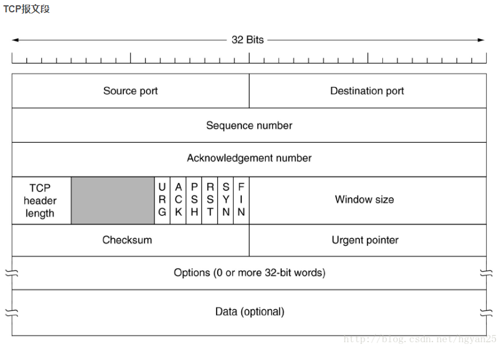
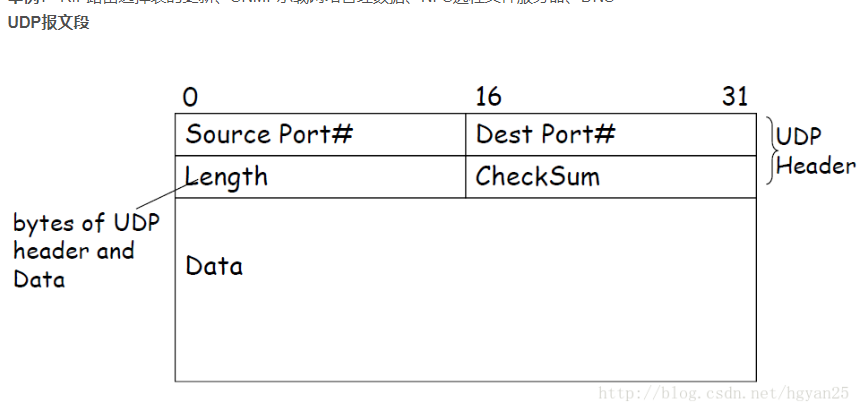
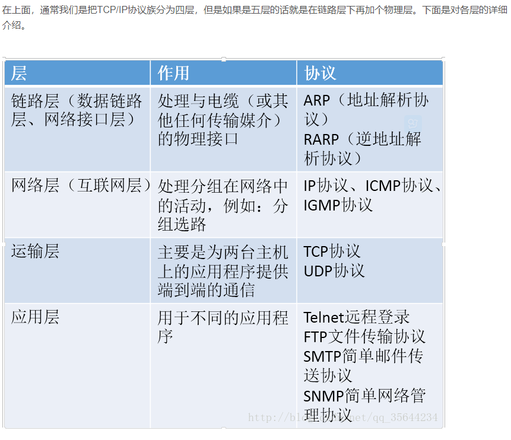
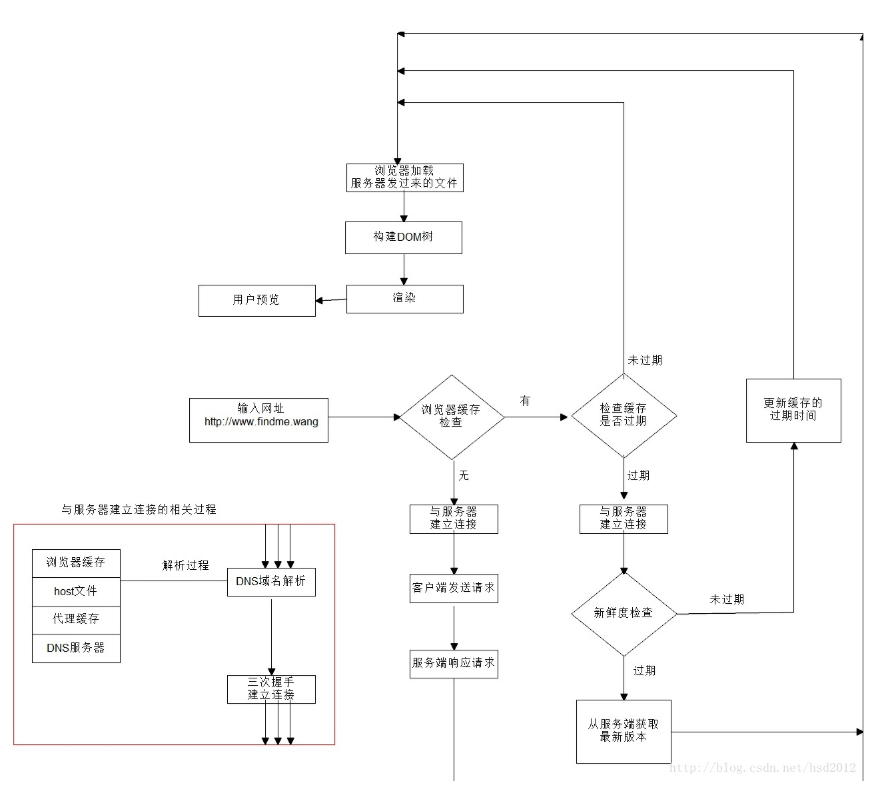

- tcp的三次握手四次分手 什么要四次挥手，为什么要经过TIME WAIT状态。那tcp里面的time_wait状态知道吧，说一下
    - 由TCP客户端请求TCP服务端建立连接。
    第一步：TCP客户端随机选择一个seq num，例如a，并且设置syn为1，发送TCP报文，这个TCP报文会被封装成IP数据报发送给TCP服务端。此时的TCP报文不包含应用层数据。[进入SYN SEND状态，等待服务器确认]
    第二步：TCP服务器端收到IP数据报后，取出TCP SYN报文，为这个连接分配变量和缓存，对客户端请求连接的报文段进行确认。然后随机选择一个seq num，例如b，设置SYN为1，然后设置ack num为a+1，将syn ack报文段封装成ip数据报发送给客户端。[服务器进入SYN RECV状态]
    第三步：TCP客户端收到了服务器发送的syn ack报文段后，为该连接分配变量和缓存，对服务器允许连接的报文段进行确认。因为连接已经建立，syn设置为0，然后设置ack num为b+1，确认收到该报文，并且设置seq num为a+1，此时报文里可携带应用层信息。再将这个tcp报文段发送给服务器端。[双方进入ESTABLISHED状态]
    此时三次握手完成，tcp连接建立。
    TCP报头格式

    
    首部最小长度为20byte
    UDP报头格式
    
    首部最小长度为8byte
    - sync 泛洪攻击
    Client在短时间内伪造大量不存在的IP地址，并向Server不断地发送SYN包，然后服务端为该客户端分配缓存和变量等资源，但是客户端并不进行第三步的确认，导致大量的半开状态的连接。最终使得服务器端资源耗尽。Server需要不断重发直至超时，这些伪造的SYN包将产时间占用未连接队列，导致正常的SYN请求因为队列满而被丢弃，从而引起网络堵塞甚至系统瘫痪。解决方案可以采用cookie的方式，不为半开连接分配资源，分配初始序列号，通过cookie来验证客户的合法性。检测SYN攻击的方式非常简单，即当Server上有大量半连接状态且源IP地址是随机的，则可以断定遭到SYN攻击了
    - 为什么是三次握手
    保证可靠传输的同时保证传输效率
    - 两次握手呢
    如果仅用两次握手就确认连接建立，可能会出现问题。
    情况1：如果第一次发送的syn报文延迟了，由于没有收到ack，会再次发送sync报文，server先收到确认后，建立了连接，完成数据传输，在关闭连接。然后再收到了延迟的sync报文，那么会再次建立一个连接。
    情况2：如果第二次握手发送的syn ack报文段在传输过程丢失，那么客户端会认为连接没有建立成功，可能会继续发送syn报文段到服务端。可能会有sync泛洪攻击，大量的半连接状态出现，server端可能会崩溃。因此第三次握手是必要的。
    - 四次握手呢
    第三次握手如果丢失，跟上面的情况其实是一样的，因此没有完全可靠的通信协议。
    但在三次握手之后至少可以让client和server都确认双方的通信情况，但是呢无法确认后序的情况。在这种意义上说，四次、五次握手都是徒劳的。
    主要是考虑效率问题。其实在第三次握手的时候，连接已经建立。

- TCP的四次挥手
    - 过程
    tcp客户端向服务器端发送一段特殊的报文段，设置FIN为1，并且seq为x（随机选择了一个序列号）[Client进入FIN_WAIT_1状态]
    TCP服务端收到报文后，发送ack报文段确认信息。此时客户端不会再发送信息，但是仍然能够接收信息。[Server进入CLOSE_WAIT状态]
    Tcp服务端发送fin报文段，随机选择序列号，发送给客户端。此时服务端不再发送数据。[Server进入LAST_ACK状态。]
    客户端接收到终止报文段后进行确认，等待一段时间后关闭连接。[]
    此时两台主机用于该连接的所有资源会被释放。
    - 为什么是四次
     由于TCP连接时全双工的，因此，每个方向都必须要单独进行关闭，这一原则是当一方完成数据发送任务后，发送一个FIN来终止这一方向的连接，收到一个FIN只是意味着这一方向上没有数据流动了，即不会再收到数据了，但是在这个TCP连接上仍然能够发送数据，直到这一方向也发送了FIN。首先进行关闭的一方将执行主动关闭，而另一方则执行被动关闭。当然也有双方同时关闭的状态

    - 为什么要有time wait
    简单来说：time_wait状态是四次挥手中server向client发送FIN终止连接后进入的状态。能够看到time_wait状态存在于client收到server的Fin并返回ack包时的状态（第三次挥手之后）。当处于time_wait状态时，我们无法创建新的连接，由于port被占用，连接还没有close
    - 产生time wait的原因(一般是2MSL)
    1.可靠的终止TCP连接。若处于time_wait的client发送给server确认报文段丢失的话(第四次挥手的报文段)，server将在此又一次发送FIN报文段，那么client必须处于一个可接收的状态就是time_wait而不是close状态。
    2.保证迟来的TCP报文段有足够的时间被识别并丢弃。linux 中一个TCPport不能打开两次或两次以上。当client处于time_wait状态时我们将无法使用此port建立新连接，假设不存在time_wait状态，新连接可能会收到旧连接的数据。
    time_wait持续的时间是2MSL，保证旧的数据能够丢弃。由于网络中的数据最大存在MSL(maxinum segment lifetime)
    - TIME WAIT产生在哪一方
    一般是在client方。准确来说在主动断开连接或者发送异常的那一方
    - 如何避免time wait状态占用资源
    假设是client，我们一般不用操心，由于client一般选用暂时port。再次创建连接会新分配一个port。
    假设是server主动关闭连接后异常终止。则由于它总是使用用一个知名serverport号，所以连接的time_wait状态将导致它不能重新启动。只是我们能够通过socket的选项SO_REUSEADDR来强制进程马上使用处于time_wait状态的连接占用的port。 通过socksetopt设置后，即使sock处于time_wait状态，与之绑定的socket地址也能够马上被重用。
    （我讲了两个，socket选项和线程池）

- 为什么建立连接是三次握手，而关闭连接却是四次挥手呢？
    这是因为服务端在LISTEN状态下，收到建立连接请求的SYN报文后，把ACK和SYN放在一个报文里发送给客户端。而关闭连接时，当收到对方的FIN报文时，仅仅表示对方不再发送数据了但是还能接收数据，己方也未必全部数据都发送给对方了，所以己方可以立即close，也可以发送一些数据给对方后，再发送FIN报文给对方来表示同意现在关闭连接，因此，己方ACK和FIN一般都会分开发送。

- tcp、udp的区别
tcp 面向连接
    可靠传输(三次握手、滑动窗口、拥塞避免，超时定时器，慢启动、快恢复、快重传)(Tcp通过校验和，重传控制，序号标识，滑动窗口、确认应答实现可靠传输。如丢包时的重发控制，还可以对次序乱掉的分包进行顺序控制。)
    基于字节流
udp 不面向连接
    不可靠传输
    基于数据报
区别：
1、tcp是基于连接的，可靠性高；udp是基于无连接的，可靠性较低；
2、由于tcp需要有三次握手、重新确认等连接过程，实时性差；同时过程复杂，也使其易于被攻击；而udp无连接，因而实时性较强，也稍安全；
3、在传输相同大小的数据时，tcp报头20字节；udp首部开销只有8个字节，tcp报头比udp复杂，故实际包含的用户数据较少。tcp无丢包，而udp有丢包，故tcp开销大，udp开销较小；
4、每条tcp连接只能是点到点的；udp支持一对一、一对多、多对一、多对多的交互通信。

- TCP报文长度是在TCP三次握手中那一次确定的？
这个是关于TCP报文的最大报文段长度mss的相关问题。在TCP连接的前两次握手中（SYN报文中），通信双方都会在选项字段中告知对方自己期待收到最大报文长度（mss值），以双方两个SYN报文中最小的mss最为本次数据传输的mss值。通信双方以“协商”的方式来确定报文长度的，前两次握手是告诉对方自己的mss值，在第三次握手确定mss值

- TCP报文长度是由什么确定的？
这个跟具体传输网络有关，以太网的MTU为1500字节，Internet的MTU为576字节。
MTU是网络层的传输单元，那么MSS = MTU - 20字节（IP首部） - 20字节（TCP首部）。所以以太网的MSS为1460字节，而Internet的MSS为536字节。

- 如果TCP连接过程中，第三次握手失败怎么办？
server给client返回一个SYN+ACK报文后server进入SYN_RCV状态。client收到SYN+ACK报文后进入ESTABLISHED状态，并且给server返回一个ACK报文。
server端发送了SYN+ACK报文后就会启动一个定时器，等待client返回的ACK报文。如果第三次握手失败的话client给server返回的ACK报文，在传输过程中出现故障，server并不能收到这个ACK报文。那么server端就会启动超时重传机制，超过规定时间后重新发送SYN+ACK，重传次数根据/proc/sys/net/ipv4/tcp_synack_retries来指定，默认是5次。如果重传指定次数到了后，仍然未收到ACK应答，那么一段时间后，server自动关闭这个连接。但是client认为这个连接已经建立，如果client端向server写数据，server端将以RST包响应，方能感知到server的错误。
当第三次握手失败时的处理操作，可以看出当失败时服务器并不会重传ack报文，而是直接发送RTS报文段，进入CLOSED状态。这样做的目的是为了防止SYN洪泛攻击。

- tcp的可靠性如何实现
TCP通过以下方式提供数据传输的可靠性：
（1）协商MSS：TCP在传输数据之前，都会把要传输的数据分割成TCP认为最合适的报文段大小。在TCP三次握手的前两次握手中（也就是两个SYN报文段中），通过一个“协商”的方式来告知对方自己期待收到的最大报文段长度（MSS），结果使用通信双发较小的MSS最为最终的MSS。在SYN=1的报文段中，会在报文段的选项部分来指定MSS大小（相当于告知对方自己所能接收的最大报文段长度）。在后续通信双发发送应用层数据之前，如果发送数据超过MSS，会对数据进行分段。
（2）使用了超时重传机制。当发送一个TCP报文段后，发送发就会针对该发送的段启动一个定时器。如果在定时器规定时间内没有收到对该报文段的确认，发送方就认为发送的报文段丢失了要重新发送。
（3）确认机制。当通信双发的某一端收到另一个端发来的一个报文段时，就会返回对该报文段的确认报文。
（4）首部校验和。在TCP报文段首部中有16位的校验和字段，该字段用于校验整个TCP报文段（包括首部和数据部分）。IP数据报的首部校验和只对IP首部进行校验。TCP详细的校验过程如下，发送TCP报文段前求一个值放在校验位，接收端接受到数据后再求一个值，如果两次求值形同则说明传输过程中没有出错；如果两次求值不同，说明传输过程中发生错误，无条件丢弃该报文段引发超时重传。
（5）使用滑动窗口流量控制协议。
（6）由于在TCP发送端可能对数据分段，那么在接收端会对接收到的数据重新排序。

- 应用场景
    - TCP——慢，但更注重可靠性：
    - UDP——丢包率高，更注重实时性：RIP路由表的更新、SNMP承载网络管理数据、NFS远程文件服务器、DNS
    - 视频实时传输协议——rtp——基于udp实现的，封装了其他协议——实例：远程桌面连接、直播
- 两个人面对面视频聊天，应该采用什么协议，为什么
    应该要先问需求
    - 连接过程需要应答确认，单纯的udp做不到
    - 实时性单纯tcp做不到，因为有延迟发送机制，需要关闭延迟确认算法那
    可以尝试对udp进行封装（不对tcp进行封装是因为他虽然可靠性高，但是状态太多了），可以尝试向上封装，在应用层确保可靠性(在应用层实现一个简单心跳包)。
    一般实时性高、对可靠性不是要求严格的可以用udp，如果是直播，又是广播的形式，用udp更好。udp在广播时，只需要给与我直接相连的路由器或者服务器发送数据即可，而tcp是虚电路，相当于每个客户端都建立了一个虚电路链接。

TCP流量控制
滑动窗口协议(mss，三次握手时确定) 窗口相当于缓冲区吧，对比于TCP每发送一段数据后都必须等到接收端确认后才能发送下一段数据
TCP拥塞避免
 慢开始 拥塞避免：启动算法的基本思想是当TCP开始在一个网络中传输数据或发现数据丢失并开始重发时，首先慢慢的对网路实际容量进行试探，避免由于发送了过量的数据而导致阻塞。添加一个拥塞窗口
 快重传、快恢复

- TCP超时重传
在发送一个数据之后，就开启一个定时器，若是在这个时间内没有收到发送数据的ACK确认报文，则对该报文进行重传，在达到一定次数还没有成功时放弃并发送一个复位信号。

- HTTP 所在层次 ，OSI层次划分
HTTP是在应用层
osi七层
应用层 - 表示层 - 会话层 - 传输层（端到端的传输，为不同主机的应用进程之间提供逻辑通信的功能） -网络层（主机到主机之间的传输，不同主机之间的逻辑通信） - 数据链路层 - 物理层
每一层都简述一下：
应用层: 多数应用程序是由通信进程对组成，每对中的两个进程相互发送报文。从一个进程向另一个进程发送的报文必须通过下面的网络。进程通过一个称为套接字的软件接口向网络发送报文和从网络接收报文。 套接字： 应用程序和网络之间的应用程序编程接口。
表示层
会话层
传输层（端到端的传输，为不同主机的应用进程之间提供逻辑通信的功能）实现端对端的传输，应用层进程得到消息后交给传输层变成数据段，然后交予网络层。它位于网络层之上，应用层之下，为运行在不同主机上的应用进程之间提供了逻辑通信功能。
网络层（主机到主机之间的传输，不同主机之间的逻辑通信）
数据链路层 负责建立和管理节点间的链路。(成帧、链路接入、可靠交付、差错检测与纠正)
物理层 物理层的作用是实现相邻计算机节点之间比特流的透明传送，尽可能屏蔽掉具体传输介质和物理设备的差异。

TCP/IP 五层协议
应用层 传输层 网络层 数据链路层 物理层
TCP/IP 四层协议
应用层 传输层 网络层 网络接口层

- TCP/IP协议族

链路层有ARP协议、RARP协议。
在网络层有IP协议、ICMP协议、IGMP协议。
在传输层中有TCP协议与UDP协议。
在应用层有FTP、TELNET、SMTP、SNTP等协议。
- 网络各层的设备
物理层：网卡，网线，集线器(采用广播的形式来传输信息)，中继器，调制解调器
数据链路层：网桥，交换机(能够进行地址学习，采用存储转发的形式来交换报文.)
网络层：路由器（连通不同的网络，选择信息传送的线路）
网关工作在第四层传输层及其以上
应用层：软件

- 集线器的交换机的区别
　　首先说HUB,也就是集线器。它的作用可以简单的理解为将一些机器连接起来组成一个局域网。而交换机（又名交换式集线器）作用与集线器大体相同。但是两者在性能上有区别：集线器采用的式共享带宽的工作方式，而交换机是独享带宽。这样在机器很多或数据量很大时，两者将会有比较明显的。
工作位置不同。集线器工作在物理层，而交换机工作在数据链路层。
工作方式不同。集线器是一种广播方式，当集线器的某个端口工作时其他端口都能收听到信息。交换机工作时端口互不影响。
带宽不同。集线器是所有端口共享一条带宽，在同一时刻只能有两个端口传输数据；而交换机每个端口独占一条带宽。
性能不同。交换机以MAC地址进行寻址，有一定额外的寻址开销；集线器以广播方式传输数据，流量小时性能下降不明显，适用于共享总线的局域网。

- 路由器与交换机的区别：
总的来说，路由器与交换机的主要区别体现在以下几个方面：
（1）工作层次不同。最初的的交换机是工作在数据链路层，而路由器一开始就设计工作在网络层。由于交换机工作在数据链路层，所以它的工作原理比较简单，而路由器工作在网络层，可以得到更多的协议信息，路由器可以做出更加智能的转发决策。
（2）数据转发所依据的对象不同。交换机是利用物理地址或者说MAC地址来确定转发数据的目的地址。而路由器则是利用IP地址来确定数据转发的地址。IP地址是在软件中实现的，描述的是设备所在的网络。MAC地址通常是硬件自带的，由网卡生产商来分配的，而且已经固化到了网卡中去，一般来说是不可更改的。而IP地址则通常由网络管理员或系统自动分配。
（3）传统的交换机只能分割冲突域，不能分割广播域；而路由器可以分割广播域。由交换机连接的网段仍属于同一个广播域，广播数据包会在交换机连接的所有网段上传播，在某些情况下会导致通信拥挤和安全漏洞。连接到路由器上的网段会被分配成不同的广播域，广播数据不会穿过路由器。虽然第三层以上交换机具有VLAN功能，也可以分割广播域，但是各子广播域之间是不能通信交流的，它们之间的交流仍然需要路由器。
（4）交换机负责同一个网段的通信，而路由器负责不同网段的通信。路由器提供了防火墙的服务。路由器仅仅转发特定地址的数据包，不传送不支持路由协议的数据包传送和未知目标网络数据包的传送，从而可以防止广播风暴。

- 应用层的协议有哪些，ping使用的什么协议，工作在哪一层
FTP、HTTP、TELNET、SMTP、DNS等协议。SMTP/FTP/MIME/DNS/HTTP/POP3/IMAP
ping 使用icmp协议 在网络层工作

- HTTP协议
HTTP是超文本传输协议，是客户端浏览器或其他程序与Web服务器之间的应用层通信协议。在Internet上的Web服务器上存放的都是超文本信息， 客户机需要通过HTTP协议传输所要访问的超文本信息。HTTP包含命令和传输信息，不仅可用于Web访问，也可以用于其他因特网/内联网应用系统之间的通信，从而实现各类应用资源超媒体访问的集成

- http和https区别，https在请求时额外的过程，https是如何保证数据安全的
HTTPS（全称：Hypertext Transfer Protocol over Secure Socket Layer），是以安全为目标的HTTP通道，简单讲是HTTP的安全版。即HTTP下加入SSL层，HTTPS的安全基础是SSL，因此加密的详细内容就需要SSL
优点：
内容加密 建立一个信息安全通道，来保证数据传输的安全；
身份验证 确认网站的真实性；
数据完整性 防止内容被第三方冒充或者篡改
劣势：
对数据进行加密决定了它比http慢。需要进行非对称的加解密，且需要三次握手。出于安全考虑，浏览器不会在本地保存HTTPS缓存

HTTP协议以明文方式发送内容，不提供任何方式的数据加密，一旦攻击者截取了Web浏览器和网站服务器之间的传输报文，就可以直接读懂其中的信息，因此HTTP协议不适合传输一些敏感信息，比如信用卡号、密码等。
解决方式：使用HTTPS协议。
HTTPS协议在HTTP的基础上加上了SSL协议，SSL依靠证书来验证服务器的身份，并为浏览器和服务器的通信进行加密。
区别：
1. https协议需要申请ca证书，一般需要交费
2. http协议是超文本传输协议，以明文传输，https协议是具有安全性的SSL加密传输协议
3. http和https协议使用完全不同的连接方式，用的端口也不同，http使用80端口，https使用443端口
4. http的连接很简单，是无状态的，HTTPS是由SSL+HTTP协议构成的可进行加密传输、身份验证的网络协议，比http协议更安全。

- http1.0和1.1的区别
HTTP1.0：短暂连接，每次请求需要一个RTT来建立连接，一个RTT来传输数据
HTTP1.1：持久连接，只需要建立一次连接，以后都不需要建立连接
HTTP/1.0为每一次HTTP的请求/响应建立一条新的TCP链接，因此一个包含HTML内容和图片的页面将需要建立多次的短期的TCP链接。一次TCP链接的建立将需要3次握手。另外，为了获得适当的传输速度，则需要TCP花费额外的回路链接时间（RTT）。每一次链接的建立需要这种经常性的开销，而其并不带有实际有用的数据，只是保证链接的可靠性，因此HTTP/1.1提出了可持续链接的实现方法。
HTTP/1.1将只建立一次TCP的链接而重复地使用它传输一系列的请求/响应 消息，因此减少了链接建立的次数和经常性的链接开销。

- http的状态码
类型：
GET(可用于表单，拓展URL)
POST(表单提交)
DELETE
HEAD(HTTP报文响应，不返回请求对象)
PUT(允许用户上传对象到指定的web服务器上指定的路径）
返回码
1. 消息
100 continue
101 switching protocols
102 processing
2. 成功
200 ok
201 created
202 accepted
3. 重定向
301 move permanently
302 move temporarily
304 not modified
305 use proxy
4. 请求错误
400 bad request
401 unauthorized
403 forbidden
404 not found
405 method not allowed
408 request time out
409 conflict
410 gone
5. 服务器错误
500 interval server
502 bad gateway
503 service unavailable
504 gateway timeout
505 http version unsupported

- 为什么需要浏览器缓存
Web缓存存在于服务器和客户端之间。Web缓存密切注视着服务器-客户端之间的通信，监控请求，并且把请求输出的内容（例如html页面、 图片和文件）另存一份；然后，如果下一个请求是相同的URL，则直接使用保存的副本，而不是再次请求源服务器。
优点：
1. 减少网络延迟，加快网页打开的速度，缓存比源服务器离客户端更近
2. 降低服务器的压力，客户机可以重复利用缓存，减少对源服务器的请求
3. 减少网络带宽损耗，使用缓存只会产生少量网络流量，可以降低运营成本
缺点：
1. 缓存没有清理机制
2. 给开发带来困扰

- SESSION机制、cookie机制的区别
cookie机制采用的是在客户端保持状态的方案，而session机制采用的是在服务器端保持状态的方案。
1. Cookie和Session都是会话技术，Cookie是运行在客户端，Session是运行在服务器端。
2. Cookie有大小限制以及浏览器在存cookie的个数也有限制，Session是没有大小限制和服务器的内存大小有关。
3. Cookie有安全隐患，通过拦截或本地文件找得到你的cookie后可以进行攻击。
4. Session是保存在服务器端上会存在一段时间才会消失，如果session过多会增加服务器的压力。
- 怎么判断消息发送完毕
包头带长度，或者包尾带结束符。
比如规定前4个字节表示该包的数据体长度，这样每次先读4个字节，根据4个字节的值再去读数据体。处理完毕之后再读4个字节，再根据4个字节的值读数据体。一直循环下去，如此可以解决粘包的情况

- HTTP协议（一些报头字段的作用，如cache-control、keep-alive）
检验缓存是否过期通常有两个HTTP头进行控制Expires和Cache-Control：
HTTP1.0提供Expires，值为一个绝对时间表示缓存新鲜日期
HTTP1.1增加了Cache-Control: max-age=,值为以秒为单位的最大新鲜时间
当这两个属性Expires和Cache-Control同时存在时，Cache-Control优先级高于Expires。
当浏览器首次向服务器发送请求的时候，服务器响应的http头部会携带，Last-Modified和ETag。
当缓存过期的时候，浏览器就会将该两个参数的值以If-Modified-Since、If-None-Match形式写在HTTP头中，发服务器请求资源。其中If-Modified-Since是与Last-Modified相互对应，If-None-Match与ETag相互对应，。为了演示，我们通过下图方式复制浏览器请求

- 打开网页到页面显示之间的过程（涵盖了各个方面，DNS解析过程，Nginx请求转发、连接建立和保持过程、浏览器内容渲染过程，考虑的越详细越好）。

查询缓存、域名解析、三次握手、网络协议、新鲜度检查、HTTP协议、GET请求、DOM树、渲染树等
1. 在浏览器地址栏输入URL
2. 浏览器查看缓存，如果请求资源在缓存中并且新鲜，跳转到转码步骤
    - 如果资源未缓存，发起新请求
    - 如果已缓存，检验是否足够新鲜，足够新鲜直接提供给客户端，否则与服务器进行验证。
    - 检验新鲜通常有两个HTTP头进行控制Expires和Cache-Control：
    HTTP1.0提供Expires，值为一个绝对时间表示缓存新鲜日期
    HTTP1.1增加了Cache-Control: max-age=,值为以秒为单位的最大新鲜时间
3. 浏览器解析URL获取协议，主机，端口，path
4. 浏览器组装一个HTTP（GET）请求报文
5. 浏览器获取主机ip地址，过程如下：
浏览器缓存
本机缓存
hosts文件
路由器缓存
ISP DNS缓存
DNS递归查询（可能存在负载均衡导致每次IP不一样）
6. 打开一个socket与目标IP地址，端口建立TCP链接，三次握手如下：
    - 客户端发送一个TCP的SYN=1，Seq=X的包到服务器端口
    - 服务器发回SYN=1， ACK=X+1， Seq=Y的响应包
    - 客户端发送ACK=Y+1， Seq=Z
7. TCP链接建立后发送HTTP请求
8. 服务器接受请求并解析，将请求转发到服务程序，如虚拟主机使用HTTP Host头部判断请求的服务程序
9. 服务器检查HTTP请求头是否包含缓存验证信息如果验证缓存新鲜，返回304等对应状态码
10. 处理程序读取完整请求并准备HTTP响应，可能需要查询数据库等操作
11. 服务器将响应报文通过TCP连接发送回浏览器
12. 浏览器接收HTTP响应，然后根据情况选择关闭TCP连接或者保留重用，关闭TCP连接的四次握手如下：
    主动方发送Fin=1， Ack=Z， Seq= X报文
    被动方发送ACK=X+1， Seq=Z报文
    被动方发送Fin=1， ACK=X， Seq=Y报文
    主动方发送ACK=Y， Seq=X报文
13. 浏览器检查响应状态吗：是否为1XX，3XX， 4XX， 5XX，这些情况处理与2XX不同
14. 如果资源可缓存，进行缓存
15. 对响应进行解码（例如gzip压缩）
16. 根据资源类型决定如何处理（假设资源为HTML文档）
17. 解析HTML文档，构件DOM树，下载资源，构造CSSOM树，执行js脚本，这些操作没有严格的先后顺序，以下分别解释
18. 构建DOM树：
    Tokenizing：根据HTML规范将字符流解析为标记
    Lexing：词法分析将标记转换为对象并定义属性和规则
    DOM construction：根据HTML标记关系将对象组成DOM树
19. 解析过程中遇到图片、样式表、js文件，启动下载
20. 构建CSSOM树：
    Tokenizing：字符流转换为标记流
    Node：根据标记创建节点
    CSSOM：节点创建CSSOM树
21. 根据DOM树和CSSOM树构建渲染树:
    从DOM树的根节点遍历所有可见节点，不可见节点包括：1）script,meta这样本身不可见的标签。2)被css隐藏的节点，如display: none
    对每一个可见节点，找到恰当的CSSOM规则并应用
    发布可视节点的内容和计算样式
22. js解析如下：
    - 浏览器创建Document对象并解析HTML，将解析到的元素和文本节点添加到文档中，此时document.readystate为loading
    - HTML解析器遇到没有async和defer的script时，将他们添加到文档中，然后执行行内或外部脚本。这些脚本会同步执行，并且在脚本下载和执行时解析器会暂停。这样就可以用document.write()把文本插入到输入流中。同步脚本经常简单定义函数和注册事件处理程序，他们可以遍历和操作script和他们之前的文档内容
    - 当解析器遇到设置了async属性的script时，开始下载脚本并继续解析文档。脚本会在它下载完成后尽快执行，但是解析器不会停下来等它下载。异步脚本禁止使用 document.write()，它们可以访问自己script和之前的文档元素
    - 当文档完成解析，document.readState变成interactive
    - 所有defer脚本会按照在文档出现的顺序执行，延迟脚本能访问完整文档树，禁止使用document.write()
    - 浏览器在Document对象上触发DOMContentLoaded事件
    - 此时文档完全解析完成，浏览器可能还在等待如图片等内容加载，等这些内容完成载入并且所有异步脚本完成载入和执行，document.readState变为complete,window触发load事件
23. 显示页面（HTML解析过程中会逐步显示页面）

- IP地址子网划分
A类网：第一位为0：后面的7位为网络部分（最多容纳128个网段，但1600万+的主机）
B类网：前两位为10：后面14位为网络部分（16384个网段，65534个主机）
C类网：前三位为110：后面21位为网络部分
D类网：前四位为1110：后面全为多播地址
E类网：前四位1111：被保留

- POST和GET区别
两者都是HTTP网络请求的方式
从四个方面来进行对比
1. 效率 GET是[得]，从服务器获取数据，效率较快，POST是[给]，向服务器发送数据并下载数据，效率较慢
2. 缓存，GET请求可以被缓存，默认的请求方式也是有缓存的，POST请求默认不缓存
3. 安全性：GET请求把所有的参数都放到url中，明文显示，且服务器的日志会记录；POST请求只有资源路径，参数封装到二进制的数据体中，服务器不会记录参数，相对安全，但还是可以抓包分析
4. 数据量，http协议对他们的请求大小没有限制，但实际应用中，GET能承载的数据量小于POST

- DNS解析过程
迭代式查询
本地域名服务器从根节点开始逐级迭代进行域名查询
对本地域名服务器的压力比较大

递归式查询
本地域名服务器去问根节点服务器，根节点服务器再负责接下来的查询
对根节点服务器的压力比较大，因此一般不采用此方法

- TCP如何保证数据的可靠传输的（这个问题可以引申出很多子问题，拥塞控制慢开始、拥塞避免、快重传、滑动窗口协议、停止等待协议、超时重传机制，最好都能掌握） 

- 地址解析协议ARP 
地址解析协议，即ARP（Address Resolution Protocol），是根据IP地址获取物理地址的一个TCP/IP协议。主机发送信息时将包含目标IP地址的ARP请求广播到网络上的所有主机，并接收返回消息，以此确定目标的物理地址；收到返回消息后将该IP地址和物理地址存入本机ARP缓存中并保留一定时间，下次请求时直接查询ARP缓存以节约资源。

- 如果网络延迟很高，但是又没有发生丢包，利用tcp会使吞吐量下降，该如何解决呢
Q：tcp滑动窗口了解吗
A：了解（刚想开始介绍就被打断）
Q：ok，那tcp的拥塞控制呢
A：也知道
Q：好，假设现在网络延迟很高，但是又没有发生丢包，这个时候用tcp进行传输你觉得速率怎么样
A：不是很好
Q：那你会怎么解决呢
A：如果网络延迟很高，但是实际上网络没有发生丢包的话，tcp的拥塞控制可能会进行快重传使发送速率下降，你是觉得瓶颈出在快重传是吧
Q：嗯，也就是我想避免拥塞控制
A：（哇突然问题清楚了...）从应用层封装udp协议或者使用raw socket直接封装ip数据报
Q：...网络延迟还没高到要封装ip数据报的地步

- DDos攻击的原理介绍一下
A：emmm...listen有一个队列，处理连接请求。在收到匿名IP发过来的SYN之后，会在listen队列中存放一个记录，但是队列容量是有限的，当这样的恶意请求过多的时候，listen队列里就塞满了这些无效的连接请求，然后装不下更多的连接记录了，所以就拒绝其他请求了

- dhcp工作过程的六个步骤：
1. 寻找dhcp服务器，以广播的方式发送DHCP discover发现信息寻找dhcp服务器，所有的主机都会收到，但只有dhcp服务器才会回应。
2. dhcp服务器从尚未分配的ip地址中选一个分配给dhcp请求的客户机，发送一个dhcp offer提供信息
3. dhcp客户机可能会收到多个dhcp offer报文，这个时候它从中选一个并作出回应。以广播的方式回答一个dhcp request请求信息
4. dhcp服务器收到dhcp客户端发送来的dhcp request请求信息后，发送一个dhcp ack信息，告诉客户机可以使用它提供的ip地址
5. dhcp客户机收到之后就可以将ip地址与网卡绑定。当再次登录的时候，直接发送dhcp request信息，使用原来的ip地址
6. 如果这个ip地址没有被占用，dhcp服务器发送ack确认包，表明客户机可以使用这个ip地址；否则发送一个dhcp nack否认信息
7. 如果收到dhcp nack否认信息，就重新发送dhcp discover去请求新的ip地址。
8. DHCP服务器向DHCP客户机出租的IP地址一般都有一个租借期限，期满后DHCP服务器便会收回出租的IP地址。如果DHCP客户机要延长其IP租约，则必须更新其IP租约。DHCP客户机启动时和IP租约期限到达租约的50%时，DHCP客户机都会自动向DHCP服务器发送更新其IP租约的信息。
