## c++
0. struct 与class的区别
C++中的struct对C中的struct进行了扩充，它已经不再只是一个包含不同数据类型的数据结构了，它已经获取了太多的功能。
struct能包含成员函数吗？ 能！！
struct能继承吗？ 能！！
struct能实现多态吗？ 能！！！
（一）默认继承权限。如果不明确指定，来自class的继承按照private继承处理，来自struct的继承按照public继承处理；
（二）成员的默认访问权限。class的成员默认是private权限，struct默认是public权限。
struct作为数据结构的实现体，它默认的数据访问控制是public的，而class作为对象的实现体，它默认的成员变量访问控制是private的
“class”这个关键字还用于定义模板参数，就像“typename”。但关键字“struct”不用于定义模板参数。
struct更适合看成是一个数据结构的实现体，class更适合看成是一个对象的实现体。

1. 常量指针和指针常量
常量指针(被指向的对象是常量)：const int * p, int const * p;[底层指针，指针指向常量，也就是指针指向的值不能变，const在 * 号的左边]
指针常量(指针本身是常量)：int * const p;[顶层指针，本质是一个常量，而用指针修饰它。也就是指针本身不能变，const在 * 号的右边]
(底层指针-指针指向的值不能变) * （顶层指针-指针本身不能变）

2. 多态中的vtbl存在哪里
虚函数表vtbl存放在全局数据区：每个类对应一个虚函数表嘛，是一个类所有对象共有的
vptr一般是存放在一个对象的最前面
还看到一个解释：虚函数表vtable在Linux/Unix中存放在可执行文件的只读数据段中(rodata)，这与微软的编译器将虚函数表存放在常量段存在一些差别。

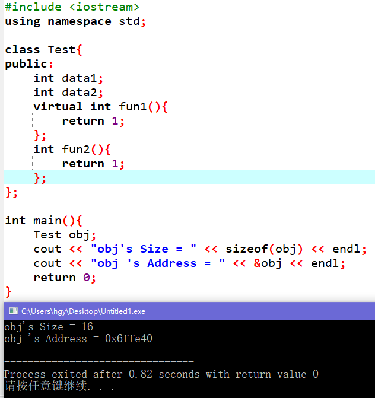
注意：成员函数不占用任何的内存。但是如果你将成员函数设置为虚函数，obj的size就要增加vtbl的大小。
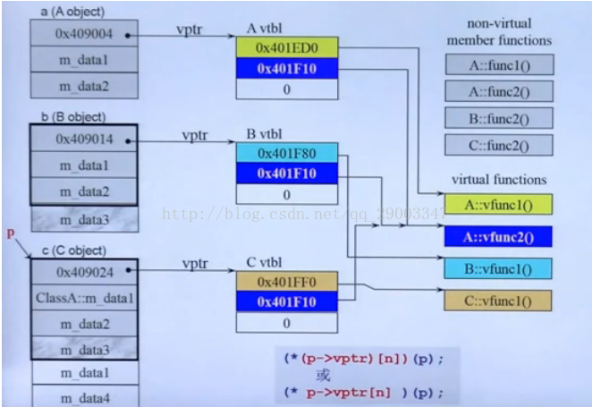
vptr指向vtbl，存放的内容就是vtbl的地址。vtbl是一个存了多个函数指针的数组，其实就是存了虚函数的地址。
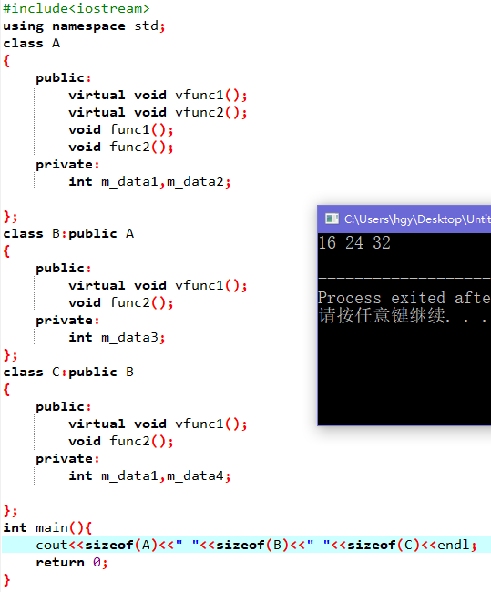
敲黑板：这里有一个内存对齐的问题。算sizeof(B)的时候，如果B不继承A，那么结果为16 = 8(4)+8
3. 动态内存分配
一般用new 和delete这样一对运算符来完成动态内存的分配。
new，在动态内存中为对象分配空间并返回一个指向该对象的指针。我们可以选择对对象进行初始化
delete，接受一个动态对象的指针，销毁该对象，并释放与之相关的内存。
- 为什么要使用智能指针：
我们知道c++的内存管理是让很多人头疼的事，当我们写一个new语句时，一般就会立即把delete语句直接也写了，但是我们不能避免程序还未执行到delete时就跳转了或者在函数中没有执行到最后的delete语句就返回了，如果我们不在每一个可能跳转或者返回的语句前释放资源，就会造成内存泄露。使用智能指针可以很大程度上的避免这个问题，因为智能指针就是一个类，当超出了类的作用域时，类会自动调用析构函数，析构函数会自动释放资源。

- 实际去使用一下智能指针。主要是对shared_ptr与unique_ptr进行使用
    - shared_ptr允许多个指针指向同一个对象，可以赋值可以拷贝
    针对shared_ptr类的实例，它的计数器就是用于记录有多少个指针指向一个对象
    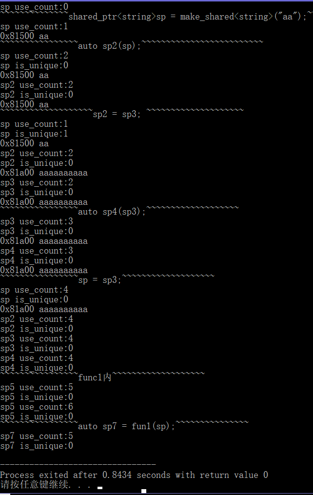
        1.  当你用new创建一个对象的同时创建一个shared_ptr时，这时会发生两次动态申请内存：一次是给使用new申请的对象本身的，而另一次则是由shared_ptr的构造函数引发的为资源管理对象分配的。
        与此相反，当你使用make_shared的时候，C++编译器只会一次性分配一个足够大的内存，用来保存这个资源管理者和这个新建对象
        2. 将一个shared_ptr 赋予另一个shared_ptr 会递增赋值号右侧的shared_ptr 的引用计数，而递减左侧shared_ptr 的引用计数，
        3. 如果一个shared_ptr 引用技术变为0时，它所指向的对象会被自动销毁。
        4. 为什么使用get返回的指针不能使用delete
        ```
        {
            auto p = make_shared<int>(20);
            auto q = p.get();
            delete q;//报错
            //解释：p是一个智能指针，在函数块结束后会自动调用内部delete释放动态申请的空间，然而我们又delete了一次，等于释放了两次空间。
        }
        ```

    - unique_ptr
    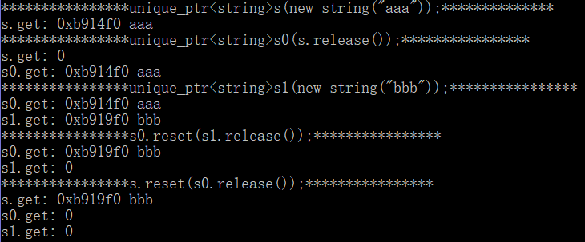
        1. unique_ptr既不支持拷贝也不支持赋值，每次只有一个指针指向一个对象
        2. unique_ptr必须手动new，将其绑定
        3. release 成员返回unique_ptr当前保存的指针，并将它置为空
        4. reset接收一个可选的地址参数，令unique_ptr重新指向给定的指针，如果原来的unique_ptr不为空，它原来指向的对象被释放。

    - weak_ptr是一种不控制所指向对象生存期的智能指针，它指向一个shared_ptr管理的对象。将一个weak_ptr绑定到一个shared_ptr不会改变它的引用计数。一旦shared_ptr的引用计数为0，它指向的对象被销毁，对象会被释放，不会管有没有weak_ptr指向它。
    必须要用shared_ptr进行初始化，引入lock(当expired为true时返回一个空shared_ptr；否则返回一个指向w的对象的shared_ptr)和expired(当共享对象的use_count为0，返回true)
- 线程安全问题
只要存在“共享资源”，就存在线程安全问题。
shared_ptr的引用计数本身是安全且无锁的(正如面试官所说的，技术上实现是原子操作)，但对象的读写则不是，因为 shared_ptr 有两个数据成员，读写操作不能原子化。使得多线程读写同一个 shared_ptr 对象需要加锁
线程安全的做法：
我们通常的做法是将全局的shared_ptr在使用之前就初始化好，然后在线程中使用全局shared_ptr的引用。
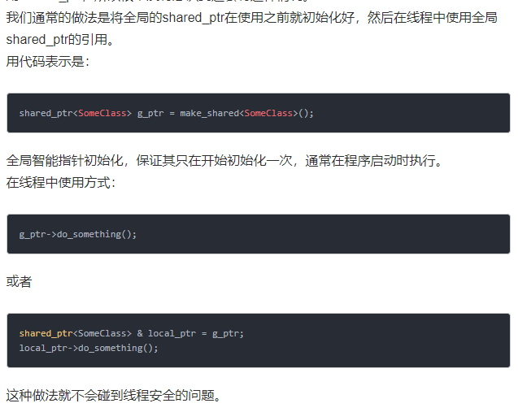
4. 是否了解lambda
c++11的新特性至少要知道吧
一个lambda表达式可以理解为一个可调用的代码单元，也可以理解为一个未命名的内联函数。
有返回值、一个参数列表，和一个函数体。
与函数不同，它可以定义在函数内部。
[capture list](parameter list) -> return type{function body}
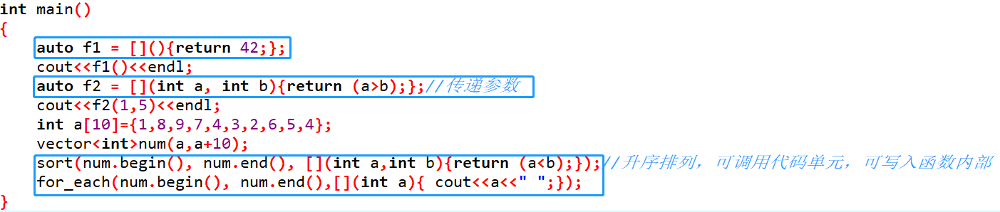
一个lambda只有在其捕获列表中捕获一个它所在函数中的局部变量，才能在函数体内使用这个变量
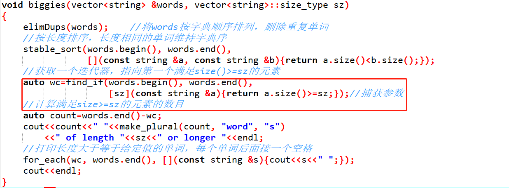
5. 为什么要内存对齐
内存对齐是编译器的工作
- 规则：
1. 数据成员对齐：对于结构的各个成员，第一个成员位于偏移为0的位置，以后的每个数据成员的偏移量必须是min(#pragma pack()指定的数,这个数据成员的自身长度)的倍数

2. 结构的整体对齐：在所有的数据成员完成各自对齐之后，结构或联合体本身也要进行对齐，对齐将按照 预编译指令#pragram pack 指定的数值和结构或者联合体最大数据成员长度中比较小的那个。也就是min(#pragram pack() , 长度最长的数据成员)；
3. 如果pragram pack()>=数据成员的长度，那么这个预处理值是没有用的。windows默认的是8,linux默认是4
    - 数据成员对齐：
    char: min(8, 1) =1 |OXXX| offset=0 [0,-,-,-]
    int: min(8,4) = 4 |OOOO| offset=4 4%4=0 [4,5,6,7] offset偏移量应该是min(8,4)的倍数
    short: min(8,2) = 2|O offset=8 [8,9]
    - 结构对齐
    min(max(1,2,4), 8) = 4
    |OXXX|OOOO|OXXX|
    ```
    struct A{
        char a;
        int b;
        short c;
    };
    ```
- 为什么要内存对齐
    - 性能原因：数据结构(尤其是栈)应该尽可能地在自然边界上对齐。原因在于，为了访问未对齐的内存，处理器需要作两次内存访问；而对齐的内存访问仅需要一次访问。
    cpu把内存当成是一块一块的，块的大小可以是2,4,8,16个字节，因此CPU在读取内存的时候是一块一块进行读取的，块的大小称为（memory granularity）内存读取粒度。
    如果一个int类型放在1-4位置，然后需要两次才能读完，cpu提取后需要组合出正确的int类型数据，再放入到寄存器中，舍弃掉无关的数据。多了额外的操作，大大降低了cpu的性能。
    如果放在0-3,只需要1次读取，使用了一个周期就获得数据。减少cpu的使用资源
    - 平台原因：不是所有的硬件平台都能访问任意地址上的任意数据的；某些硬件平台只能在某些地址处取某些特定类型的数据，否则抛出硬件异常。

- 禁止内存对齐
设置#pragma pack(1)，即指定按1字节对齐，也就是禁止内存对齐。

## STL
1.
    - vector与map的底层
    vector其实就是一个自动管理的动态数组。
    map的话一般说的是以红黑树为底层的map。
    - map又分为unordered map与map(map, multimap->红黑树的插入值的方式有两种)
    unordered map指的是以hash table为底层实现的map
    map指的是以红黑树为底层实现的map，map的查找复杂度是O(logn)
    hash table的底层是由vector与linked list实现。每个桶对应一个链表，然后根据一个映射函数计算一个key，查找key对应的bucket，如果发生冲突，就用链表连起来。减少冲突的方式就是增大桶数。hashmap的查找复杂度是常数级别
    - 红黑树与二叉平衡搜索树AVL树的区别：（从插入和删除的角度来看问题）
    (红黑树的设计更加复杂一些 为什么还要设计它)
    红黑树执行查找、插入、删除等操作的时间复杂度为O（logn）
    红黑树能够以O(log2(N))的时间复杂度进行搜索、插入、删除操作。此外,任何不平衡都会在3次旋转之内解决。这一点是AVL所不具备的。
    二叉搜索树查找的时间复杂度为O(logN)。
    平衡二叉树的缺陷：为了保证高度平衡，动态插入和删除的代价也随之增加
    - priority queue
    缺省情况下通过max-heap完成，后者是一个以vector表现的完全二叉树，依照权值从高到低自动递减排序。
    一般被称为container adapter（修改某物的接口，使得它有另一种风貌）
    priority_queue没有迭代器，也不能遍历

2. 删掉一个迭代器 事先保存上一个迭代器，那么这个迭代器是否失效
    - vector的迭代器在内存重新分配时将失效（它所指向的元素在该操作的前后不再相同）。当把超过capacity()-size()个元素插入vector中时，内存会重新分配，所有的迭代器都将失效；否则，指向当前元素以后的任何元素的迭代器都将失效。当删除元素时，指向被删除元素以后的任何元素的迭代器都将失效。
    - 增加任何元素都将使deque的迭代器失效。在deque的中间删除元素将使迭代器失效。在deque的头或尾删除元素时，只有指向该元素的迭代器失效。
    - list增加任何元素都不会使迭代器失效。删除元素时，除了指向当前被删除元素的迭代器外，其它迭代器都不会失效。
    - set、map如果迭代器所指向的元素被删除，则该迭代器失效。其它任何增加、删除元素的操作都不会使迭代器失效。

3. STL的多线程安全问题
一般说来，stl对于多线程的支持仅限于下列两点：
1.多个读取者是安全的。即多个线程可以同时读取一个容器中的内容。
  即此时多个线程调用 容器的不涉及到写的接口都可以 eg find, begin, end 等.
2.对不同容器的多个写入者是安全的。即多个线程对不同容器的同时写入合法。
但是对于同一容器当有线程写,有线程读时,如何保证正确?
需要程序员自己来控制，比如：线程A读容器某一项时，线程B正在移除该项。这会导致一下无法预知的错误。
通常的解决方式是用开销较小的临界区（CRITICAL_SECTION）来做同步。以下列方式同步基本上可以做到线程安全的容器(就是在有写操作的情况下仍能保证安全)。
1.每次调用容器的成员函数的期间需要锁定。
2.每个容器容器返回迭代器的生存期需要锁定。
3.每个容器在调用算法的执行期需要锁定。
举个例子：
当你调用map的任何接口时, 比如 end(), begin(), find()等时, 可能会返回一个iterator, 如果有别的线程正在修改这个map, 你的iterator就变得无效了, 再用这个iterator行为就可能出问题. 或者在find()函数内部, 会访问到map内部的红黑树的数据结构, 而这个红黑树是有可能被别的线程调整的(比如别的现在往map中插入一个不存在的记录). 所以, 是危险的.

## 计网
1. tcp udp区别 （more）
    - socket连接的函数
    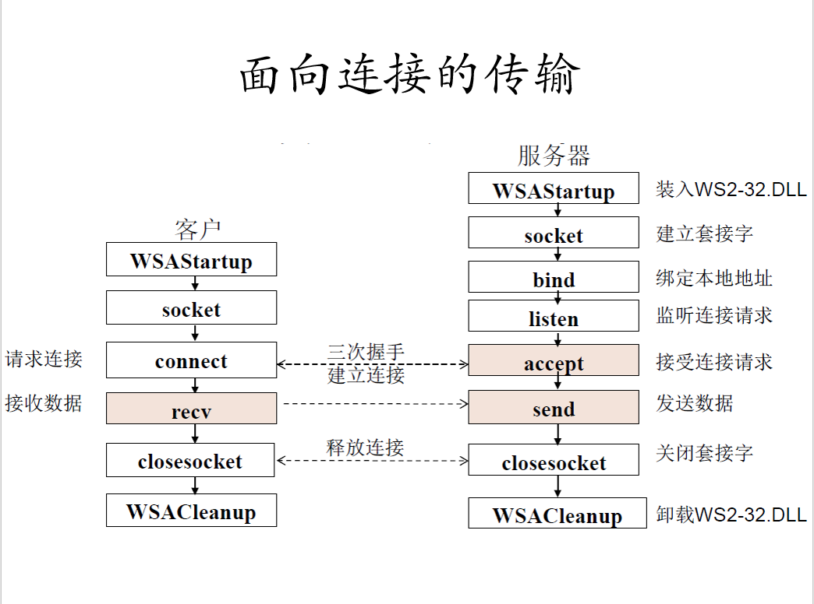
    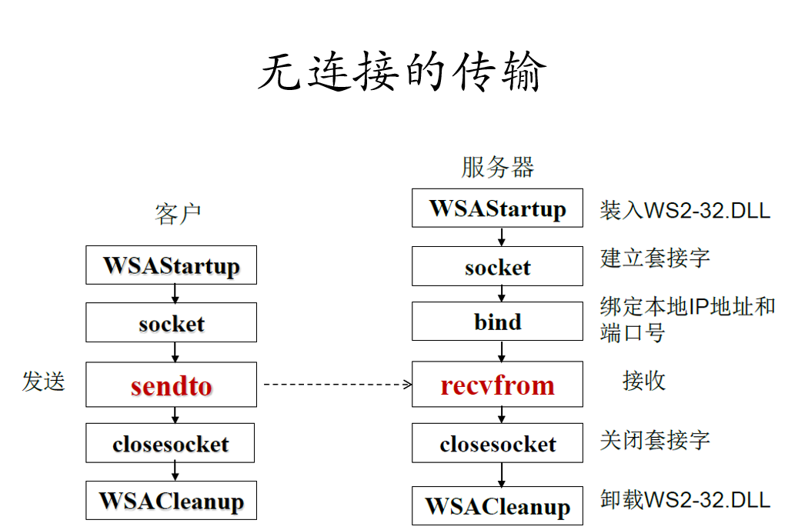
    - accept发生在三次握手什么时候
    accept 分配资源 获得连接 在三次握手之后，避免syn flood的攻击
    - 为什么udp的服务端有connect函数
    TCP中调用connect会引起三次握手,client与server建立连结.UDP中调用connect内核仅仅把对端ip&port记录下来
    udp服务器调用了bind()函数为服务器套接字绑定本地地址/端口，这样使得客户端的能知道它发数据的目的地址/端口
    - 字节流与数据报区别
    TCP采用的是字节流的传输方式。我们所发送的数据都被看成是字节存放在发送缓冲区里面。发送端会根据接收缓冲区剩余空间的大小，网络中的拥塞情况调节发送字节速率。在接收端的上层再进行数据的还原。
    UDP采用的是数据报的传输方式。在UDP里面会将内容（不论多大的内容）封在一个数据报里面，然后再将数据报传给接收端
2. http返回码
301与302的区别
301表示旧地址A的资源已经被永久地移除了（这个资源不可访问了），搜索引擎在抓取新内容的同时也将旧的网址交换为重定向之后的网址；302表示旧地址A的资源还在（仍然可以访问），这个重定向只是临时地从旧地址A跳转到地址B，搜索引擎会抓取新的内容而保存旧的网址。

尽量用301来重定向，因为302可能会发生网址劫持、网址规范化等问题。
当你的网站出现网址URL规范化问题的时候，就有可能造成被怀疑为复制网页，因而影响搜索引擎结果排名。
打开一个网址的时候，出现一个不属于网站范畴的广告，或者是跳转到某个不属于本站范畴的页面。而这种导致的后果除了损失网站本身流量之外，更多的是可能对网站品牌口碑等造成严重的不良影响。
使用301跳转的场景：
    1）域名到期不想续费（或者发现了更适合网站的域名），想换个域名。
    2）在搜索引擎的搜索结果中出现了不带www的域名，而带www的域名却没有收录，这个时候可以用301重定向来告诉搜索引擎我们目标的域名是哪一个。
    3）空间服务器不稳定，换空间的时候。
网站劫持：网站劫持简单来理解就是把本来进入的网页中途拦截到其他网站页面的意思。

3. time wait有无观察过
Netstat是在内核中访问网络连接状态及其相关信息的程序，它能提供TCP连接，TCP和UDP监听，进程内存管理的相关报告。
可以用netstat 有网络状态观察 timewait  esatablished last ack fin_wait2...
还可以看到协议、发送端、接收端、网络状态、端口号...

4. 滑动窗口协议
用于流量控制
发送窗口：已经ack数据 |已经发送并等待ack的数据，等待发送的数据(接收端有能力处理，还有空间)|等待发送的数据(接收端没有能力处理，没有空间)。发送窗口的大小会随着接受窗口的windows来改变。
接收窗口：|等待上层数据处理且ack的数据，等待接收的数据j， 已经接收的数据但没有ack|
伴随的问题： zero window(发送端在窗口变成0后，会发ZWP的包给接收方，让接收方来ack他的Window尺寸)和silly window syndrome(每次接收端只取走一点点数据，window size很小，Nagle’s algorithm，延时处理，大于某个阈值MSS时才发数据)

5. 拥塞控制
RTO（Retransmission TimeOut）即重传超时时间。
RTT（Round Trip Time）往返时延。由三部分组成：链路的传播时间（propagation delay）、末端系统的处理时间、路由器缓存中的排队和处理时间（queuing delay）。
发送方中未被确认的数据量不会超过congwin与recvwindow的最小值
拥塞的判断: 超时或者收到3个冗余的ACK。当过度拥塞的时候，路径上的一台或者多台路由器的缓存会溢出，导致数据报被丢弃。
概括为三部分：1. 加性乘(收到一个ack，cwnd = cwnd+1/cwnd)，乘性减(出现丢包，cwnd减半) AIMD  2. 慢启动(初始值为1，每收到一个ack，cwnd就加1MSS;经过一个RTT，cwnd就翻倍) 3. 对超时时间做出反应（超时进入慢启动，3duplicate ack就拥塞窗口减半然后线性增长）
为什么要拥塞控制：
如果网络上的延时突然增加，那么，TCP对这个事做出的应对只有重传数据，但是，重传会导致网络的负担更重，于是会导致更大的延迟以及更多的丢包，于是，这个情况就会进入恶性循环被不断地放大。试想一下，如果一个网络内有成千上万的TCP连接都这么行事，那么马上就会形成“网络风暴”，TCP这个协议就会拖垮整个网络
算法：
拥塞窗口 cnwd 以及阈值 ssthresh(slow start threshold)
慢启动（一点点提速）： 初始化cnwd为1， 然后收到ack就增加1(线性增长)，经过一个RTT就翻倍(指数增长)
拥塞避免：当cnwd>ssthresh时，收到ack，cnwd = cnwd+1/cnwd；经过一个RTT时，cnwd=cnwd+1，线性上升，避免cnwd上升过快导致网络拥塞
拥塞发送的快速重传：丢包的时候两种情况——RTO超时或者3次duplicate。两种处理方式。RTO超时时重传数据包，ssthresh=cnwd/2, cnwd=1,直接慢启动；如果duplicate ack的话重传，tahoe与RTO超时一样。reno算法会将cnwd减半，然后设置sshthread = cnwd，进入快速恢复状态
快恢复：你还有3个Duplicated Acks说明网络也不那么糟糕
cwnd = sshthresh  + 3 * MSS
重传Duplicated ACKs指定的数据包
如果再收到 duplicated Acks，那么cwnd = cwnd +1
如果收到了新的Ack，那么，cwnd = sshthresh ，然后就进入了拥塞避免的算法了。

5. 乱序怎么办(tcp)
通过#seq来排序
ack#确保不丢包而已

6. 什么时候会出现RST
复位报文段为了通知对方关闭或者重新建立连接。
    - 客户端尝试与服务器未对外提供服务的端口建立TCP连接，服务器将会直接向客户端发送reset报文。
    - 客户端和服务器的某一方在交互的过程中发生异常（如程序崩溃等），该方系统将向对端发送TCP reset报文，告之对方释放相关的TCP连接
    - 接收端收到TCP报文，但是发现该TCP的报文，并不在其已建立的TCP连接列表内，则其直接向对端发送reset报文
    - 在交互的双方中的某一方长期未收到来自对方的确认报文，则其在超出一定的重传次数或时间后，会主动向对端发送reset报文释放该TCP连接
    - 有些应用开发者在设计应用系统时，会利用reset报文快速释放已经完成数据交互的TCP连接，以提高业务交互的效率

前面说到出现“Connection reset”的原因是服务器关闭了Connection[调用了Socket.close()方法]。大家可能有疑问了：服务器关闭了Connection为什么会返回“RST”而不是返回“FIN”标志。原因在于Socket.close()方法的语义和TCP的“FIN”标志语义不一样：发送TCP的“FIN”标志表示我不再发送数据了，而Socket.close()表示我不在发送也不接受数据了。问题就出在“我不接受数据” 上，如果此时客户端还往服务器发送数据，服务器内核接收到数据，但是发现此时Socket已经close了，则会返回“RST”标志给客户端。当然，此时客户端就会提示：“Connection reset”。
7. tcp三次握手的过程，accept发生在三次握手哪个阶段？
accept()发生在第3步，原因是，此时accept()函数需要给此次连接分配资源。的确，最初是想这样设计的。但是，设想一个情景，若有10000个客户端都和该服务端进行连接，发送SYN，服务端收到之后，这些客户端却不再理会服务端的回复，然而此时服务端的资源却都用accept()分配了。这就是所谓的“DDOS攻击”。为了解决这个问题，accept()于是被放在三次握手之后。通过accept函数来获得此次连接。
8. 状态机
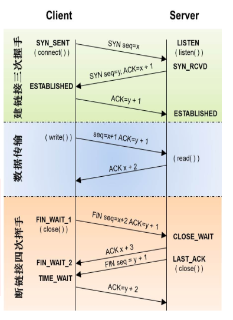

9. 缓存Expires  Cache-Control  Last-Modified  ETag  If-Modified-Since  If-None-Match 这些请求头部在浏览器缓存中分别起什么作用，如何起到缓存的作用？
    - 当某一文件在浏览器中第一次被访问的时候，这个时候浏览器是没有缓存的，直接从服务器获取文件，返回给客户端，并且存入浏览器缓存；此时，返回状态码200，并且服务端可以设置响应头部Expires或者Cache-Control，Last-Modified或者ETag。
    - 如果设置了Expires或者Cache-Control，那么在指定时间内再次请求该文件时，只要不强制刷新缓存(F5等)，浏览器会直接读取缓存而不再去请求服务器。
    - 如果没有设置Expires或者Cache-Control或者过期了，就需要再次请求服务器了，浏览器会发起条件验证，发起请求时在请求头加上If-Modified-Sinse或者If-None-Match，服务器端判断最新的文件是否发生了更新，如果没有，总则返回响应状态码304(not modified)，并且不带任何响应实体，也就是说，传输到客户端的只有一些相应头部，响应实体是空的，这样就大大减少了传输的体积，浏览器接受到了304响应，就知道了要读取浏览器缓存了。

10. 浏览器输入地址之后发生了什么
预处理，查缓存——>DNS解析——>建立连接——>发起请求——>等待响应——>接受数据——>处理元素——>布局渲染
    1、浏览器中输入网址。查看缓存，是否曾经访问过，看expired cached-control看缓存是否过期，如果过期，需要重新访问服务器，如果返回码为304 not modified的话，更新expired那些值。否则需要重新更新缓存。
    2、发送至DNS服务器并获得域名对应的WEB服务器的ip地址。一般我们用的是迭代式访问dns服务器，应用将请求发送至本地dns服务器，然后由本地dns服务器先向根域名服务器查询，看是否有对应的域名-ip，如果没有，根域名dns服务器会返回下一级域名服务器，这样迭代查找，知道找到域名-ip的映射，返回给应用。并且会存到dns缓存中，以便下一次的查询。
    3、与WEB服务器建立TCP连接。三次握手协议。（http底层协议是通过tcp来完成的。HTTP的所有内容将作为TCP的实体被封装到TCP报文里面。）
    4、浏览器向WEB服务器的ip地址发送相应的http请求。(http请求行，http响应头，http数据报文)
    5、WEB服务器响应请求并返回指定URL的数据，或错误信息(http返回码)，如果设定重定向，则重定向到新的URL地址。
    6、浏览器下载数据后解析HTML源文件，解析的过程中实现对页面的排版，解析完成后在浏览器中显示基础页面。
    7、分析页面中的超链接并显示在当前页面，重复以上过程直至无超链接需要发送，完成全部显示。
    服务器返回html文档之后，浏览器的渲染引擎开始dom解析过程（构建DOM树->渲染树（Render tree）->布局render树->绘制render树）
    解析dom树的过程：通过网络请求获取的html网页或资源从字节流解码成字符流，然后通过词法分析器解析成词语，之后经过语法分析器构建成节点，最后这些节点组成一颗dom树

## 数据库
1. 如何修改数据库中的隔离级别、各种隔离性的实现
查看隔离的级别：(可以看到默认是repeatable read)
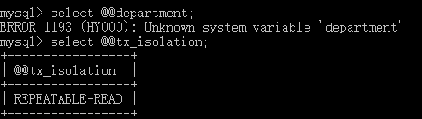
这里修改事务权限的语句是：
```
set [ global | session ] transaction isolation level Read uncommitted | Read committed | Repeatable | Serializable;
```
如果选择global，意思是此语句将应用于之后的所有session，而当前已经存在的session不受影响。
如果选择session，意思是此语句将应用于当前session内之后的所有事务。
如果什么都不写，意思是此语句将应用于当前session内的下一个还未开始的事务。

2. 如何给用户权限
```
创建用户
grant all privileges on *.* to testuser@localhost identified by “123456”;
设置用户访问数据库权限
grant all privileges on test_db.* to testuser@localhost identified by “123456” ;
设置用户操作权限
grant all privileges on *.* to testuser@localhost identified by “123456” WITH GRANT OPTION ;
设置远程访问
grant all privileges on *.* to testuser@“192.168.1.100” identified by “123456” ;
flush privileges
```
3. 为什么要设计范式
第一范式：每一个属性不能拆分成更简单的属性
第二范式：满足第一范式，并且非主键元素完全依赖于主键元素
第三范式：满足第二范式，并且消除关系依赖
BCNF：满足第三范式，主属性不依赖于主属性
三大范式只是一般设计数据库的基本理念，可以**建立冗余较小、结构合理的数据库**。如果有特殊情况，当然要特殊对待，数据库设计最重要的是看需求跟性能，需求>性能>表结构。所以不能一味的去追求范式建立数据库。


## 操作系统层、linux
1. 原子操作
原子操作是指不会被线程调度机制打断的操作；这种操作一旦开始，就一直运行到结束，中间不会有任何 context switch（切换到另一个线程）。
原子操作是不可分割的，在执行完毕之前不会被任何其它任务或事件中断。
2. 虚拟内存
为了扩大主存空间，又不想花钱买实际的内存，因此引入了虚拟内存。将容量有限的主存扩充到容量巨大的外存，让外存也成为主存的一部分，同时提供了接近于缓存的访问速度，以及最大容量约为2^寻址位数。
3. 有没有写过多线程(写一个)

在多线程环境下，每个线程拥有一个栈和一个程序计数器。栈和程序计数器用来保存线程的执行历史和线程的执行状态，是线程私有的资源。其他的资源（比如堆、地址空间、全局变量）是由同一个进程内的多个线程共享。
- 线程共享资源包括：
    1. 进程代码段
    2. 进程的公有数据(利用这些共享的数据，线程很容易的实现相互之间的通讯)[比如说全局变量]
    3. 进程打开的文件描述符、信号的处理器、进程的当前目录和进程用户ID与进程组ID。

- 线程独立资源包括：
    1. 线程ID
    每个线程都有自己的线程ID，这个ID在本进程中是唯一的。进程用此来标识线程。
    2. 寄存器组的值
    由于线程间是并发运行的，每个线程有自己不同的运行线索，当从一个线程切换到另一个线程上 时，必须将原有的线程的寄存器集合的状态保存，以便将来该线程在被重新切换到时能得以恢复。
    3. 线程的堆栈
    堆栈是保证线程独立运行所必须的。线程函数可以调用函数，而被调用函数中又是可以层层嵌套的，所以线程必须拥有自己的函数堆栈， 使得函数调用可以正常执行，不受其他线程的影响。
    4. 错误返回码
    由于同一个进程中有很多个线程在同时运行，可能某个线程进行系统调用后设置了errno值，而在该 线程还没有处理这个错误，另外一个线程就在此时被调度器投入运行，这样错误值就有可能被修改。所以，不同的线程应该拥有自己的错误返回码变量。
    5. 线程的信号屏蔽码
    由于每个线程所感兴趣的信号不同，所以线程的信号屏蔽码应该由线程自己管理。但所有的线程都 共享同样的信号处理器。
    6. 线程的优先级
    由于线程需要像进程那样能够被调度，那么就必须要有可供调度使用的参数，这个参数就是线程的优先级。

- 多进程之间通信方式：
    文件映射：本地之间
    共享内存：本地之间
    匿名管道：本地之间
    命名管道：跨服务器
    邮件槽：一对多的传输数据，通常通过网络向一台Windows机器传输
    剪切板：本地之间
    socket：跨服务器
- 多线程之间同步机制：
    临界区：不可以跨进程，忘记解锁会无限等待，要么存在要么没有，多线程访问独占性共享资源
    互斥量：可以跨进程，忘记解锁会自动释放，要么存在要么没有
    事件：又叫线程触发器，不可以跨进程，要么存在要么没有，一个线程来唤醒另一个线程（包括自动和人工两种方式）
    信号量：可以跨进程，始终代表可用资源数量，当资源数为0时，线程阻塞，允许多个线程同时访问一个共享资源

- 多线程之间的通信
    - 锁机制：互斥锁（提供了以排它方式阻止数据结构被并发修改的方法）、读写锁（允许多个线程同时读共享数据，而对写操作互斥。）、条件变量（与互斥锁一起用）
    - 信号量机制：包括无名线程信号量与有名线程信号量
    - 信号机制：类似于进程间的信号处理。
线程间通信的主要目的是用于线程同步，所以线程没有象进程通信中用于数据交换的通信机制。    
4. linux的IPC linux IPC Inter-Process Communication
- 多进程之间的通信？
    一、管道（无名管道）
    管道，通常指无名管道，是 UNIX 系统IPC最古老的形式。
    1、特点：
    - 半双工（数据只能在一个方向上流动），具有固定的读端和写端。
    - 只能用于具有亲缘关系的进程之间的通信（也是父子进程或者兄弟进程之间）。因为子进程继承父继承的文件描述符，除了父子进程，其他进程不知道fd的值，所以通常调用pipe的进程接着调用fork，在父子之间通信。
    - 可以看成是一种特殊的文件，对于它的读写也可以使用普通的read、write
    等函数。但是它不是普通的文件，并不属于其他任何文件系统，并且只存在于内存中。
    二、FIFO（命名管道）
    命名管道，它是一种文件类型。
    1、特点
    可以在无关的进程之间交换数据，与无名管道不同。
    FIFO有路径名与之相关联，它以一种特殊设备文件形式存在于文件系统中。
    FIFO的通信方式类似于在进程中使用文件来传输数据，只不过FIFO类型文件同时具有管道的特性。在数据读出时，FIFO管道中同时清除数据，并且“先进先出”。
    三、消息队列
    消息队列，是消息的链接表，存放在内核中。一个消息队列由一个标识符（即队列ID）来标识。
    1、特点
    面向记录，其中的消息具有特定的格式以及特定的优先级。
    消息队列独立于发送与接收进程。进程终止时，消息队列及其内容并不会被删除。(管道不同，进程终止管道内容删除）
    消息队列可以实现消息的随机查询,消息不一定要以先进先出的次序读取,也可以按消息的类型读取。
    四、信号量（用于同步不用于存储）
    信号量（semaphore）与已经介绍过的 IPC 结构不同，它是一个计数器。信号量用于实现进程间的互斥与同步，而不是用于存储进程间通信数据。
    1、特点
    用于进程间同步，若要在进程间传递数据需要结合共享内存。
    基于操作系统的 PV 操作（信号量的处理相关，P表示通过的意思，V表示释放的意思），程序对信号量的操作都是原子操作。
    P(S)：
    ①将信号量S的值减1，即S=S-1；
    ②如果S>=0，则该进程继续执行；否则该进程置为等待状态。
    V(S)：
    ①将信号量S的值加1，即S=S+1；
    ②该进程继续执行；如果该信号的等待队列中有等待进程就唤醒一等待进程。
    每次对信号量的 PV 操作不仅限于对信号量值加 1 或减 1，而且可以加减任意正整数。
    支持信号量组。
    五、共享内存
    共享内存（Shared Memory），指两个或多个进程共享一个给定的存储区。
    1、特点
    最快的IPC，因为进程是直接对内存进行存取。
    因为多个进程可以同时操作，所以需要进行同步。
    信号量+共享内存 通常结合在一起使用，信号量用来同步对共享内存的访问。
    例子
    使用【共享内存+信号量+消息队列】的组合来实现服务器进程与客户进程间的通信。
    共享内存用来传递数据；信号量用来同步；消息队列用来 在客户端修改了共享内存后 通知服务器读取。

5. 是否了解文件系统，比如ext2, ext3, ext4
文件目录下。文件目录也作为一个文件进行储存。
通用的文件模型：每个目录被看成是一个文件，可以包含若干文件和其他子目录
通用文件模型的组成部分：
    - 超级块对象
    存放已安装的文件系统的有关信息。对基于磁盘的文件系统，这类对象对应的是文件系统控制块。
    所有的super block都是以双向循环链表的形式链接在一起
    超级块对象 sb（存放涉及的super block的地址）->s_op（read_inode字段存放的这一函数的地址）->read_inode(inode);
    - 索引节点对象
    存放有关具体文件的一般信息。对基于磁盘的文件系统，这类对象通常对应于存放在磁盘的文件控制块。每个索引节点对象都有一个索引节点号，这个节点号唯一标识文件系统的文件。
    索引节点的数据结构里存放了文件系统处理文件所需要的所有信息。
    每个索引节点对象总是会存在于下列双向循环链表中的某个链表中：有效未使用的索引节点链表(i_count=0)、正在使用的索引节点链表(i_count>0)或者脏索引节点的链表(s_dirty)。这些链表通过适当的索引节点对象的i_list字段链接起来。此外，这些对象还包含在每个文件系统的双向循环链表中，以及存放在一个inode_hashtable的散列表中。
    与索引节点对象关联的方法叫做索引节点操作。比如create,lookup,unlink,symlink...
    - 文件对象
    存放打开文件与进程之间交互的有关信息。这类信息仅当进程访问文件期间存在于内核中。
    文件对象主要是描述进程怎么跟一个打开的文件进行交互。文件对象是在文件打开时创建的，由一个file结构组成。
    存放在文件对象中的主要信息是文件指针，即文件中当前的位置，下一个操作将在该位置发生。由于可能会有几个进程同时访问一个文件，因此文件指针是存放在文件对象里，而不是存放在索引节点对象中。
    文件对象是通过一个叫flip的slab高速缓存分配。
    当内核将索引节点从磁盘装入内存时，会将指向这些文件操作的指针存放在file_operation结构中，而这个结构的地址是放在索引节点对象的i_fop字段中，然后进程打开文件的时候，vfs就将这个地址初始化新文件对象的f_op字段。
    相关的一些文件操作包括read、aio_read、write、readdir、open...
    - 目录项对象
    存放目录项(也就是文件特定名称)与对应文件进行链接的有关信息，每个磁盘文件系统都以自己特有的方式将这类信息存放在磁盘上。
    vfs将一个目录看做是若干个子目录与文件组成的一个普通文件。
    一旦目录项被读入内存，vfs就将它转化为基于dentry结构的一个目录项对象。
    对于进程查找的路径名中的每个分量，内核都会为其创建一个目录项对象，目录项对象将每个分量与其对应的索引节点相联系。例如查找路径名/tmp/test，内核会为根目录'/'建立目录项对象，为‘tmp’建立第二级目录项对象，为‘test’第三级目录项对象
    目录项对象在磁盘中没有对应映射，而是存放在名为dentry_cache的slab分配器高速缓存中。
    四个状态：free(空闲状态,不包含有效信息，未被vfs使用)，unused(未使用状态,d_count=0)，in use(正在使用状态, d_count>0)，负状态(negative，与目录项关联的索引节点不存在了，对应的磁盘索引节点被删除或者解析到一个不存在的路径)
    关联的操作叫目录项操作d_op，包括d_available,d_hash,d_compare...

6. 在一个目录中打开一个文件，并进行读写操作的底层实现
7. 文件名存放在哪里
文件目录下。文件目录也作为一个文件进行储存。
通用的文件模型：每个目录被看成是一个文件，可以包含若干文件和其他子目录
8. VFS如何实现路径名的查找
一些命令会用到路径名查找，比如说mkdir, rmdir, open(),stat等等
首先将路径拆分成一个个文件名序列，除了最后一个文件名，其他文件名必然是目录。
然后判断是否绝对路径，也就是以'/'开头为绝对路径，否则为相对路径。
    前者会读current->fs->root(进程的根目录的目录项)
    后者会读current->fs->pwd(当前工作目录下的目录项)
接着进入所标识的目录进行搜索。读取与之关联的索引节点(根据d_inode)
然后从磁盘中读出包含那个索引节点的目录文件，并检查第二个名字匹配的目录项，以获得相应的索引节点。这个过程反复进行。
加速的方式：目录项高速缓存，保存最近最常使用的目录项对象在内存中
其他：每个目录的访问权要检查，符号链接可能会导致循环引用，内核要考虑到并终止，可能是已安装文件系统的安装点，须延伸到新的文件系统...
实现的方式：pathlookup(name, flag, nameidata存放查找的结果)
特殊：符号链接的查找
符号链接是一个普通文件，其中存放了另一个文件的路径名。路径名可以包含符号链接，由内核来解析。如果'/foo/bar'是'../dir'的一个符号链接，那么/foo/bar/file路径名必须由内核解析为对'/dir/file'文件的引用。内核指向两个不同路径的查找操作。可能会有无休止的递归调用流，引发内核栈的溢出。

9. VFS中比较重要的系统调用实现
    - open
    接收路径名、访问模式的一些flag，以及该文件被创建时的许可权等
    返回值：一个文件描述符(指向文件对象的指针数组current->files->fd中分配给新文件的索引)或者-1
        - getname() 从进程地址空间读取该文件的路径名
        - get unused_fd()，在current->files->fd中找到一个空的位置，相应的索引放在fd局部变量里
        - flip_open()函数，open_namei():看与目录项关联的索引节点是否存在，权限是否允许，dentry_open()函数，创建文件对象，设置文件对象数据结构，以及将文件对象插入到文件系统超级块对象s_files字段所指向的打开文件链表中。返回文件对象的地址
        - 设置current->files->fd[fd]=上一步得到的文件对象的地址
        - 返回fd
    - read、write
    参数： 文件描述符fd，一个内存区的地址buf(该缓冲区包含要传送的数据)，一个数count(指定应该传送多少字节)
    输出：所成功传送的字节数或者-1
    过程：
    根据fd读取文件对象的地址 file
    根据f_mode中的标志，如果不允许读写，范围-EBADF
    如果f_op中没有定义read()/write()/aio_read()/aio_write()文件操作，就返回-EINVAL
    然后粗略检查参数buf与count，检查锁是否有冲突
    调用f_op->read()或者aio_read()...等方法。返回实际传送的字节数。适当更新文件指针。
    释放文件对象
    返回实际传送的字节数。
    - close
    当read的系统调用返回0时，说明已经拷贝完成，程序需要关闭打开的文件。
    获得current->file->fd[fd]的文件对象的地址
    将这个地址置为NULL，释放文件描述符fd
    调用flip_close。flush, 释放锁，fput()释放文件对象
    - 例子：cp
    open()系统调用返回了两个文件描述符，分别存放在intf和outf变量中。然后程序开始循环，在每次循环中，都有部分输入文件的内容被拷贝到本地缓冲区(read()系统调用)中，然后这个本地缓冲区的数据会被拷贝到输出文件中。

9. linux的文件描述符 fd
内核利用文件描述符来访问文件。是一个非负整数。
每个进程与文件系统进行相互交互会维护一些数据。
进程描述符(task struct)中对应的文件系统的数据成员：
    - struct fs_struct * fs;//保存每个进程都会有自己当前工作的目录和他自己的根目录
    - struct files_struct * files;//保存进程当前打开的文件
fd字段就是在这个files_struct结构中的字段。
fd字段指向文件对象的指针数组，这个额数组的长度存放在max_fds字段中，通过fd字段指向file_struct中的fd_array字段，fd_array字段包含32个文件对象指针，但如果进程打开的文件数目大于32，会分配一个新的或者更大的文件指针数组，并将其地址放到fd字段中同时内核还会更新max_fds字段的值。
对于在fd数组中有元素的每个文件来说，数组的索引就是文件描述符(file description),通常，索引值为0的是进程的标准输入文件，索引为1的是进程的标准输出文件，索引为3的是进程的标准错误文件.
    - fget() 这个函数接收文件描述符fd作为参数，返回current->files->fd[fd]中的地址。增加文件对象引用计数器f_count的值
    - fput() 这个函数将文件对象的地址作为参数，减少文件对象引用计数器f_count的值。一般用来释放文件对象。

文件指针指向进程用户区中的一个被称为FILE结构的数据结构。FILE结构包括一个缓冲区和一个文件描述符。文件指针储存在文件对象里。
而文件描述符是文件描述符表fd_array的一个索引

10. linux文件加锁：劝告锁和强制锁。
11. linux下如何抓包
linux下用tcpdump这个工具
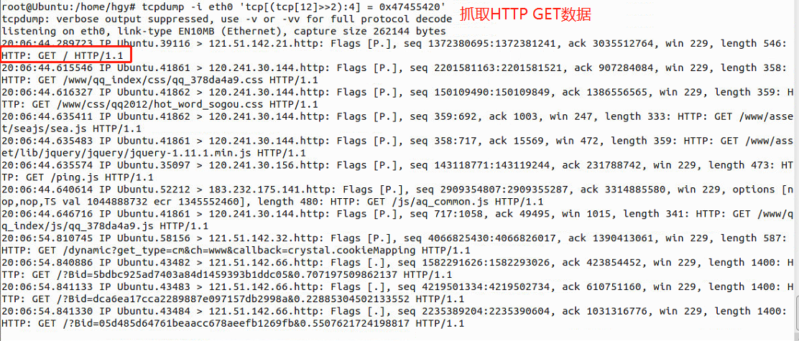
tcpdump命令用于监视TCP/IP连接并直接读取数据链路层的数据包头。
windows下，Wireshark（前称Ethereal）是一个网络封包分析软件，网络封包分析软件的功能是撷取网络封包，并尽可能显示出最为详细的网络封包资料。Wireshark使用WinPCAP作为接口，直接与网卡进行数据报文交换。通过一些过滤条件来进行过滤。port、src、dst等

12. 观察网络状态
netstat命令是一个监控TCP/IP网络的非常有用的工具，它可以显示路由表、实际的网络连接以及每一个网络接口设备的状态信息。
在这里可以观察timewait状态 close wait状态 established状态 last ack状态
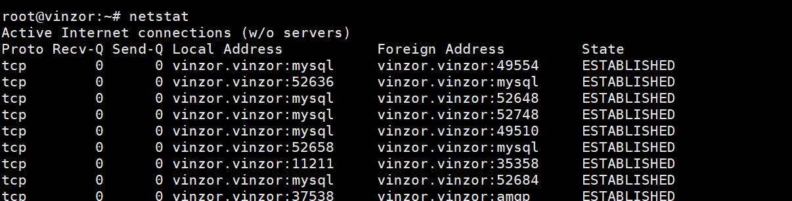

13. linux gdb
```
g++ -q hello.cpp -o hello
gdb -q test
```
g++ -g选项的作用：
在linux C中gcc编译器一章有说，-g选项的意义是“生成调试信息，该程序可以被调试器调试”
gdb常用的一些命令：
设置断点：break 行数
列出所有的代码:list
下一个断点：next(不会跟踪进函数) 或者continue
清除断点：clear 行数 或者disable 行数
打印当前的变量值: print 变量名
设置当前某个值： print 变量名=val
跟踪进函数：step

一般也用于多线程的调试
    info threads 显示当前可调试的所有线程，每个线程会有一个GDB为其分配的ID，后面操作线程的时候会用到这个ID。 前面有*的是当前调试的线程。
    thread ID 切换当前调试的线程为指定ID的线程。

14. 在linux下运行c++文件
- 单个文件情况
    一般我们用g++来运行
    g++ hello.cpp -o hello 默认会生成a.out
    当然也可以用gcc来运行
    gcc helloworld.cpp -lstdc++ -o helloworld
- 多个文件情况
    g++ hellospeak.cpp speak.cpp
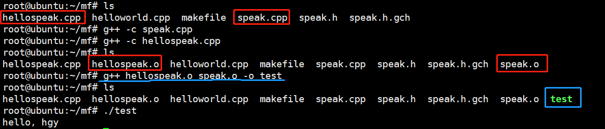
将.o文件作为输入文件传递给链接器，然后编译源码文件并将其链接成单一的可执行文件
```
//静态库.a
$ g++ -c sayhello.cpp
$ g++ -c say.cpp
$ ar -r libsay.a sayhello.o say.o
$ g++ saymain.cpp libsay.a -o saymain
//动态库*.so
1. 制作so文件：libadd_c.so
gcc -shared -fpic -lm -ldl -o libadd_c.so add.c
2. 动态链接
g++ test.cpp -ldl -o test
```
预编译：g++ -E helloworld.cpp -o helloworld.ii
编译：g++ -S helloworld.cpp 生成汇编代码
汇编：将汇编代码转为机器码 .o文件
链接：lib静态链接 dll动态链接

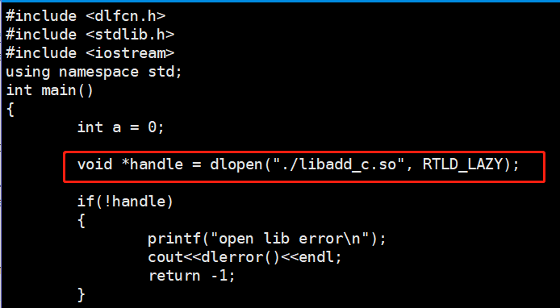
编译可以用gcc/g++，而链接可以用g++或者gcc -lstdc++。因为gcc命令不能自动和C＋＋程序使用的库联接，所以通常使用g++来完成联接。但在编译阶段，g++会自动调用gcc，二者等价。
15. makefile
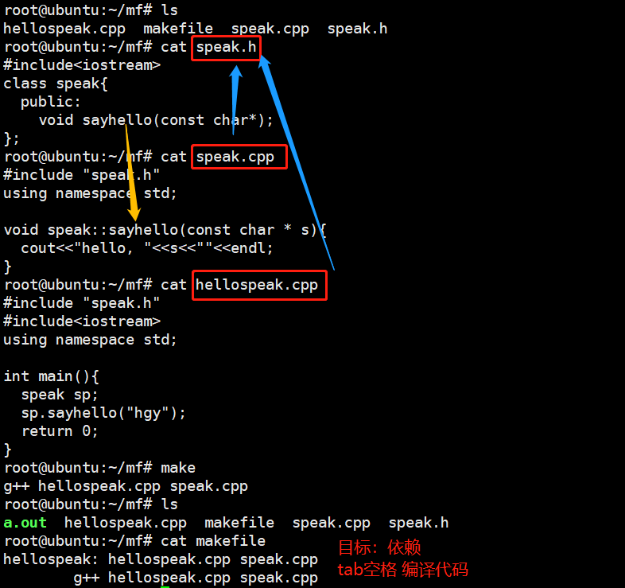

16. volatile是干什么用的
直接读取原始内存地址的值。一般是读到寄存器再读取寄存器的值。
 

17. 操作系统相关的一些算法
程序调度算法：长期调度程序、中期调度程序，短期调度程序
cpu调度算法：fcfs，最短作业优先，优先级调度，时间片轮询
内存分配算法：首次适配，最佳适配，最差适配
虚拟内存换页算法：FIFO页置换，置换最长时间不使用的页，LRU置换最近最少使用的页。频繁的页面置换会导致系统颠簸
磁盘调度算法：fcfs，ssjf(最短寻道时间优先算法)，scan(电梯算法，先移动到0(值减少)，再到反方向访问)，c-scan(先向上请求(值增大)，到顶之后立刻回到0，再向上请求)，LOOK（不会到0）
## 算法
1. 洗牌算法的时间复杂度、空间复杂度
   一个二叉树找两个节点的最小公共子节点
